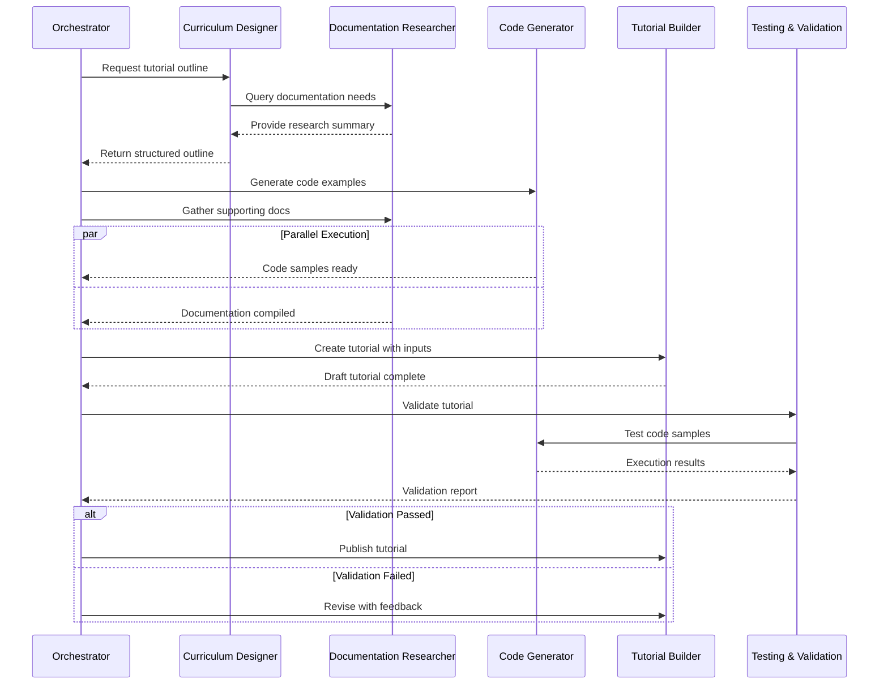

# Inter-Agent Communication Protocol
## Yocto & Meta-Tegra Learning System

---

## 1. Communication Architecture

### Message Bus Design
```python
class AgentMessageBus:
    """
    Central message routing system for all agents.
    Implements publish-subscribe pattern with priority queuing.
    """
    
    def __init__(self):
        self.agents = {}
        self.message_queue = PriorityQueue()
        self.event_log = []
        self.routing_table = {}
    
    def register_agent(self, agent_id, agent_instance):
        """Register an agent with the message bus"""
        self.agents[agent_id] = agent_instance
        self.routing_table[agent_id] = []
    
    def publish(self, message):
        """Publish message to the bus"""
        self.message_queue.put((message.priority, message))
        self.event_log.append(message)
    
    def subscribe(self, agent_id, message_types):
        """Subscribe agent to specific message types"""
        for msg_type in message_types:
            self.routing_table[msg_type].append(agent_id)
```

### Message Format Specification
```json
{
    "header": {
        "message_id": "uuid-v4",
        "timestamp": "2024-01-15T10:30:00Z",
        "sender": "agent_id",
        "recipients": ["agent_id_1", "agent_id_2"],
        "message_type": "task_request|status_update|query|response",
        "priority": 1,
        "correlation_id": "parent_message_id",
        "requires_ack": true
    },
    "body": {
        "action": "specific_action_type",
        "context": {
            "project_phase": "foundation|intermediate|advanced",
            "module": "module_identifier",
            "dependencies": ["dep_1", "dep_2"]
        },
        "payload": {
            // Action-specific data
        },
        "constraints": {
            "deadline": "2024-01-16T10:30:00Z",
            "resources": {
                "max_tokens": 10000,
                "max_time_seconds": 3600
            }
        }
    },
    "metadata": {
        "version": "1.0",
        "retry_count": 0,
        "max_retries": 3,
        "ttl": 86400
    }
}
```

---

## 2. Communication Workflows

### Workflow 1: Tutorial Creation Pipeline



### Workflow 2: Project Development

```python
async def project_development_workflow(project_spec):
    """
    Orchestrates the creation of a complete project
    """
    
    # Phase 1: Design
    design_request = {
        "header": {
            "message_type": "task_request",
            "sender": "orchestrator",
            "recipients": ["project_architect"],
            "priority": 1
        },
        "body": {
            "action": "design_system",
            "payload": project_spec
        }
    }
    
    design = await send_and_wait(design_request)
    
    # Phase 2: Parallel Development
    tasks = []
    
    for component in design.components:
        code_task = create_code_task(component)
        doc_task = create_doc_task(component)
        tasks.extend([code_task, doc_task])
    
    results = await asyncio.gather(*tasks)
    
    # Phase 3: Integration
    integration_request = {
        "header": {
            "message_type": "task_request",
            "sender": "orchestrator",
            "recipients": ["knowledge_integration"],
            "priority": 2
        },
        "body": {
            "action": "integrate_components",
            "payload": results
        }
    }
    
    integrated_project = await send_and_wait(integration_request)
    
    # Phase 4: Testing
    test_results = await comprehensive_testing(integrated_project)
    
    return finalize_project(integrated_project, test_results)
```

---

## 3. Message Type Definitions

### Task Request Messages

```python
class TaskRequestMessage:
    """Request an agent to perform a specific task"""
    
    SCHEMA = {
        "action": str,  # "create_recipe", "research_topic", "generate_code", etc.
        "inputs": dict,  # Task-specific inputs
        "requirements": list,  # Success criteria
        "deadline": datetime,  # Task deadline
        "priority": int  # 1-5 priority scale
    }
    
    EXAMPLES = {
        "create_recipe": {
            "action": "create_recipe",
            "inputs": {
                "package_name": "custom-gpio-lib",
                "functionality": "GPIO control for Jetson",
                "dependencies": ["tegra-libraries-core"],
                "target_platform": "jetson-orin-agx"
            },
            "requirements": [
                "Builds successfully",
                "Includes Python bindings",
                "Optimized for size"
            ],
            "deadline": "2024-01-16T12:00:00Z",
            "priority": 2
        }
    }
```

### Query Messages

```python
class QueryMessage:
    """Request information from an agent"""
    
    SCHEMA = {
        "query_type": str,  # "status", "capability", "knowledge"
        "query": str,  # Natural language or structured query
        "context": dict,  # Additional context
        "response_format": str  # Expected response structure
    }
    
    EXAMPLES = {
        "knowledge_query": {
            "query_type": "knowledge",
            "query": "What are the differences between Xavier and Orin device trees?",
            "context": {
                "comparison_aspects": ["gpio", "i2c", "ethernet"],
                "detail_level": "implementation"
            },
            "response_format": "structured_comparison"
        }
    }
```

### Status Update Messages

```python
class StatusUpdateMessage:
    """Provide progress updates on ongoing tasks"""
    
    SCHEMA = {
        "task_id": str,
        "status": str,  # "in_progress", "completed", "failed", "blocked"
        "progress_percentage": int,
        "current_step": str,
        "estimated_completion": datetime,
        "blockers": list,
        "partial_results": dict
    }
    
    EXAMPLES = {
        "tutorial_progress": {
            "task_id": "tut-gpio-001",
            "status": "in_progress",
            "progress_percentage": 60,
            "current_step": "Writing troubleshooting section",
            "estimated_completion": "2024-01-15T14:00:00Z",
            "blockers": [],
            "partial_results": {
                "sections_complete": ["intro", "setup", "implementation"],
                "word_count": 2500,
                "code_examples": 5
            }
        }
    }
```

---

## 4. Coordination Patterns

### Pattern 1: Fork-Join Parallelism

```python
async def fork_join_pattern(orchestrator, task_spec):
    """
    Split work among multiple agents, then combine results
    """
    
    # Fork: Distribute subtasks
    subtasks = task_spec.decompose()
    futures = []
    
    for subtask in subtasks:
        agent = orchestrator.select_agent(subtask.requirements)
        future = agent.execute_async(subtask)
        futures.append(future)
    
    # Join: Collect and merge results
    results = await asyncio.gather(*futures)
    
    # Merge with conflict resolution
    merged_result = orchestrator.merge_results(
        results,
        conflict_resolution="voting"  # or "priority", "manual"
    )
    
    return merged_result
```

### Pattern 2: Pipeline Processing

```python
class PipelineCoordinator:
    """
    Manages sequential processing through multiple agents
    """
    
    def __init__(self, stages):
        self.stages = stages  # Ordered list of agents
        self.checkpoints = {}
    
    async def process(self, initial_input):
        current_data = initial_input
        
        for i, agent in enumerate(self.stages):
            try:
                # Process current stage
                result = await agent.process(current_data)
                
                # Save checkpoint
                self.checkpoints[f"stage_{i}"] = result
                
                # Validate before proceeding
                if not self.validate_stage_output(result, i):
                    return self.handle_validation_failure(i, result)
                
                current_data = result
                
            except Exception as e:
                return self.handle_stage_failure(i, e)
        
        return current_data
```

### Pattern 3: Consensus Building

```python
class ConsensusProtocol:
    """
    Multiple agents reach agreement on outputs
    """
    
    async def reach_consensus(self, agents, task):
        proposals = {}
        
        # Round 1: Collect initial proposals
        for agent in agents:
            proposal = await agent.propose_solution(task)
            proposals[agent.id] = proposal
        
        # Round 2: Review and score
        scores = defaultdict(dict)
        for reviewer in agents:
            for agent_id, proposal in proposals.items():
                if agent_id != reviewer.id:
                    score = await reviewer.evaluate_proposal(proposal)
                    scores[agent_id][reviewer.id] = score
        
        # Calculate consensus
        consensus_scores = {}
        for agent_id in proposals:
            consensus_scores[agent_id] = np.mean(list(scores[agent_id].values()))
        
        # Select best proposal or merge top proposals
        best_agent = max(consensus_scores, key=consensus_scores.get)
        
        if consensus_scores[best_agent] > 0.8:
            return proposals[best_agent]
        else:
            # Merge top 3 proposals
            top_3 = sorted(consensus_scores, key=consensus_scores.get, reverse=True)[:3]
            return await self.merge_proposals([proposals[a] for a in top_3])
```

---

## 5. Error Handling & Recovery

### Error Message Format

```json
{
    "header": {
        "message_type": "error",
        "severity": "warning|error|critical",
        "error_code": "E001",
        "timestamp": "2024-01-15T10:30:00Z"
    },
    "body": {
        "error_type": "validation_failed",
        "message": "Recipe build failed: missing dependency",
        "details": {
            "recipe": "custom-gpio-lib",
            "missing_dep": "python3-dev",
            "build_log": "..."
        },
        "recovery_suggestions": [
            "Add python3-dev to DEPENDS",
            "Check if python3 is in IMAGE_INSTALL"
        ]
    }
}
```

### Retry Logic

```python
class RetryManager:
    """
    Manages automatic retry with exponential backoff
    """
    
    def __init__(self, max_retries=3, base_delay=1):
        self.max_retries = max_retries
        self.base_delay = base_delay
    
    async def execute_with_retry(self, func, *args, **kwargs):
        last_exception = None
        
        for attempt in range(self.max_retries):
            try:
                return await func(*args, **kwargs)
            
            except TemporaryError as e:
                last_exception = e
                delay = self.base_delay * (2 ** attempt)
                await asyncio.sleep(delay)
                
            except PermanentError as e:
                # Don't retry permanent errors
                raise e
        
        raise MaxRetriesExceeded(f"Failed after {self.max_retries} attempts", last_exception)
```

---

## 6. Performance Optimization

### Message Batching

```python
class MessageBatcher:
    """
    Batch multiple small messages for efficiency
    """
    
    def __init__(self, batch_size=10, max_wait_time=1.0):
        self.batch_size = batch_size
        self.max_wait_time = max_wait_time
        self.buffer = []
        self.last_flush = time.time()
    
    async def add_message(self, message):
        self.buffer.append(message)
        
        if len(self.buffer) >= self.batch_size:
            await self.flush()
        elif time.time() - self.last_flush > self.max_wait_time:
            await self.flush()
    
    async def flush(self):
        if self.buffer:
            batch_message = self.create_batch_message(self.buffer)
            await self.send_batch(batch_message)
            self.buffer = []
            self.last_flush = time.time()
```

### Priority Queue Management

```python
class PriorityMessageQueue:
    """
    Ensures high-priority messages are processed first
    """
    
    def __init__(self):
        self.queues = {
            1: deque(),  # Critical
            2: deque(),  # High
            3: deque(),  # Medium
            4: deque(),  # Low
            5: deque()   # Background
        }
    
    def enqueue(self, message):
        priority = message.header.priority
        self.queues[priority].append(message)
    
    def dequeue(self):
        for priority in range(1, 6):
            if self.queues[priority]:
                return self.queues[priority].popleft()
        return None
```

---

## 7. Monitoring & Observability

### Message Flow Tracking

```python
class MessageTracker:
    """
    Tracks message flow through the system
    """
    
    def __init__(self):
        self.traces = {}
        self.metrics = defaultdict(int)
    
    def start_trace(self, message):
        trace_id = str(uuid.uuid4())
        self.traces[trace_id] = {
            "message_id": message.header.message_id,
            "start_time": time.time(),
            "path": [message.header.sender],
            "status": "in_progress"
        }
        return trace_id
    
    def update_trace(self, trace_id, agent_id):
        if trace_id in self.traces:
            self.traces[trace_id]["path"].append(agent_id)
    
    def complete_trace(self, trace_id, status="success"):
        if trace_id in self.traces:
            trace = self.traces[trace_id]
            trace["end_time"] = time.time()
            trace["duration"] = trace["end_time"] - trace["start_time"]
            trace["status"] = status
            
            # Update metrics
            self.metrics["total_messages"] += 1
            self.metrics[f"status_{status}"] += 1
            self.metrics["avg_duration"] = (
                (self.metrics["avg_duration"] * (self.metrics["total_messages"] - 1) + 
                 trace["duration"]) / self.metrics["total_messages"]
            )
```

### Health Check Protocol

```python
class HealthCheckProtocol:
    """
    Regular health checks for all agents
    """
    
    async def check_agent_health(self, agent):
        health_query = {
            "header": {
                "message_type": "health_check",
                "timestamp": datetime.now().isoformat()
            },
            "body": {
                "checks": ["memory", "queue_size", "response_time"]
            }
        }
        
        try:
            response = await agent.health_check(health_query, timeout=5.0)
            return {
                "agent_id": agent.id,
                "status": "healthy",
                "metrics": response.metrics
            }
        except TimeoutError:
            return {
                "agent_id": agent.id,
                "status": "unresponsive",
                "error": "Health check timeout"
            }
```

---

## 8. Example Integration Scenarios

### Scenario 1: Complete Module Creation

```python
async def create_learning_module(module_spec):
    """
    Coordinates creation of a complete learning module
    """
    
    bus = AgentMessageBus()
    
    # Step 1: Design curriculum
    curriculum_msg = {
        "header": {
            "message_type": "task_request",
            "sender": "orchestrator",
            "recipients": ["curriculum_designer"],
            "priority": 1
        },
        "body": {
            "action": "design_module",
            "payload": module_spec
        }
    }
    
    curriculum = await bus.send_and_wait(curriculum_msg)
    
    # Step 2: Parallel content creation
    tasks = []
    
    # Research papers
    research_task = bus.send_async({
        "header": {"recipients": ["documentation_researcher"]},
        "body": {"action": "gather_papers", "topics": curriculum.topics}
    })
    tasks.append(research_task)
    
    # Code examples for each lesson
    for lesson in curriculum.lessons:
        code_task = bus.send_async({
            "header": {"recipients": ["code_generator"]},
            "body": {"action": "create_examples", "lesson": lesson}
        })
        tasks.append(code_task)
    
    # Wait for all parallel tasks
    results = await asyncio.gather(*tasks)
    
    # Step 3: Build tutorials
    for i, lesson in enumerate(curriculum.lessons):
        tutorial_msg = {
            "header": {
                "recipients": ["tutorial_builder"],
                "priority": 2
            },
            "body": {
                "action": "create_tutorial",
                "payload": {
                    "lesson": lesson,
                    "code": results[i+1],  # Skip research at index 0
                    "references": results[0]  # Research papers
                }
            }
        }
        
        tutorial = await bus.send_and_wait(tutorial_msg)
        
        # Step 4: Validate each tutorial
        validation = await bus.send_and_wait({
            "header": {"recipients": ["testing_validation"]},
            "body": {"action": "validate_tutorial", "tutorial": tutorial}
        })
        
        if not validation.passed:
            # Revision loop
            await handle_revision(tutorial, validation.feedback)
    
    # Step 5: Final integration
    integrated = await bus.send_and_wait({
        "header": {"recipients": ["knowledge_integration"]},
        "body": {"action": "integrate_module", "module": curriculum}
    })
    
    return integrated
```

### Scenario 2: Adaptive Learning Path

```python
class AdaptiveLearningCoordinator:
    """
    Adjusts learning path based on learner progress
    """
    
    def __init__(self, bus):
        self.bus = bus
        self.learner_state = {}
    
    async def adapt_path(self, learner_id, assessment_results):
        # Analyze performance
        analysis = await self.bus.send_and_wait({
            "header": {"recipients": ["curriculum_designer"]},
            "body": {
                "action": "analyze_performance",
                "results": assessment_results
            }
        })
        
        if analysis.needs_remediation:
            # Generate remedial content
            remedial = await self.bus.send_and_wait({
                "header": {"recipients": ["tutorial_builder"]},
                "body": {
                    "action": "create_remedial",
                    "gaps": analysis.knowledge_gaps
                }
            })
            return {"next_content": remedial, "type": "remediation"}
        
        elif analysis.ready_for_advanced:
            # Skip to advanced topics
            advanced = await self.bus.send_and_wait({
                "header": {"recipients": ["project_architect"]},
                "body": {
                    "action": "suggest_project",
                    "skill_level": "advanced",
                    "interests": self.learner_state[learner_id].interests
                }
            })
            return {"next_content": advanced, "type": "acceleration"}
        
        else:
            # Continue standard path
            return {"next_content": analysis.next_module, "type": "standard"}
```

---

## Appendix: Quick Reference

### Agent IDs
- `orchestrator` - Master coordinator
- `curriculum_designer` - Learning path designer  
- `documentation_researcher` - Documentation gatherer
- `code_generator` - Code creator
- `tutorial_builder` - Tutorial writer
- `project_architect` - Project designer
- `testing_validation` - Quality assurance
- `knowledge_integration` - Concept connector

### Message Types
- `task_request` - Request work
- `status_update` - Progress report
- `query` - Information request
- `response` - Query answer
- `error` - Error notification
- `health_check` - System health

### Priority Levels
1. **Critical** - System failures
2. **High** - Blocking tasks
3. **Medium** - Normal work
4. **Low** - Optimizations
5. **Background** - Maintenance
