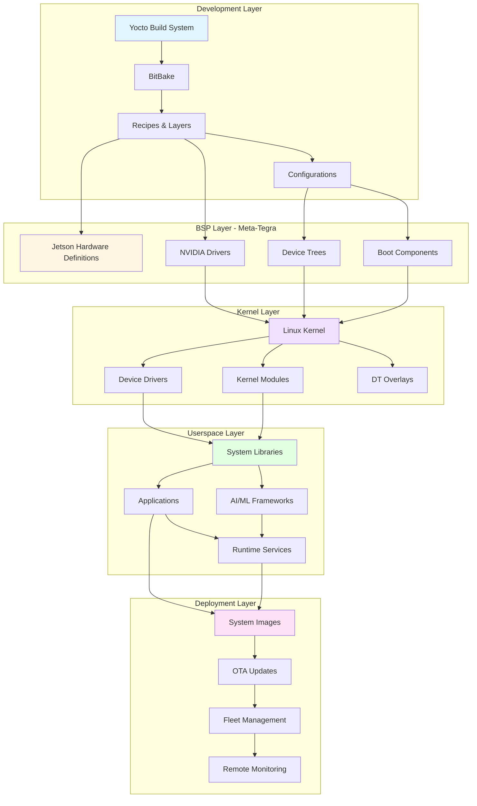
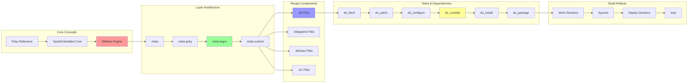
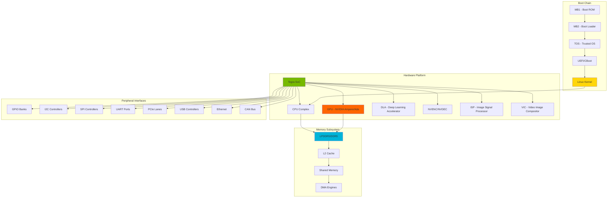
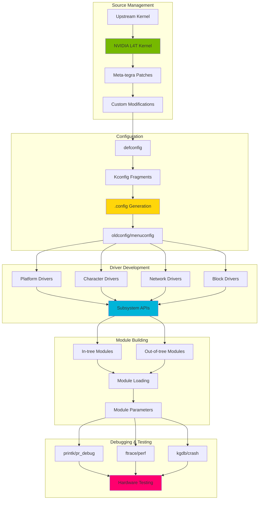
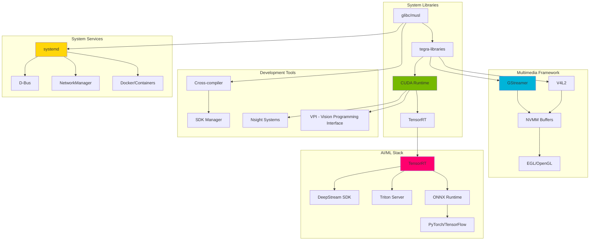
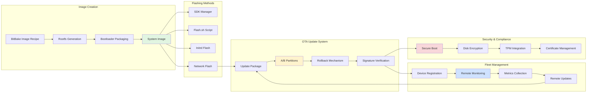
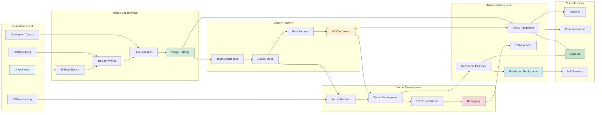
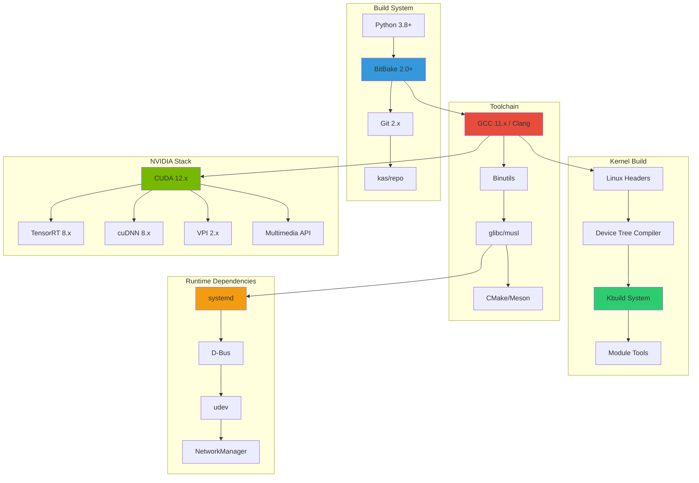

# Knowledge Integration: Concept Map
## Yocto & Meta-Tegra Learning System

This document provides visual concept maps showing the relationships between different technical domains in the Yocto and Meta-Tegra ecosystem.

---

## 1. Master System Architecture



---

## 2. Yocto Build System Concepts



---

## 3. Jetson Platform Architecture



---

## 4. Device Tree Ecosystem

```mermaid
graph LR
    subgraph "DT Sources"
        DTS1[tegra234.dtsi]
        DTS2[Board DTS]
        DTS3[Overlay DTS]
        DTS4[Fragment DTS]
    end

    subgraph "DT Compilation"
        DTC1[Device Tree Compiler]
        DTC2[DTB Binary]
        DTC3[DTBO Overlays]
    end

    subgraph "DT Nodes"
        DN1[compatible]
        DN2[reg]
        DN3[interrupts]
        DN4[clocks]
        DN5[pinctrl]
        DN6[status]
    end

    subgraph "Driver Binding"
        DB1[Platform Driver]
        DB2[of_match_table]
        DB3[probe function]
        DB4[Device Resources]
    end

    subgraph "Runtime Usage"
        RU1[/proc/device-tree]
        RU2[/sys/firmware/devicetree]
        RU3[Kernel DT API]
        RU4[libfdt]
    end

    DTS1 --> DTS2
    DTS2 --> DTS3
    DTS3 --> DTS4

    DTS4 --> DTC1
    DTC1 --> DTC2
    DTC1 --> DTC3

    DTC2 --> DN1
    DTC2 --> DN2
    DTC2 --> DN3
    DTC2 --> DN4
    DTC2 --> DN5
    DTC2 --> DN6

    DN1 --> DB2
    DN2 --> DB4
    DN3 --> DB4
    DB2 --> DB1
    DB1 --> DB3
    DB3 --> DB4

    DB4 --> RU1
    DB4 --> RU2
    RU1 --> RU3
    RU2 --> RU4

    style DTS1 fill:#e1f5e1
    style DTC1 fill:#fff3cd
    style DB1 fill:#cfe2ff
    style RU3 fill:#f8d7da
```

---

## 5. Kernel Development Flow



---

## 6. Userspace Application Stack



---

## 7. Deployment & Production Flow



---

## 8. Cross-Domain Integration Map

```mermaid
graph TB
    subgraph "Domain: GPIO Control"
        GPIO[GPIO Subsystem]
        GPIO --> GPIO_DT[Device Tree Config]
        GPIO --> GPIO_K[Kernel Driver]
        GPIO --> GPIO_U[Userspace sysfs]
        GPIO --> GPIO_Y[Yocto Recipe]
    end

    subgraph "Domain: Camera Pipeline"
        CAM[Camera System]
        CAM --> CAM_HW[MIPI CSI Hardware]
        CAM --> CAM_DRV[V4L2 Driver]
        CAM --> CAM_GST[GStreamer Plugin]
        CAM --> CAM_AI[DeepStream]
    end

    subgraph "Domain: AI Inference"
        AI[AI Pipeline]
        AI --> AI_MODEL[TensorRT Model]
        AI --> AI_RUNTIME[CUDA Runtime]
        AI --> AI_APP[Application]
        AI --> AI_DEPLOY[Container Image]
    end

    subgraph "Domain: Networking"
        NET[Network Stack]
        NET --> NET_ETH[Ethernet Driver]
        NET --> NET_WIFI[WiFi Module]
        NET --> NET_PROTO[Protocol Stack]
        NET --> NET_SERVICE[System Services]
    end

    subgraph "Integration Points"
        INT1[Yocto Builds All]
        INT2[DT Configures Hardware]
        INT3[Kernel Provides APIs]
        INT4[Systemd Orchestrates]
        INT5[Containers Package]
    end

    GPIO_Y --> INT1
    CAM_GST --> INT1
    AI_DEPLOY --> INT1
    NET_SERVICE --> INT1

    GPIO_DT --> INT2
    CAM_HW --> INT2
    AI_RUNTIME --> INT2
    NET_ETH --> INT2

    GPIO_K --> INT3
    CAM_DRV --> INT3
    AI_RUNTIME --> INT3
    NET_PROTO --> INT3

    GPIO_U --> INT4
    CAM_GST --> INT4
    AI_APP --> INT4
    NET_SERVICE --> INT4

    AI_DEPLOY --> INT5
    NET_SERVICE --> INT5

    style INT1 fill:#ff6b6b
    style INT2 fill:#4ecdc4
    style INT3 fill:#45b7d1
    style INT4 fill:#96ceb4
    style INT5 fill:#ffeaa7
```



---

## 9. Learning Progression Map



---

## 10. Technology Dependency Graph



---

## Usage Guide

### How to Navigate This Concept Map

1. **Start with Master Architecture**: Understand the big picture of how all layers interact
2. **Deep Dive into Domains**: Focus on specific areas (Yocto, Kernel, Userspace, etc.)
3. **Follow Dependencies**: Use arrows to understand prerequisite knowledge
4. **Cross-Reference**: Look at integration maps to see how domains connect
5. **Track Progress**: Use the learning progression map to plan your journey

### Recommended Learning Paths

- **Embedded Systems Engineer**: Diagrams 2 → 3 → 4 → 5 → 7
- **AI/ML Engineer**: Diagrams 3 → 6 → 8 (AI Domain)
- **DevOps Engineer**: Diagrams 2 → 7 → 8 (Deployment)
- **Hardware Engineer**: Diagrams 3 → 4 → 5 → 8 (GPIO Domain)

### Interactive Elements

Each node in the diagrams links to:
- Related tutorials in the learning system
- Documentation references
- Code examples in the repository
- Hands-on projects

---

## Related Resources

- **LEARNING-PATHWAYS.md**: Role-based learning tracks
- **SKILL-MATRIX.md**: Required skills for each domain
- **TECHNOLOGY-STACK.md**: Detailed version compatibility
- **CROSS-REFERENCES.md**: Tutorial and project connections

---

*Generated by Knowledge Integration Agent*
*Part of Yocto & Meta-Tegra Multi-Agent Learning System*
