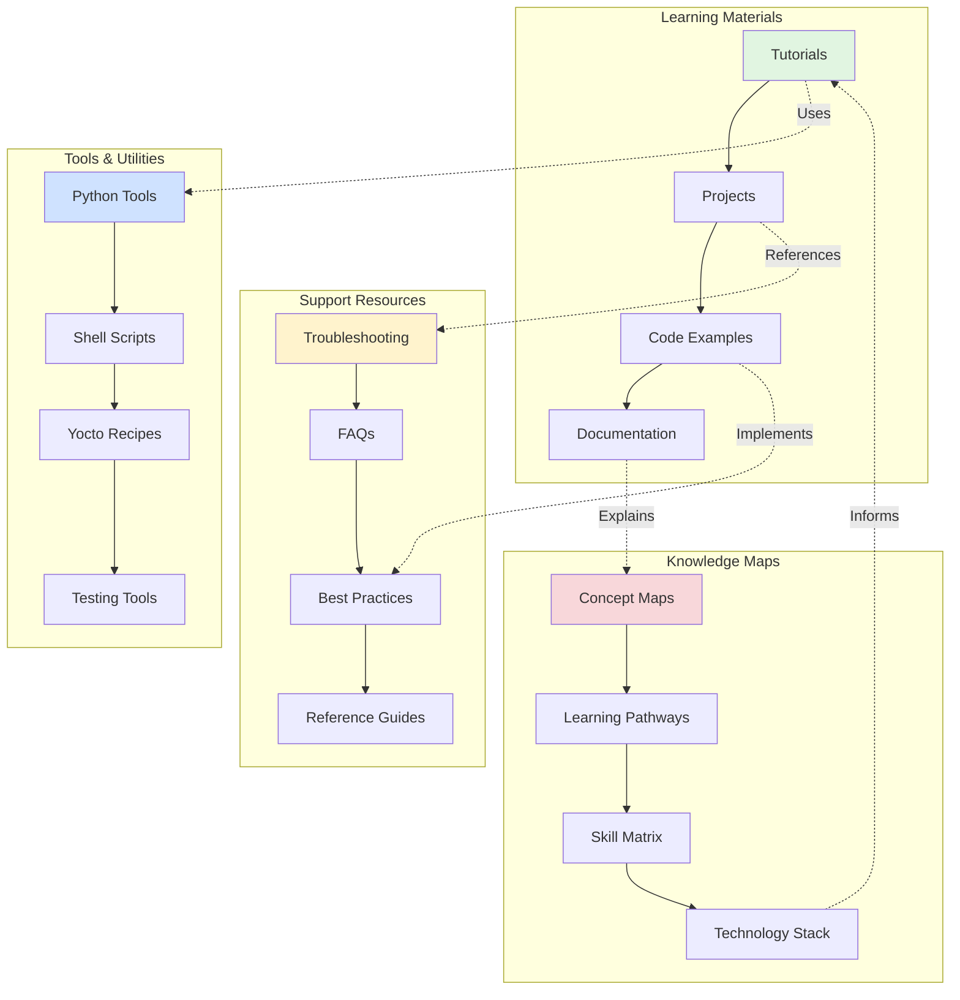
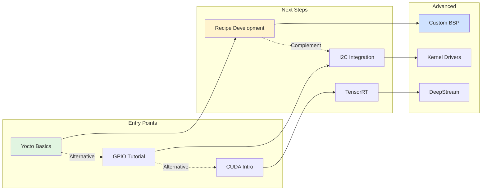
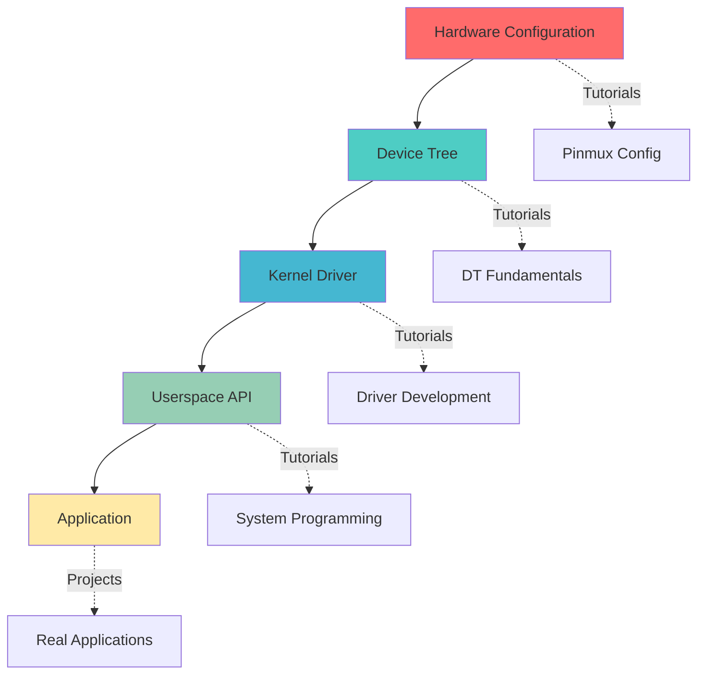
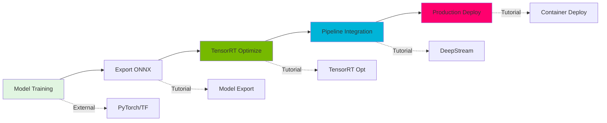
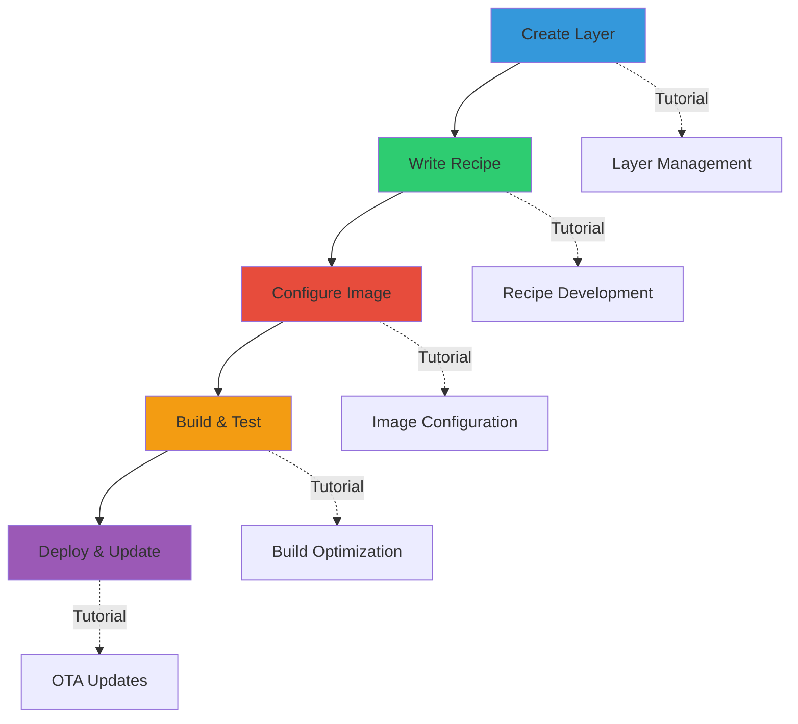

# Cross-References & Navigation Guide
## Yocto & Meta-Tegra Learning System

This document provides comprehensive cross-references between tutorials, projects, tools, and troubleshooting resources to help navigate the entire learning system.

---

## Navigation Overview



---

## Tutorial Cross-Reference Matrix

### Foundation Tutorials

#### Tutorial: Yocto Basics & BitBake

**Core Topics**:
- BitBake task execution
- Recipe syntax fundamentals
- Layer architecture
- Build directory structure

**Prerequisites**:
- None (entry point)

**Related Tutorials**:
- ➡️ **Next**: Recipe Development 101
- 🔗 **Related**: Layer Management
- 🔗 **Advanced**: Build Performance Optimization

**Uses Tools**:
- `bitbake` command
- `bitbake-layers` utility
- `devtool` for development

**Common Issues** → See:
- 🔧 [Troubleshooting: Build Failures](#build-failures)
- 🔧 [Troubleshooting: Dependency Issues](#dependency-resolution)

**Projects Using This**:
- 🎯 All beginner projects
- 🎯 Custom Layer Creation Project
- 🎯 Build System Automation

---

#### Tutorial: Recipe Development 101

**Core Topics**:
- Writing .bb files
- Source fetching (git, http, local)
- Patching source code
- do_compile and do_install

**Prerequisites**:
- ✅ Yocto Basics & BitBake
- ✅ Shell scripting fundamentals

**Related Tutorials**:
- ⬅️ **Previous**: Yocto Basics & BitBake
- ➡️ **Next**: Advanced Recipe Techniques
- 🔗 **Related**: Package Management
- 🔗 **Parallel**: Device Tree Integration

**Uses Tools**:
- `devtool add` - Create recipes
- `devtool modify` - Modify existing
- `recipetool` - Recipe utilities

**If You Liked This, Try**:
- 📚 Kernel Recipe Customization
- 📚 Creating bbappend Files
- 📚 Recipe Inheritance Patterns

**Common Issues** → See:
- 🔧 [Troubleshooting: Fetch Failures](#fetch-failures)
- 🔧 [Troubleshooting: Patch Application](#patch-issues)
- 🔧 [Troubleshooting: QA Warnings](#qa-errors)

---

### Platform Tutorials

#### Tutorial: Understanding Tegra Architecture

**Core Topics**:
- Tegra SoC components
- CPU, GPU, DLA architecture
- Memory subsystem
- Peripheral interfaces

**Prerequisites**:
- ✅ Basic hardware knowledge
- ✅ Linux fundamentals

**Related Tutorials**:
- ➡️ **Next**: GPIO Control on Jetson
- ➡️ **Next**: Device Tree Fundamentals
- 🔗 **Related**: Boot Process Deep Dive
- 🔗 **Advanced**: Performance Optimization

**Uses Tools**:
- `tegrastats` - System monitoring
- `jetson_clocks` - Performance mode
- `nvpmodel` - Power model selection

**If You Liked This, Try**:
- 📚 Power Management Strategies
- 📚 Thermal Design Guidelines
- 📚 Memory Bandwidth Optimization

**Projects Using This**:
- 🎯 Industrial IoT Gateway
- 🎯 AI Vision System
- 🎯 Robotics Platform

---

#### Tutorial: GPIO Control on Jetson Orin

**Core Topics**:
- GPIO banks and naming (PQ.05 notation)
- sysfs interface
- libgpiod library
- Interrupt-driven GPIO

**Prerequisites**:
- ✅ Understanding Tegra Architecture
- ✅ C programming basics
- ✅ Device Tree Fundamentals

**Related Tutorials**:
- ⬅️ **Previous**: Understanding Tegra Architecture
- ➡️ **Next**: I2C Device Integration
- 🔗 **Related**: Device Tree GPIO Configuration
- 🔗 **Advanced**: Kernel GPIO Driver Development

**Uses Tools**:
- `gpio_calculator.py` - Pin mapping
- `gpioinfo` - GPIO chip info
- `gpioget/gpioset` - libgpiod tools

**Code Examples**:
- Python GPIO control script
- C libgpiod example
- Kernel module with GPIO interrupts
- Device tree GPIO configuration

**If You Liked This, Try**:
- 📚 PWM Control for Motor Drivers
- 📚 SPI Communication
- 📚 Hardware Interrupt Optimization

**Common Issues** → See:
- 🔧 [Troubleshooting: GPIO Permission Denied](#gpio-permissions)
- 🔧 [Troubleshooting: GPIO Not Toggling](#gpio-hardware-issues)
- 🔧 [Troubleshooting: Pinmux Conflicts](#pinmux-debugging)

**Projects Using This**:
- 🎯 Smart Sensor Hub
- 🎯 Industrial I/O Board
- 🎯 Home Automation Controller

---

### Kernel Development Tutorials

#### Tutorial: Device Tree Fundamentals

**Core Topics**:
- DT syntax and structure
- Compatible strings
- reg, interrupts, clocks properties
- Overlay mechanism

**Prerequisites**:
- ✅ Linux kernel basics
- ✅ Understanding Tegra Architecture

**Related Tutorials**:
- ➡️ **Next**: Creating Device Tree Overlays
- 🔗 **Related**: Kernel Driver Development
- 🔗 **Related**: GPIO Control on Jetson
- 🔗 **Advanced**: Runtime Device Tree Modification

**Uses Tools**:
- `dtc` - Device tree compiler
- `fdtdump` - Binary DT dump
- `dtx_diff` - DT comparison

**Code Examples**:
- I2C sensor device tree node
- GPIO controller configuration
- Pinmux device tree
- Overlay for camera interface

**If You Liked This, Try**:
- 📚 Pinmux Configuration
- 📚 Clock Tree Management
- 📚 Power Domain Integration

**Common Issues** → See:
- 🔧 [Troubleshooting: DT Compilation Errors](#dt-syntax-errors)
- 🔧 [Troubleshooting: Driver Not Binding](#dt-driver-binding)
- 🔧 [Troubleshooting: Overlay Conflicts](#dt-overlay-issues)

---

#### Tutorial: Kernel Driver Development

**Core Topics**:
- Platform driver model
- probe() and remove() functions
- Resource management
- Character device interface

**Prerequisites**:
- ✅ C programming (advanced)
- ✅ Device Tree Fundamentals
- ✅ Linux kernel architecture

**Related Tutorials**:
- ⬅️ **Previous**: Device Tree Fundamentals
- ➡️ **Next**: Interrupt Handling
- 🔗 **Related**: Memory Management
- 🔗 **Advanced**: DMA and Zero-Copy

**Uses Tools**:
- `insmod/rmmod` - Module loading
- `dmesg` - Kernel logs
- `kgdb` - Kernel debugging
- `ftrace` - Function tracing

**Code Examples**:
- Basic platform driver skeleton
- I2C driver implementation
- Character device with ioctl
- Interrupt-driven driver

**If You Liked This, Try**:
- 📚 Kernel Synchronization Primitives
- 📚 Power Management APIs
- 📚 Advanced Debugging Techniques

**Common Issues** → See:
- 🔧 [Troubleshooting: Module Won't Load](#module-loading-errors)
- 🔧 [Troubleshooting: Kernel Oops](#kernel-crash-debugging)
- 🔧 [Troubleshooting: Resource Leaks](#memory-leak-detection)

**Projects Using This**:
- 🎯 Custom Sensor Integration
- 🎯 CAN Bus Driver
- 🎯 Industrial Protocol Stack

---

### AI/ML Tutorials

#### Tutorial: TensorRT Model Optimization

**Core Topics**:
- ONNX to TensorRT conversion
- INT8 quantization calibration
- Layer fusion
- Dynamic shapes

**Prerequisites**:
- ✅ Deep learning basics
- ✅ Python programming
- ✅ CUDA fundamentals

**Related Tutorials**:
- ⬅️ **Previous**: CUDA Programming Basics
- ➡️ **Next**: DeepStream Pipeline Development
- 🔗 **Related**: Model Deployment Strategies
- 🔗 **Advanced**: Custom TensorRT Plugins

**Uses Tools**:
- `trtexec` - Engine building and benchmarking
- `polygraphy` - Debugging and validation
- `onnx-graphsurgeon` - Model modification
- Python TensorRT API

**Code Examples**:
- ONNX conversion script
- INT8 calibration code
- Multi-batch inference
- Custom plugin implementation

**If You Liked This, Try**:
- 📚 DLA Offloading
- 📚 Mixed Precision Inference
- 📚 Model Profiling and Analysis

**Common Issues** → See:
- 🔧 [Troubleshooting: Unsupported Layers](#tensorrt-layer-support)
- 🔧 [Troubleshooting: Calibration Failures](#int8-calibration)
- 🔧 [Troubleshooting: Performance Issues](#tensorrt-optimization)

**Projects Using This**:
- 🎯 Real-time Object Detection
- 🎯 Semantic Segmentation System
- 🎯 Multi-Model Inference Pipeline

---

#### Tutorial: DeepStream Pipeline Development

**Core Topics**:
- DeepStream architecture
- GStreamer plugin chain
- Metadata handling
- Multi-stream processing

**Prerequisites**:
- ✅ GStreamer basics
- ✅ TensorRT Model Optimization
- ✅ Computer vision fundamentals

**Related Tutorials**:
- ⬅️ **Previous**: TensorRT Model Optimization
- ➡️ **Next**: Custom DeepStream Plugin
- 🔗 **Related**: Video Encoding/Decoding
- 🔗 **Advanced**: Triton Integration

**Uses Tools**:
- `deepstream-app` - Reference application
- `gst-inspect-1.0` - Plugin inspection
- `nvds_analytics` - Analytics plugin
- Python/C++ DeepStream API

**Code Examples**:
- 4-stream detection pipeline
- Custom tracker configuration
- Metadata extraction
- RTSP streaming output

**If You Liked This, Try**:
- 📚 Custom Tracker Development
- 📚 Analytics Plugin Configuration
- 📚 Cloud Integration (AWS/Azure)

**Common Issues** → See:
- 🔧 [Troubleshooting: Pipeline Stalls](#deepstream-performance)
- 🔧 [Troubleshooting: Memory Issues](#deepstream-memory)
- 🔧 [Troubleshooting: Sync Problems](#multi-stream-sync)

**Projects Using This**:
- 🎯 Traffic Monitoring System
- 🎯 Retail Analytics
- 🎯 Security Surveillance

---

### DevOps & Deployment Tutorials

#### Tutorial: OTA Update System Implementation

**Core Topics**:
- A/B partition strategy
- SWUpdate configuration
- Update package creation
- Rollback mechanisms

**Prerequisites**:
- ✅ Yocto image creation
- ✅ System administration
- ✅ Security basics

**Related Tutorials**:
- ⬅️ **Previous**: Custom Image Creation
- ➡️ **Next**: Fleet Management
- 🔗 **Related**: Secure Boot Configuration
- 🔗 **Advanced**: Delta Updates

**Uses Tools**:
- SWUpdate framework
- RAUC (alternative)
- hawkBit server (optional)
- Update verification scripts

**Code Examples**:
- sw-description file
- Update handler scripts
- Bootloader integration
- Health check implementation

**If You Liked This, Try**:
- 📚 Remote Provisioning
- 📚 Secure Update Chain
- 📚 Update Orchestration

**Common Issues** → See:
- 🔧 [Troubleshooting: Update Failures](#ota-update-errors)
- 🔧 [Troubleshooting: Rollback Issues](#rollback-failures)
- 🔧 [Troubleshooting: Verification Errors](#update-verification)

**Projects Using This**:
- 🎯 Fleet Management System
- 🎯 Edge Device Orchestration
- 🎯 Production Deployment Platform

---

## Project Cross-Reference Matrix

### Beginner Projects

#### Project: Custom Yocto Layer for Jetson

**Difficulty**: Beginner
**Duration**: 8-10 hours
**Skills Practiced**:
- Layer creation
- Basic recipe writing
- Machine configuration
- Image building

**Prerequisites**:
- ✅ Yocto Basics & BitBake
- ✅ Recipe Development 101

**Uses Tutorials**:
- 📚 Yocto Basics & BitBake
- 📚 Layer Management
- 📚 Image Configuration

**Prepares You For**:
- 🎯 GPIO Sensor Integration (Intermediate)
- 🎯 Custom BSP Development (Advanced)

**Common Challenges**:
- Layer priority conflicts
- Recipe dependency issues
- Configuration variable overrides

**Related Projects**:
- 🔗 Meta-layer for Industrial I/O
- 🔗 Custom Image with Specific Packages

---

#### Project: GPIO-Controlled LED Blinker

**Difficulty**: Beginner
**Duration**: 4-6 hours
**Skills Practiced**:
- GPIO configuration
- Python/C programming
- Device tree basics
- systemd service creation

**Prerequisites**:
- ✅ GPIO Control on Jetson
- ✅ Device Tree Fundamentals

**Uses Tutorials**:
- 📚 GPIO Control on Jetson Orin
- 📚 Device Tree Fundamentals
- 📚 systemd Service Creation

**Prepares You For**:
- 🎯 Smart Sensor Hub (Intermediate)
- 🎯 Industrial I/O Controller (Advanced)

**Code Components**:
- Python GPIO control script
- systemd service file
- Device tree overlay
- Yocto recipe for deployment

**If You Completed This, Try**:
- 🎯 PWM Motor Controller
- 🎯 I2C Sensor Reader
- 🎯 Multi-pin Pattern Generator

---

### Intermediate Projects

#### Project: Smart Sensor Hub with I2C/SPI

**Difficulty**: Intermediate
**Duration**: 15-20 hours
**Skills Practiced**:
- Kernel driver development
- Device tree configuration
- Multi-sensor integration
- Data processing pipeline

**Prerequisites**:
- ✅ GPIO Control on Jetson
- ✅ Kernel Driver Development
- ✅ Device Tree Fundamentals

**Uses Tutorials**:
- 📚 I2C Device Integration
- 📚 SPI Communication
- 📚 Kernel Driver Development
- 📚 Device Tree Overlays

**Uses Tools**:
- `i2c-tools` for debugging
- `spidev` for testing
- Custom kernel module
- Python data processing

**Prepares You For**:
- 🎯 Industrial IoT Gateway (Advanced)
- 🎯 Environmental Monitoring System (Advanced)

**Common Challenges**:
- Bus timing issues
- Interrupt handling
- Power management
- Data synchronization

**Related Projects**:
- 🔗 CAN Bus Interface
- 🔗 Modbus RTU Gateway
- 🔗 Multi-Protocol Converter

---

#### Project: Real-Time Object Detection System

**Difficulty**: Intermediate
**Duration**: 20-25 hours
**Skills Practiced**:
- TensorRT optimization
- GStreamer pipeline
- Camera integration
- Performance tuning

**Prerequisites**:
- ✅ TensorRT Model Optimization
- ✅ GStreamer Basics
- ✅ Camera Interface Setup

**Uses Tutorials**:
- 📚 TensorRT Model Optimization
- 📚 Camera Pipeline Setup
- 📚 DeepStream Basics
- 📚 Performance Profiling

**Uses Tools**:
- TensorRT for inference
- GStreamer for pipeline
- Nsight Systems for profiling
- Custom tracking algorithm

**Prepares You For**:
- 🎯 Multi-Camera Surveillance (Advanced)
- 🎯 Traffic Analytics System (Advanced)
- 🎯 Robotics Vision Stack (Advanced)

**Code Components**:
- Model conversion scripts
- GStreamer pipeline code
- Post-processing algorithms
- Visualization and output

**If You Completed This, Try**:
- 🎯 Semantic Segmentation System
- 🎯 Pose Estimation Application
- 🎯 3D Object Detection

**Common Issues** → See:
- 🔧 [Troubleshooting: Low FPS](#performance-optimization)
- 🔧 [Troubleshooting: Memory Errors](#memory-management)
- 🔧 [Troubleshooting: Model Accuracy](#model-calibration)

---

### Advanced Projects

#### Project: Autonomous Mobile Robot Platform

**Difficulty**: Advanced
**Duration**: 60-80 hours
**Skills Practiced**:
- ROS2 integration
- Multi-sensor fusion
- AI perception pipeline
- System integration
- Real-time control

**Prerequisites**:
- ✅ ROS2 Fundamentals
- ✅ Real-Time Object Detection
- ✅ Motor Control & PWM
- ✅ Sensor Integration

**Uses Tutorials**:
- 📚 ROS2 on Yocto
- 📚 DeepStream Pipeline Development
- 📚 SLAM Integration
- 📚 Navigation Stack Setup
- 📚 Real-time Kernel Configuration

**Uses Tools**:
- ROS2 navigation stack
- TensorRT for perception
- Custom control algorithms
- Fleet management interface

**Integrates Components**:
- Camera perception (4x cameras)
- LiDAR SLAM
- IMU fusion
- Motor controllers
- Safety systems

**Prepares You For**:
- Career in robotics engineering
- Autonomous systems development
- Complex system integration

**Related Projects**:
- 🔗 Warehouse Automation Robot
- 🔗 Agricultural Autonomous Vehicle
- 🔗 Inspection Drone Controller

**Common Challenges**:
- Sensor synchronization
- Real-time performance
- Power management
- Safety certification

---

#### Project: Industrial Edge AI Gateway

**Difficulty**: Advanced
**Duration**: 50-70 hours
**Skills Practiced**:
- Complete system design
- Multi-protocol support
- AI inference pipeline
- OTA updates
- Fleet management
- Security hardening

**Prerequisites**:
- ✅ OTA Update System
- ✅ TensorRT Optimization
- ✅ Network Protocol Stack
- ✅ Security & Encryption

**Uses Tutorials**:
- 📚 OTA Update Implementation
- 📚 Container Deployment
- 📚 Industrial Protocol Integration
- 📚 Security Hardening
- 📚 Fleet Management

**Uses Tools**:
- Docker for containerization
- SWUpdate for OTA
- MQTT for IoT communication
- Grafana for monitoring

**Integrates Components**:
- Multi-sensor interfaces
- Edge AI processing
- Cloud connectivity
- Local data storage
- Secure boot chain

**Deliverables**:
- Complete Yocto image
- OTA update system
- Monitoring dashboard
- API documentation
- Deployment guide

**Related Projects**:
- 🔗 Smart Factory Controller
- 🔗 Energy Management System
- 🔗 Predictive Maintenance Platform

---

## "If You Liked X, Try Y" Recommendations

### Tutorial Recommendations



#### If You Liked: Yocto Basics
**Try These Next**:
1. ⭐ Recipe Development 101 (natural progression)
2. ⭐ Layer Management (expand knowledge)
3. ⭐ Build Performance Optimization (practical skill)
4. 🔀 Device Tree Fundamentals (parallel track)
5. 🔀 Container Integration (modern approach)

**Why**: These build directly on BitBake knowledge while expanding your Yocto mastery.

---

#### If You Liked: GPIO Control
**Try These Next**:
1. ⭐ I2C Device Integration (similar interface)
2. ⭐ SPI Communication (similar concepts)
3. ⭐ PWM Motor Control (related hardware)
4. 🔀 Interrupt Handling (deeper understanding)
5. 🔀 Real-time GPIO Performance (optimization)

**Why**: Natural progression through peripheral interfaces with increasing complexity.

---

#### If You Liked: TensorRT Optimization
**Try These Next**:
1. ⭐ DeepStream Pipeline (practical application)
2. ⭐ Custom TensorRT Plugins (advanced)
3. ⭐ Multi-Model Inference (scaling)
4. 🔀 DLA Offloading (alternative accelerator)
5. 🔀 Triton Inference Server (deployment)

**Why**: Builds on TensorRT skills with practical deployment scenarios.

---

#### If You Liked: Device Tree Fundamentals
**Try These Next**:
1. ⭐ Device Tree Overlays (dynamic configuration)
2. ⭐ Pinmux Configuration (related topic)
3. ⭐ Runtime DT Modification (advanced)
4. 🔀 Kernel Driver Development (uses DT)
5. 🔀 Boot Process Analysis (system understanding)

**Why**: Deepens hardware configuration knowledge across the stack.

---

### Project Recommendations

#### If You Completed: GPIO LED Blinker
**Try These Next**:
1. ⭐⭐ PWM Motor Controller (natural progression)
2. ⭐⭐ I2C Sensor Hub (more complex I/O)
3. ⭐ Button & Interrupt Demo (event-driven)
4. ⭐⭐⭐ Smart Home Controller (integration)

**Why**: Gradually increase complexity while building on GPIO skills.

---

#### If You Completed: Real-Time Object Detection
**Try These Next**:
1. ⭐⭐⭐ Multi-Camera Surveillance (scaling)
2. ⭐⭐⭐ Tracking and Analytics (deeper vision)
3. ⭐⭐⭐ Action Recognition (temporal)
4. ⭐⭐⭐⭐ Robotics Vision Stack (integration)

**Why**: Expands vision capabilities and real-world applications.

---

#### If You Completed: OTA Update System
**Try These Next**:
1. ⭐⭐⭐ Fleet Management Platform (scaling)
2. ⭐⭐⭐ Remote Provisioning (automation)
3. ⭐⭐⭐ Delta Update Optimization (efficiency)
4. ⭐⭐⭐⭐ Complete DevOps Pipeline (integration)

**Why**: Builds production-ready deployment capabilities.

---

## Common Patterns Across Domains

### Pattern 1: Hardware-to-Software Stack



**Applies To**:
- GPIO, I2C, SPI, UART, PCIe, USB
- Camera, Display, Audio
- Sensors, Actuators, Custom hardware

**Tutorials Following This Pattern**:
1. GPIO Control on Jetson
2. I2C Device Integration
3. Camera Pipeline Setup
4. Display Configuration

**Projects Following This Pattern**:
1. Smart Sensor Hub
2. Industrial I/O Controller
3. Custom Peripheral Integration

---

### Pattern 2: AI Model to Deployment



**Applies To**:
- Object detection, segmentation, classification
- Pose estimation, depth estimation
- Action recognition, tracking

**Tutorials Following This Pattern**:
1. TensorRT Model Optimization
2. DeepStream Pipeline Development
3. Triton Server Deployment
4. Container-based AI Deployment

**Projects Following This Pattern**:
1. Real-Time Object Detection
2. Traffic Monitoring System
3. Retail Analytics Platform
4. Security Surveillance

---

### Pattern 3: Yocto Integration Workflow



**Applies To**:
- All software component integration
- System image creation
- Package management
- Production deployment

**Tutorials Following This Pattern**:
1. Custom Layer Creation
2. Recipe Development 101
3. Image Configuration
4. OTA Update System

**Projects Following This Pattern**:
1. All Yocto-based projects
2. Custom BSP Development
3. Production System Images

---

## Troubleshooting Cross-References

### Build & Configuration Issues

#### Build Failures

**Symptom**: BitBake build fails with errors

**Common in Tutorials**:
- Yocto Basics & BitBake
- Recipe Development 101
- Custom Image Creation

**Related to Projects**:
- All projects using Yocto

**Diagnosis Steps**:
1. Check `bitbake -e <recipe>` for variable expansion
2. Review `temp/log.do_<task>` in work directory
3. Verify layer priorities with `bitbake-layers show-layers`
4. Check dependency chain with `bitbake -g <recipe>`

**Common Causes**:
- Missing dependencies (DEPENDS/RDEPENDS)
- Incorrect SRC_URI or checksums
- Recipe syntax errors
- Layer configuration conflicts

**Solutions**:
→ See Tutorial: [Debugging Build Failures]
→ See Tool: [build_analyzer.py]
→ See FAQ: [Common BitBake Errors]

**Related Issues**:
- 🔗 [Dependency Resolution](#dependency-resolution)
- 🔗 [Fetch Failures](#fetch-failures)
- 🔗 [QA Errors](#qa-errors)

---

#### Dependency Resolution

**Symptom**: "Nothing PROVIDES" or circular dependency errors

**Common in Tutorials**:
- Recipe Development 101
- Package Management
- Custom Image Creation

**Diagnosis Steps**:
1. Check with `bitbake -g <recipe> && cat pn-depends.dot`
2. Verify DEPENDS vs RDEPENDS usage
3. Check for virtual providers
4. Review PREFERRED_PROVIDER settings

**Solutions**:
- Add missing packages to DEPENDS/RDEPENDS
- Set PREFERRED_PROVIDER for virtual packages
- Check layer priority for conflicting providers
- Use `bitbake-layers show-recipes` to find providers

**Related Issues**:
- 🔗 [Build Failures](#build-failures)
- 🔗 [Package Conflicts](#package-conflicts)

---

#### Fetch Failures

**Symptom**: do_fetch task fails

**Common in Tutorials**:
- Recipe Development 101
- Kernel Customization
- Third-party Package Integration

**Diagnosis Steps**:
1. Check network connectivity
2. Verify SRC_URI syntax
3. Check SRC_REV for git fetches
4. Verify checksums (SRC_URI[sha256sum])

**Common Causes**:
- Network/proxy issues
- Incorrect URL or protocol
- Missing authentication
- Checksum mismatch

**Solutions**:
- Update SRC_URI to valid location
- Configure HTTP proxy if needed
- Use mirrors with PREMIRRORS
- Update checksums after source changes

**Related Issues**:
- 🔗 [Patch Issues](#patch-issues)
- 🔗 [Git Fetch Problems](#git-fetching)

---

### Hardware & Driver Issues

#### GPIO Permissions

**Symptom**: Permission denied accessing /sys/class/gpio

**Common in Tutorials**:
- GPIO Control on Jetson
- Smart Sensor Hub

**Common in Projects**:
- GPIO LED Blinker
- Industrial I/O Controller

**Diagnosis Steps**:
1. Check file permissions: `ls -l /sys/class/gpio/`
2. Verify user groups: `groups`
3. Check udev rules: `cat /etc/udev/rules.d/*gpio*`

**Solutions**:
- Add user to gpio group: `sudo usermod -aG gpio $USER`
- Create udev rule:
  ```
  SUBSYSTEM=="gpio", MODE="0666"
  ```
- Use libgpiod instead of sysfs
- Run with sudo (not recommended for production)

**Related Issues**:
- 🔗 [GPIO Hardware Issues](#gpio-hardware-issues)
- 🔗 [Pinmux Debugging](#pinmux-debugging)

---

#### GPIO Hardware Issues

**Symptom**: GPIO value doesn't change or read incorrectly

**Common in Tutorials**:
- GPIO Control on Jetson
- Device Tree Fundamentals

**Diagnosis Steps**:
1. Verify pinmux configuration
2. Check device tree GPIO properties
3. Measure voltage with multimeter
4. Check for hardware conflicts

**Solutions**:
- Configure pinmux with `jetson-io`
- Update device tree overlay
- Check for pull-up/pull-down requirements
- Verify no other driver claims the pin

**Tools**:
- `sudo /opt/nvidia/jetson-io/jetson-io.py`
- `sudo cat /sys/kernel/debug/gpio`
- `gpio_calculator.py` for pin mapping

**Related Issues**:
- 🔗 [Pinmux Debugging](#pinmux-debugging)
- 🔗 [Device Tree Issues](#dt-driver-binding)

---

#### Pinmux Debugging

**Symptom**: Pin not functioning in expected mode

**Common in Tutorials**:
- GPIO Control
- I2C/SPI Integration
- Custom Hardware Integration

**Diagnosis Steps**:
1. Check pinmux state: `/sys/kernel/debug/pinctrl/`
2. Review device tree pinctrl nodes
3. Check for conflicts in pin assignment
4. Verify tegra-pinmux driver loaded

**Solutions**:
- Use jetson-io tool to configure
- Add pinctrl properties to device tree
- Check for pin conflicts with:
  ```bash
  sudo cat /sys/kernel/debug/pinctrl/2430000.pinmux/pinmux-pins
  ```

**Related Issues**:
- 🔗 [GPIO Hardware Issues](#gpio-hardware-issues)
- 🔗 [DT Driver Binding](#dt-driver-binding)

---

### AI/ML Performance Issues

#### TensorRT Layer Support

**Symptom**: Layer not supported by TensorRT

**Common in Tutorials**:
- TensorRT Model Optimization
- Custom Model Deployment

**Diagnosis Steps**:
1. Check TensorRT version compatibility
2. Review unsupported layer types
3. Test with `trtexec --verbose`

**Solutions**:
- Implement custom plugin
- Use ONNX-GraphSurgeon to modify model
- Fall back to CUDA implementation
- Update to newer TensorRT version

**Code Example**:
```python
# Custom plugin registration
import tensorrt as trt
trt.init_libnvinfer_plugins(logger, '')
```

**Related Issues**:
- 🔗 [TensorRT Optimization](#tensorrt-optimization)
- 🔗 [Model Calibration](#model-calibration)

---

#### INT8 Calibration

**Symptom**: INT8 calibration fails or accuracy drops

**Common in Tutorials**:
- TensorRT Model Optimization
- Model Quantization

**Diagnosis Steps**:
1. Verify calibration dataset representative
2. Check calibration cache generation
3. Compare FP32 vs INT8 accuracy
4. Review layer precision fallback

**Solutions**:
- Use more representative calibration data
- Increase calibration dataset size
- Use mixed precision (some layers FP16)
- Adjust calibration parameters

**Code Example**:
```python
# Calibration data iterator
class CalibrationDataReader(trt.IInt8MinMaxCalibrator):
    def __init__(self, calibration_files):
        # Implementation
        pass
```

**Related Issues**:
- 🔗 [TensorRT Layer Support](#tensorrt-layer-support)
- 🔗 [Model Accuracy](#model-calibration)

---

#### DeepStream Performance

**Symptom**: Low FPS or pipeline stalls

**Common in Tutorials**:
- DeepStream Pipeline Development
- Multi-Camera Integration

**Common in Projects**:
- Traffic Monitoring System
- Real-Time Object Detection

**Diagnosis Steps**:
1. Profile with `tegrastats`
2. Check GPU utilization
3. Monitor pipeline buffers
4. Check for memory leaks

**Solutions**:
- Adjust batch size in nvinfer
- Enable DLA for supported models
- Optimize buffer pool sizes
- Use nvstreammux properly
- Enable jetson_clocks for max performance

**Configuration**:
```ini
[property]
batch-size=4
interval=0
gpu-id=0
dla-id=0  # Enable DLA
```

**Related Issues**:
- 🔗 [Memory Management](#deepstream-memory)
- 🔗 [Multi-Stream Sync](#multi-stream-sync)

---

### Deployment & OTA Issues

#### OTA Update Errors

**Symptom**: Update fails to apply or boot

**Common in Tutorials**:
- OTA Update System
- Secure Boot Configuration

**Common in Projects**:
- Fleet Management System
- Industrial Edge Gateway

**Diagnosis Steps**:
1. Check update logs in /var/log
2. Verify update package signature
3. Check partition availability
4. Review bootloader configuration

**Solutions**:
- Verify sw-description syntax
- Check signature keys match
- Ensure sufficient space
- Test rollback mechanism

**Testing**:
```bash
# Simulate update
swupdate -i update.swu -v

# Check boot partition
sudo efibootmgr -v
```

**Related Issues**:
- 🔗 [Rollback Failures](#rollback-failures)
- 🔗 [Update Verification](#update-verification)

---

## Tool Cross-Reference

### Python Tools

#### gpio_calculator.py
**Used In**:
- Tutorial: GPIO Control on Jetson
- Tutorial: Device Tree Fundamentals
- Project: GPIO LED Blinker

**Functionality**:
- Convert Tegra GPIO names to Linux numbers
- Validate GPIO accessibility
- Generate device tree snippets

**Related Tools**:
- `gpioinfo` (libgpiod)
- `jetson-io` (NVIDIA tool)

---

#### recipe_generator.py
**Used In**:
- Tutorial: Recipe Development 101
- Tutorial: Kernel Recipe Customization
- All Yocto-based projects

**Functionality**:
- Generate BitBake recipe templates
- Create kernel module recipes
- Generate bbappend files

**Related Tools**:
- `devtool` (Yocto built-in)
- `recipetool` (Yocto built-in)

---

#### model_optimizer.py
**Used In**:
- Tutorial: TensorRT Model Optimization
- Tutorial: Model Deployment
- AI/ML projects

**Functionality**:
- Convert models to TensorRT
- Run INT8 calibration
- Benchmark inference performance

**Related Tools**:
- `trtexec` (NVIDIA)
- `polygraphy` (NVIDIA)

---

## Quick Navigation Matrix

| I Want To... | Start With Tutorial | Use Tool | Try Project | See Troubleshooting |
|--------------|-------------------|----------|-------------|-------------------|
| Learn Yocto basics | Yocto Basics & BitBake | bitbake-layers | Custom Layer | Build Failures |
| Control GPIO | GPIO Control on Jetson | gpio_calculator.py | LED Blinker | GPIO Permissions |
| Integrate sensor | I2C Device Integration | i2c-tools | Sensor Hub | Driver Binding |
| Optimize AI model | TensorRT Optimization | trtexec | Object Detection | Layer Support |
| Build vision pipeline | DeepStream Development | deepstream-app | Surveillance | Performance Issues |
| Deploy to fleet | OTA Update System | swupdate | Fleet Management | Update Errors |
| Develop kernel driver | Kernel Driver Development | kgdb | Custom Driver | Module Loading |
| Configure device tree | DT Fundamentals | dtc | Hardware Integration | DT Compilation |

---

*Generated by Knowledge Integration Agent*
*Part of Yocto & Meta-Tegra Multi-Agent Learning System*
