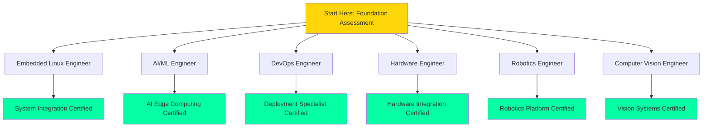

```mermaid
graph LR
    subgraph "Phase 1: Platform (2 weeks)"
        H1M1[Tegra Architecture]
        H1M2[Reference Designs]
        H1M3[Power Architecture]
        H1M4[Thermal Design]
    end

    subgraph "Phase 2: Interfaces (3 weeks)"
        H2M1[GPIO & Pinmux]
        H2M2[I2C & SPI]
        H2M3[PCIe & USB]
        H2M4[Display & Camera]
    end

    subgraph "Phase 3: Firmware (3 weeks)"
        H3M1[Boot Firmware]
        H3M2[Device Trees]
        H3M3[Driver Development]
        H3M4[Hardware Debug]
    end

    subgraph "Phase 4: Integration (3 weeks)"
        H4M1[Custom Carrier Board]
        H4M2[Bring-up Procedures]
        H4M3[Validation Testing]
        H4M4[Production Test]
    end

    subgraph "Phase 5: Advanced (2 weeks)"
        H5M1[High-Speed Design]
        H5M2[EMI/EMC]
        H5M3[Certification]
        H5M4[Manufacturing]
    end

    H1M1 --> H1M2 --> H1M3 --> H1M4
    H1M4 --> H2M1
    H2M1 --> H2M2 --> H2M3 --> H2M4
    H2M4 --> H3M1
    H3M1 --> H3M2 --> H3M3 --> H3M4
    H3M4 --> H4M1
    H4M1 --> H4M2 --> H4M3 --> H4M4
    H4M4 --> H5M1
    H5M1 --> H5M2 --> H5M3 --> H5M4

    style H1M1 fill:#ff6b6b
    style H2M1 fill:#4ecdc4
    style H3M1 fill:#45b7d1
    style H4M1 fill:#96ceb4
    style H5M1 fill:#ffeaa7
```

# Learning Pathways
## Yocto & Meta-Tegra Learning System

This document provides structured learning paths tailored for different roles and career goals. Each pathway includes prerequisites, progression steps, estimated timelines, and certification milestones.

---

## Overview of Learning Pathways

---

## Pathway 1: Embedded Linux Engineer

### Target Audience
System engineers building custom Linux distributions for Jetson platforms, focusing on BSP development, kernel customization, and system optimization.

### Prerequisites
- [ ] Linux command line proficiency
- [ ] C programming fundamentals
- [ ] Basic understanding of build systems
- [ ] Git version control experience

### Learning Journey

### Module Breakdown

#### Phase 1: Yocto Foundation (2 weeks)
**Week 1: Core Concepts**
- Introduction to Yocto Project
- BitBake architecture and workflow
- Understanding layers and configurations
- First recipe: Hello World
- **Lab**: Build core-image-minimal
- **Time**: 15 hours

**Week 2: Recipe Development**
- Recipe syntax and variables
- Dependencies and task ordering
- bbappend and override mechanisms
- Creating custom layers
- **Lab**: Create meta-myproject layer
- **Time**: 15 hours

#### Phase 2: Jetson Platform (3 weeks)
**Week 3: Hardware Understanding**
- Tegra SoC architecture
- Jetson module comparison (Nano, Xavier, Orin)
- Peripheral interfaces overview
- Power management architecture
- **Lab**: Hardware inventory and mapping
- **Time**: 10 hours

**Week 4: Meta-tegra Deep Dive**
- Layer structure and organization
- Machine configurations
- NVIDIA driver integration
- Flash tools and deployment
- **Lab**: Build tegra-minimal-initramfs
- **Time**: 12 hours

**Week 5: Device Trees & Boot**
- Device tree fundamentals
- Jetson-specific DT structure
- Boot chain: MB1 → MB2 → UEFI → Kernel
- Customizing boot configuration
- **Lab**: Create custom device tree overlay
- **Time**: 13 hours

#### Phase 3: Kernel Development (4 weeks)
**Week 6: Kernel Configuration**
- Linux kernel structure
- Kconfig system
- defconfig and fragments
- Meta-tegra kernel recipes
- **Lab**: Enable custom kernel features
- **Time**: 10 hours

**Week 7-8: Driver Development**
- Platform driver model
- GPIO, I2C, SPI drivers
- Character device drivers
- DMA and interrupts
- **Lab**: Implement I2C sensor driver
- **Time**: 20 hours

**Week 9: Advanced Topics**
- Device tree runtime overlays
- Kernel debugging (kgdb, ftrace)
- Performance profiling
- Power management APIs
- **Lab**: Debug and optimize driver performance
- **Time**: 15 hours

#### Phase 4: System Integration (3 weeks)
**Week 10: Custom Images**
- Image recipes and features
- Package groups
- SDK generation
- Licensing compliance
- **Lab**: Build production-ready image
- **Time**: 12 hours

**Week 11: Package Management**
- RPM/DEB/IPK formats
- Package feeds
- Runtime package installation
- Version management
- **Lab**: Set up package repository
- **Time**: 10 hours

**Week 12: System Services**
- systemd integration
- D-Bus services
- udev rules
- Network configuration
- **Lab**: Create custom system service
- **Time**: 13 hours

#### Phase 5: Production & Advanced (4 weeks)
**Week 13: Real-time Systems**
- RT-PREEMPT kernel
- Latency optimization
- Priority inheritance
- CPU isolation
- **Lab**: Achieve <100μs latency
- **Time**: 15 hours

**Week 14: Security**
- Secure Boot implementation
- Disk encryption (LUKS)
- TPM integration
- Security hardening
- **Lab**: Implement full secure boot chain
- **Time**: 12 hours

**Week 15-16: Production Deployment**
- A/B partition schemes
- OTA update systems (SWUpdate, RAUC)
- Fleet management
- Monitoring and telemetry
- **Lab**: End-to-end OTA system
- **Time**: 18 hours

### Capstone Project
**Smart Industrial Gateway** (40 hours)
- Custom Yocto image for Jetson Orin
- Multiple sensor interfaces (I2C, SPI, CAN)
- Real-time data acquisition kernel module
- Secure OTA update system
- Cloud connectivity with telemetry
- Production-ready deployment package

### Total Time Investment
- **Core Learning**: 180 hours (16 weeks)
- **Capstone Project**: 40 hours
- **Total**: 220 hours (~5.5 months part-time)

### Certification Requirements
- [ ] Complete all 16 weeks of modules
- [ ] Submit capstone project
- [ ] Pass technical assessment (90% threshold)
- [ ] Peer code review participation

---

## Pathway 2: AI/ML Engineer

### Target Audience
ML engineers deploying AI models on Jetson edge devices, focusing on inference optimization, vision pipelines, and model deployment.

### Prerequisites
- [ ] Python programming proficiency
- [ ] Machine learning fundamentals
- [ ] CUDA basics (helpful but not required)
- [ ] Linux command line comfort

### Learning Journey

### Module Breakdown

#### Phase 1: Jetson AI Platform (2 weeks)
- Jetson hardware capabilities (GPU, DLA, NVENC)
- JetPack SDK components
- Building AI-focused Yocto images
- Development tools (Nsight, VPI)
- **Lab**: Deploy PyTorch model on Jetson
- **Time**: 20 hours

#### Phase 2: AI Runtime Optimization (3 weeks)
- CUDA programming essentials
- TensorRT model conversion and optimization
- INT8 quantization and calibration
- Dynamic shapes and plugins
- **Lab**: Convert and optimize ONNX model
- **Time**: 30 hours

#### Phase 3: Vision Pipeline (3 weeks)
- GStreamer architecture and plugins
- DeepStream SDK fundamentals
- VPI computer vision acceleration
- Multi-camera synchronization
- **Lab**: Build real-time detection pipeline
- **Time**: 30 hours

#### Phase 4: Model Deployment (3 weeks)
- Triton Inference Server setup
- Model versioning and ensembles
- Container-based deployment
- HTTP/gRPC inference APIs
- **Lab**: Deploy multi-model inference service
- **Time**: 25 hours

#### Phase 5: Production AI Systems (3 weeks)
- Edge AI architecture patterns
- A/B model testing
- Performance profiling and optimization
- Monitoring and alerting
- **Lab**: Production-ready AI system
- **Time**: 30 hours

### Capstone Project
**Intelligent Traffic Monitoring System** (45 hours)
- Multi-camera vehicle detection and tracking
- TensorRT-optimized object detection
- License plate recognition pipeline
- Real-time analytics dashboard
- Cloud integration for insights
- Automated model update system

### Total Time Investment
- **Core Learning**: 135 hours (14 weeks)
- **Capstone Project**: 45 hours
- **Total**: 180 hours (~4.5 months part-time)

---

## Pathway 3: DevOps Engineer

### Target Audience
DevOps engineers responsible for CI/CD, deployment automation, fleet management, and infrastructure for Jetson-based systems.

### Prerequisites
- [ ] Linux system administration
- [ ] Container technologies (Docker/Kubernetes)
- [ ] CI/CD pipeline experience
- [ ] Infrastructure as Code familiarity

### Learning Journey

### Module Breakdown

#### Phase 1: Build Automation (2 weeks)
- Jenkins/GitLab CI for Yocto
- Automated testing frameworks
- Build caching strategies
- Binary artifact management
- **Lab**: Set up complete CI/CD pipeline
- **Time**: 20 hours

#### Phase 2: Containerization (2 weeks)
- Docker optimization for Jetson
- NVIDIA Container Runtime setup
- Multi-architecture builds
- Container registry management
- **Lab**: Build and deploy CUDA container
- **Time**: 18 hours

#### Phase 3: OTA Deployment (3 weeks)
- SWUpdate and RAUC comparison
- Dual-partition strategy
- Signature and encryption
- Update server infrastructure
- **Lab**: Implement complete OTA system
- **Time**: 28 hours

#### Phase 4: Fleet Management (3 weeks)
- Device provisioning automation
- Remote SSH/VPN access
- Prometheus/Grafana monitoring
- ELK stack for log analysis
- **Lab**: Monitor 10+ Jetson devices
- **Time**: 26 hours

#### Phase 5: Production Operations (2 weeks)
- Security scanning and hardening
- Backup and recovery procedures
- Compliance reporting (SBOM, CVE)
- Horizontal scaling strategies
- **Lab**: Production readiness checklist
- **Time**: 16 hours

### Capstone Project
**Automated Edge Fleet Management** (35 hours)
- GitOps-based deployment system
- Automated OTA updates for 20+ devices
- Real-time monitoring dashboard
- Automated compliance reporting
- Disaster recovery procedures
- Complete documentation

### Total Time Investment
- **Core Learning**: 108 hours (12 weeks)
- **Capstone Project**: 35 hours
- **Total**: 143 hours (~3.5 months part-time)

---

## Pathway 4: Hardware Engineer

### Target Audience
Hardware engineers working on carrier board design, peripheral integration, and hardware-software co-design for Jetson platforms.

### Prerequisites
- [ ] Digital electronics fundamentals
- [ ] PCB design experience
- [ ] Basic programming skills
- [ ] Oscilloscope/logic analyzer proficiency

### Learning Journey

### Module Breakdown

#### Phase 1: Jetson Platform Hardware (2 weeks)
- Tegra SoC block diagram deep dive
- Module specifications and differences
- Power tree design and sequencing
- Thermal management requirements
- **Lab**: Analyze reference schematic
- **Time**: 18 hours

#### Phase 2: Peripheral Interfaces (3 weeks)
- GPIO configuration and pinmux
- I2C/SPI protocol and implementation
- PCIe lane configuration
- MIPI CSI/DSI interfaces
- **Lab**: Design GPIO expansion board
- **Time**: 28 hours

#### Phase 3: Firmware & Software (3 weeks)
- Boot ROM and bootloader chain
- Device tree for hardware description
- Linux driver development basics
- Hardware debugging techniques
- **Lab**: Create custom device tree
- **Time**: 26 hours

#### Phase 4: System Integration (3 weeks)
- Carrier board design guidelines
- Board bring-up procedures
- Hardware validation tests
- Production test development
- **Lab**: Complete carrier board design
- **Time**: 30 hours

#### Phase 5: Advanced Topics (2 weeks)
- High-speed signal integrity
- EMI/EMC design considerations
- Compliance and certification
- Design for manufacturing
- **Lab**: SI/PI simulation and optimization
- **Time**: 18 hours

### Capstone Project
**Custom Industrial Carrier Board** (50 hours)
- Full schematic and PCB layout
- Industrial I/O interfaces
- Ruggedized design
- Complete device tree
- Validation test suite
- Manufacturing documentation

### Total Time Investment
- **Core Learning**: 120 hours (13 weeks)
- **Capstone Project**: 50 hours
- **Total**: 170 hours (~4.2 months part-time)

---

## Pathway 5: Robotics Engineer

### Target Audience
Robotics engineers building autonomous systems using Jetson platforms for perception, planning, and control.

### Prerequisites
- [ ] Robotics fundamentals
- [ ] Python and C++ programming
- [ ] ROS/ROS2 experience
- [ ] Control theory basics

### Learning Journey

### Capstone Project
**Autonomous Mobile Robot** (60 hours)
- Custom Yocto image with ROS2
- Multi-sensor perception system
- TensorRT-optimized vision
- Navigation and planning
- Fleet management integration
- Complete robot software stack

### Total Time Investment
- **Core Learning**: 140 hours (13 weeks)
- **Capstone Project**: 60 hours
- **Total**: 200 hours (~5 months part-time)

---

## Pathway 6: Computer Vision Engineer

### Target Audience
Vision engineers building advanced computer vision applications leveraging Jetson's acceleration capabilities.

### Prerequisites
- [ ] Computer vision fundamentals
- [ ] Python/C++ programming
- [ ] Deep learning basics
- [ ] Image processing knowledge

### Learning Journey Timeline
- **Phase 1**: Vision Pipeline (2 weeks) - 20 hours
- **Phase 2**: AI Vision (3 weeks) - 30 hours
- **Phase 3**: Optimization (2 weeks) - 20 hours
- **Phase 4**: Advanced Topics (3 weeks) - 28 hours
- **Phase 5**: Production (2 weeks) - 18 hours

### Capstone Project
**Multi-Camera Vision Analytics** (40 hours)
- 4-camera synchronized capture
- Real-time object tracking
- VPI-accelerated preprocessing
- TensorRT inference pipeline
- Analytics dashboard
- Edge-cloud hybrid processing

### Total Time Investment
- **Core Learning**: 116 hours (12 weeks)
- **Capstone Project**: 40 hours
- **Total**: 156 hours (~4 months part-time)

---

## Cross-Pathway Skill Matrix

| Skill Domain | Embedded | AI/ML | DevOps | Hardware | Robotics | Vision |
|--------------|----------|-------|--------|----------|----------|--------|
| Yocto/BitBake | ●●●●● | ●●●○○ | ●●●●○ | ●●●○○ | ●●●○○ | ●●○○○ |
| Kernel Dev | ●●●●● | ●●○○○ | ●●○○○ | ●●●●○ | ●●●○○ | ●○○○○ |
| Device Trees | ●●●●● | ●●○○○ | ●●○○○ | ●●●●● | ●●●○○ | ●○○○○ |
| CUDA/TensorRT | ●●○○○ | ●●●●● | ●●○○○ | ●○○○○ | ●●●●○ | ●●●●● |
| Computer Vision | ●○○○○ | ●●●●○ | ●○○○○ | ●○○○○ | ●●●●● | ●●●●● |
| Containers | ●●○○○ | ●●●●○ | ●●●●● | ●○○○○ | ●●●○○ | ●●●○○ |
| CI/CD | ●●●○○ | ●●●○○ | ●●●●● | ●●○○○ | ●●●○○ | ●●○○○ |
| ROS/ROS2 | ●○○○○ | ●●○○○ | ●●○○○ | ●○○○○ | ●●●●● | ●●●○○ |

**Legend**: ● = Required proficiency level (1-5)

---

## Accelerated Pathways

### Fast Track: AI Deployment (6 weeks)
For experienced ML engineers focusing only on deployment:
- Week 1-2: Jetson Platform + TensorRT
- Week 3-4: DeepStream + Optimization
- Week 5-6: Production Deployment
- **Total**: 60 hours

### Fast Track: System Integration (8 weeks)
For experienced embedded engineers:
- Week 1-2: Yocto Fundamentals
- Week 3-4: Meta-tegra + Device Trees
- Week 5-6: Kernel Customization
- Week 7-8: Production Systems
- **Total**: 80 hours

---

## Pathway Selection Guide

### Choose Embedded Linux Engineer if:
- You want to customize the entire Linux stack
- You need kernel-level optimizations
- You're building custom BSPs
- You focus on system-level integration

### Choose AI/ML Engineer if:
- You deploy machine learning models
- You work with vision or inference
- You optimize AI performance
- You integrate AI into products

### Choose DevOps Engineer if:
- You manage deployment pipelines
- You handle fleet operations
- You focus on automation
- You ensure production reliability

### Choose Hardware Engineer if:
- You design carrier boards
- You integrate custom peripherals
- You work on hardware bring-up
- You focus on hardware-software interface

### Choose Robotics Engineer if:
- You build autonomous systems
- You work with ROS/ROS2
- You integrate sensors and actuators
- You focus on perception and control

### Choose Computer Vision Engineer if:
- You build vision applications
- You optimize vision pipelines
- You work with cameras and imaging
- You focus on real-time processing

---

## Certification and Assessment

### Assessment Types
1. **Knowledge Checks**: After each module (10-20 questions)
2. **Practical Labs**: Hands-on exercises (graded)
3. **Code Reviews**: Peer review participation
4. **Capstone Project**: Final comprehensive project
5. **Technical Interview**: 1-hour discussion with expert

### Certification Levels
- **Associate**: Complete any Phase 1-2
- **Professional**: Complete any full pathway
- **Expert**: Complete multiple pathways
- **Master**: Complete all pathways + contribute to system

### Continuing Education
- Quarterly advanced workshops
- New module releases
- Community office hours
- Industry case studies

---

## Support Resources

### Learning Support
- **Discussion Forum**: Community Q&A
- **Office Hours**: Weekly live sessions
- **Mentorship**: Paired with experienced engineer
- **Code Review**: Feedback on labs and projects

### Technical Resources
- **Documentation Portal**: Comprehensive guides
- **Video Library**: Recorded lectures
- **Code Repository**: All examples and templates
- **Hardware Lab**: Remote access to Jetson devices

---

*Generated by Knowledge Integration Agent*
*Part of Yocto & Meta-Tegra Multi-Agent Learning System*
