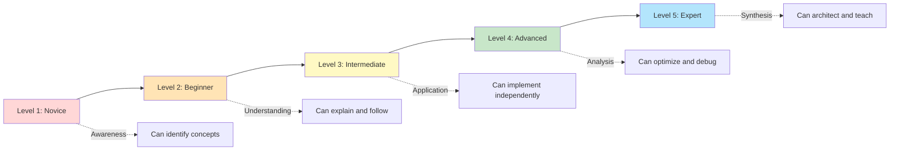
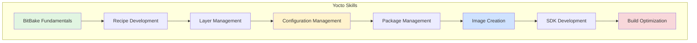
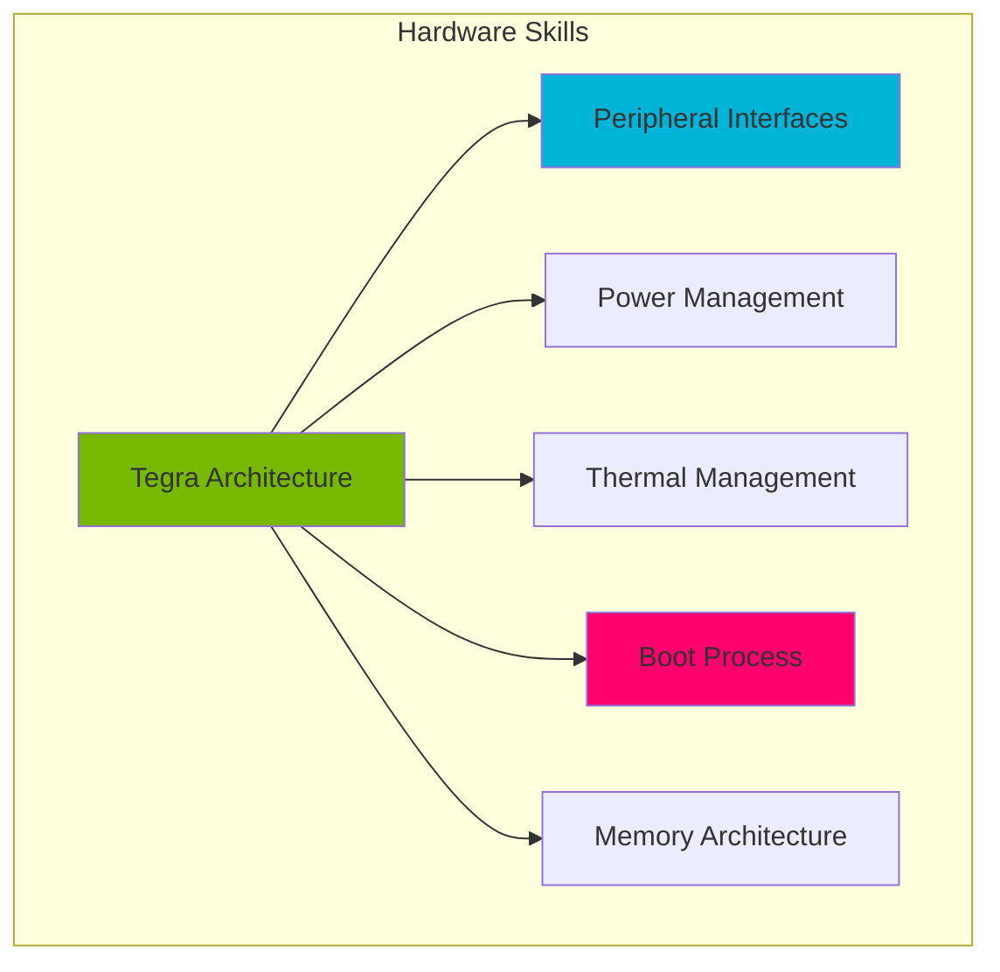
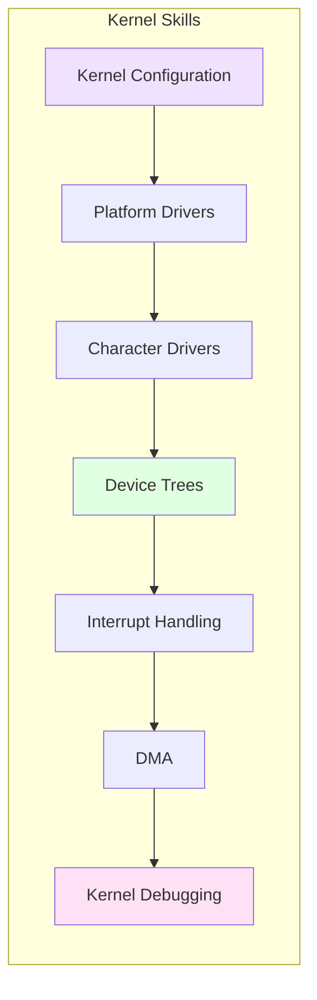
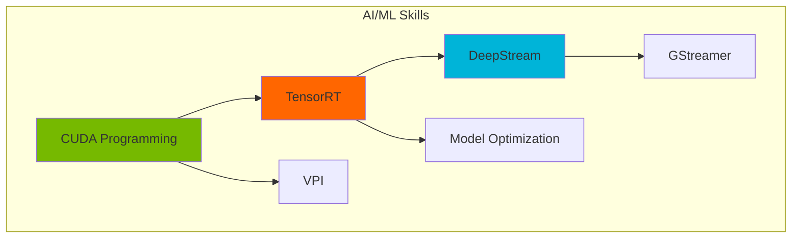
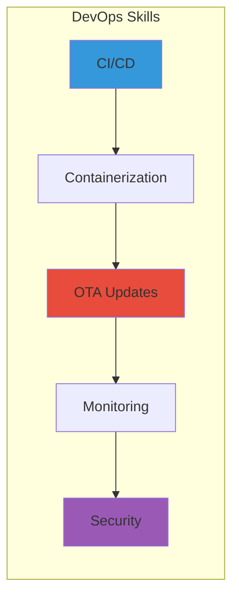
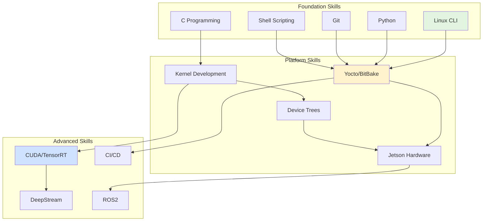

# Skill Matrix
## Yocto & Meta-Tegra Learning System

This document provides a comprehensive breakdown of skills required across the learning system, including proficiency levels, dependencies, and assessment criteria.

---

## Proficiency Level Definitions



### Level Descriptions

**Level 1 - Novice**: Awareness
- Can recognize terminology
- Understands basic concepts
- Can follow step-by-step instructions
- Requires significant guidance

**Level 2 - Beginner**: Understanding
- Can explain concepts to others
- Follows established patterns
- Can complete guided exercises
- Requires occasional assistance

**Level 3 - Intermediate**: Application
- Can implement solutions independently
- Adapts patterns to new situations
- Can troubleshoot common issues
- Self-sufficient in most tasks

**Level 4 - Advanced**: Analysis
- Can optimize and refine solutions
- Debugs complex issues
- Creates new patterns and approaches
- Minimal supervision needed

**Level 5 - Expert**: Synthesis
- Can architect complete systems
- Teaches and mentors others
- Contributes to best practices
- Fully autonomous and innovative

---

## Core Skill Categories

### 1. Yocto & Build Systems



#### 1.1 BitBake Fundamentals

| Skill Component | Beginner (L2) | Intermediate (L3) | Advanced (L4) | Expert (L5) |
|-----------------|---------------|-------------------|---------------|-------------|
| **Understanding BitBake Architecture** | Explain task execution flow | Understand task dependencies | Optimize task scheduling | Design custom task frameworks |
| **Variable Management** | Use basic variables | Override variables with operators | Debug variable resolution | Create complex variable scoping |
| **Task Execution** | Run predefined tasks | Create custom tasks | Chain tasks with dependencies | Implement parallel task execution |
| **Debugging** | Read build logs | Use bitbake -e for variables | Trace task execution | Debug BitBake internals |

**Prerequisites**: Linux command line (L2), Python basics (L2)

**Assessment Criteria**:
- [ ] Can explain BitBake vs make differences
- [ ] Successfully debugs a failed recipe build
- [ ] Creates custom task with proper dependencies
- [ ] Optimizes build time by 20%+

---

#### 1.2 Recipe Development

| Skill Component | Beginner (L2) | Intermediate (L3) | Advanced (L4) | Expert (L5) |
|-----------------|---------------|-------------------|---------------|-------------|
| **Recipe Syntax** | Write basic .bb file | Use inheritance and includes | Complex variable manipulation | Create reusable recipe patterns |
| **Source Fetching** | Use git/http SRC_URI | Handle patches and local files | Create custom fetchers | Optimize fetch performance |
| **Compilation** | Override do_compile | Cross-compilation setup | Parallel builds optimization | Custom build systems |
| **Installation** | Basic do_install | Package splitting | File packaging patterns | Complex packaging scenarios |
| **Dependencies** | DEPENDS vs RDEPENDS | Runtime dependencies | Virtual dependencies | Dependency chain optimization |

**Prerequisites**: BitBake Fundamentals (L2), Shell scripting (L2), Build systems (L2)

**Assessment Criteria**:
- [ ] Creates working recipe from source
- [ ] Properly handles patches and versioning
- [ ] Implements package splitting correctly
- [ ] Optimizes recipe for build performance

**Hands-on Exercise**:
```bash
# Create recipe for custom GPIO library
# Requirements:
# - Fetch from Git repository
# - Apply build fixes via patches
# - Split into library and development packages
# - Add runtime dependencies on kernel modules
# - Create systemd service file
```

---

#### 1.3 Layer Management

| Skill Component | Beginner (L2) | Intermediate (L3) | Advanced (L4) | Expert (L5) |
|-----------------|---------------|-------------------|---------------|-------------|
| **Layer Structure** | Understand layer organization | Create custom layer | Multi-layer architecture | Layer versioning strategy |
| **Priority Management** | Set layer priority | Resolve priority conflicts | Design priority hierarchy | Dynamic priority schemes |
| **bbappend Usage** | Create basic bbappend | Conditional bbappends | Multi-version bbappends | bbappend best practices |
| **Configuration Files** | Modify local.conf | Create machine configs | Distro configuration | Feature configuration |

**Prerequisites**: Recipe Development (L2), Git (L2)

**Assessment Criteria**:
- [ ] Creates well-structured custom layer
- [ ] Uses bbappend to customize meta-tegra
- [ ] Implements machine configuration
- [ ] Manages layer dependencies properly

---

### 2. Jetson Platform & Hardware



#### 2.1 Tegra SoC Architecture

| Skill Component | Beginner (L2) | Intermediate (L3) | Advanced (L4) | Expert (L5) |
|-----------------|---------------|-------------------|---------------|-------------|
| **CPU Complex** | Identify CPU cores | Understand ARM architecture | CPU performance tuning | CPU governor customization |
| **GPU Architecture** | Know GPU capabilities | Basic CUDA programming | Optimize GPU workloads | GPU driver customization |
| **Accelerators** | Identify DLA, NVENC, VIC | Use accelerator APIs | Performance optimization | Custom accelerator integration |
| **Memory Subsystem** | Understand memory types | Memory bandwidth concepts | Memory optimization | Custom memory mappings |
| **Interconnect** | Identify buses (AXI, APB) | Bus performance characteristics | Bus arbitration tuning | Custom peripheral integration |

**Prerequisites**: Digital electronics (L2), Computer architecture (L2)

**Assessment Criteria**:
- [ ] Can diagram Tegra architecture
- [ ] Explains accelerator use cases
- [ ] Identifies performance bottlenecks
- [ ] Optimizes memory-bound workload

---

#### 2.2 Peripheral Interfaces

| Skill Component | Beginner (L2) | Intermediate (L3) | Advanced (L4) | Expert (L5) |
|-----------------|---------------|-------------------|---------------|-------------|
| **GPIO** | Configure via sysfs | libgpiod usage | Interrupt-driven GPIO | Custom GPIO drivers |
| **I2C** | Use i2c-tools | Write I2C application | I2C driver development | I2C bus optimization |
| **SPI** | Understand SPI protocol | spidev usage | SPI driver development | High-speed SPI tuning |
| **UART** | Serial communication | Flow control | Custom UART modes | DMA-based UART |
| **PCIe** | Understand PCIe basics | PCIe device usage | PCIe driver development | PCIe performance tuning |
| **USB** | USB device modes | USB gadget configuration | USB driver development | USB Type-C/PD |
| **Camera (CSI)** | Connect camera module | v4l2 capture | Custom camera drivers | ISP tuning |
| **Display (DSI)** | Connect display | Frame buffer usage | Display driver development | Display mode timing |

**Prerequisites**: Digital protocols (L2), Linux drivers (L2)

**Assessment Criteria**:
- [ ] Integrates I2C sensor with driver
- [ ] Implements GPIO interrupt handler
- [ ] Debugs SPI communication issues
- [ ] Optimizes camera pipeline latency

---

### 3. Kernel & Driver Development



#### 3.1 Kernel Configuration & Building

| Skill Component | Beginner (L2) | Intermediate (L3) | Advanced (L4) | Expert (L5) |
|-----------------|---------------|-------------------|---------------|-------------|
| **Kconfig** | Use menuconfig | Create Kconfig entries | Complex Kconfig dependencies | Kconfig best practices |
| **defconfig** | Modify defconfig | Create custom defconfig | Config fragments | Multi-platform configs |
| **Build System** | Build kernel | Out-of-tree builds | Build optimization | Custom build scripts |
| **Modules** | Load/unload modules | Module parameters | Module versioning | Dynamic module loading |

**Prerequisites**: C programming (L3), Linux internals (L2), Make (L2)

**Assessment Criteria**:
- [ ] Creates custom kernel configuration
- [ ] Enables RT-PREEMPT features
- [ ] Optimizes kernel build time
- [ ] Manages kernel module dependencies

---

#### 3.2 Device Driver Development

| Skill Component | Beginner (L2) | Intermediate (L3) | Advanced (L4) | Expert (L5) |
|-----------------|---------------|-------------------|---------------|-------------|
| **Driver Model** | Understand driver types | Platform driver creation | Bus-specific drivers | Custom bus drivers |
| **Character Drivers** | Basic char driver | ioctl implementation | poll/select support | Advanced file operations |
| **Memory Management** | kmalloc/kfree | DMA buffers | Memory mapping | Zero-copy techniques |
| **Synchronization** | Mutexes and spinlocks | RCU usage | Lock-free structures | Lockdep debugging |
| **Interrupts** | Request IRQ | Threaded IRQ handlers | Interrupt sharing | IRQ affinity tuning |
| **Power Management** | Runtime PM basics | Suspend/resume hooks | Dynamic frequency scaling | Advanced PM states |

**Prerequisites**: Kernel config (L2), C programming (L3), Hardware interfaces (L2)

**Assessment Criteria**:
- [ ] Implements platform driver for custom hardware
- [ ] Handles interrupts correctly
- [ ] Implements proper error handling
- [ ] Follows kernel coding standards

**Code Challenge**:
```c
// Implement I2C sensor driver with:
// - Platform driver registration
// - I2C adapter integration
// - sysfs interface for readings
// - Interrupt support for data ready
// - Power management support
```

---

#### 3.3 Device Tree Mastery

| Skill Component | Beginner (L2) | Intermediate (L3) | Advanced (L4) | Expert (L5) |
|-----------------|---------------|-------------------|---------------|-------------|
| **DT Syntax** | Read DT files | Write DT nodes | Complex properties | DT schema validation |
| **Bindings** | Use existing bindings | Create simple bindings | Complex custom bindings | Binding documentation |
| **Overlays** | Apply existing overlays | Create overlays | Runtime overlay loading | Overlay conflict resolution |
| **Driver Binding** | of_match usage | DT property parsing | Advanced DT APIs | Custom binding mechanisms |
| **Pinmux** | Configure pinmux | Multi-function pins | Dynamic pinmux | Pinmux debugging |

**Prerequisites**: Kernel drivers (L2), Hardware interfaces (L2)

**Assessment Criteria**:
- [ ] Creates device tree overlay for sensor
- [ ] Properly configures pinmux
- [ ] Binds driver to DT node
- [ ] Validates DT with schema

---

### 4. AI/ML & Computer Vision



#### 4.1 CUDA Programming

| Skill Component | Beginner (L2) | Intermediate (L3) | Advanced (L4) | Expert (L5) |
|-----------------|---------------|-------------------|---------------|-------------|
| **CUDA Basics** | Understand GPU parallelism | Write simple kernels | Memory management | Kernel optimization |
| **Memory Model** | Global memory usage | Shared memory | Coalesced access | Memory hierarchy tuning |
| **Optimization** | Basic profiling | Occupancy optimization | Warp-level optimization | Advanced profiling |
| **Libraries** | cuBLAS/cuDNN usage | Thrust library | Custom kernels | Library integration |

**Prerequisites**: C/C++ (L3), Parallel programming (L2), Linear algebra (L2)

**Assessment Criteria**:
- [ ] Writes CUDA kernel for image processing
- [ ] Achieves >70% GPU utilization
- [ ] Optimizes memory bandwidth
- [ ] Profiles with Nsight Compute

---

#### 4.2 TensorRT Optimization

| Skill Component | Beginner (L2) | Intermediate (L3) | Advanced (L4) | Expert (L5) |
|-----------------|---------------|-------------------|---------------|-------------|
| **Model Conversion** | ONNX to TensorRT | PyTorch/TF to TRT | Custom layer conversion | Multi-framework support |
| **Quantization** | INT8 calibration | PTQ optimization | QAT integration | Mixed precision |
| **Optimization** | Use trtexec | Layer fusion analysis | Custom plugins | Performance tuning |
| **Deployment** | Load engine | Dynamic shapes | Multi-instance | DLA offloading |

**Prerequisites**: Deep learning (L2), CUDA (L2), Python (L3)

**Assessment Criteria**:
- [ ] Converts model to TensorRT
- [ ] Achieves 3x+ speedup
- [ ] Implements INT8 quantization
- [ ] Creates custom TensorRT plugin

---

#### 4.3 DeepStream SDK

| Skill Component | Beginner (L2) | Intermediate (L3) | Advanced (L4) | Expert (L5) |
|-----------------|---------------|-------------------|---------------|-------------|
| **Pipeline Design** | Understand DS architecture | Build basic pipeline | Multi-stream pipeline | Custom pipeline patterns |
| **Plugin Usage** | Configure plugins | Custom plugin settings | Plugin development | Plugin optimization |
| **Metadata** | Read metadata | Modify metadata | Custom metadata | Metadata analytics |
| **Performance** | Monitor FPS | Batch size tuning | Multi-GPU setup | Throughput optimization |

**Prerequisites**: GStreamer (L2), TensorRT (L2), Computer vision (L2)

**Assessment Criteria**:
- [ ] Builds 4-stream detection pipeline
- [ ] Achieves 30+ FPS per stream
- [ ] Implements custom tracker
- [ ] Optimizes memory usage

---

### 5. System Integration & DevOps



#### 5.1 CI/CD for Embedded

| Skill Component | Beginner (L2) | Intermediate (L3) | Advanced (L4) | Expert (L5) |
|-----------------|---------------|-------------------|---------------|-------------|
| **Build Automation** | Jenkins basics | Yocto in CI | Distributed builds | Build optimization |
| **Testing** | Unit tests | Integration tests | Hardware-in-loop | Automated regression |
| **Artifact Management** | Store artifacts | Binary caching | Artifact signing | Dependency management |
| **Release Management** | Tag releases | Semantic versioning | Multi-stage releases | Release automation |

**Prerequisites**: Git (L3), Linux admin (L2), Scripting (L3)

**Assessment Criteria**:
- [ ] Sets up complete CI pipeline
- [ ] Implements automated testing
- [ ] Reduces build time by 50%+
- [ ] Automates release process

---

#### 5.2 OTA Update Systems

| Skill Component | Beginner (L2) | Intermediate (L3) | Advanced (L4) | Expert (L5) |
|-----------------|---------------|-------------------|---------------|-------------|
| **Update Mechanisms** | Understand A/B updates | Implement SWUpdate | Custom update logic | Multi-partition strategies |
| **Security** | Signed updates | Encryption | Secure boot chain | TPM integration |
| **Rollback** | Manual rollback | Automatic rollback | Health checking | Gradual rollout |
| **Infrastructure** | Update server setup | CDN integration | Delta updates | Fleet management |

**Prerequisites**: System administration (L3), Security (L2), Networking (L2)

**Assessment Criteria**:
- [ ] Implements complete OTA system
- [ ] Tests rollback scenarios
- [ ] Achieves <5min update time
- [ ] Implements zero-downtime updates

---

## Skill Dependency Map



---

## Assessment & Certification

### Knowledge Assessment Format

**Multiple Choice** (30%)
- Conceptual understanding
- Best practices
- Troubleshooting scenarios

**Practical Labs** (40%)
- Hands-on implementation
- Code quality
- Problem-solving

**Code Review** (15%)
- Peer review participation
- Constructive feedback
- Code standards

**Capstone Project** (15%)
- Complete system integration
- Documentation
- Presentation

### Minimum Passing Criteria

| Level | Knowledge | Practical | Code Review | Capstone | Overall |
|-------|-----------|-----------|-------------|----------|---------|
| Associate | 70% | 60% | N/A | N/A | 65% |
| Professional | 75% | 70% | 70% | 75% | 73% |
| Expert | 85% | 85% | 85% | 85% | 85% |

---

## Skill Development Roadmap

### Month 1: Foundation
- Linux CLI: L2 → L3
- Git: L2 → L3
- C Programming: L2 → L3
- BitBake: L1 → L2

### Month 2: Yocto Mastery
- BitBake: L2 → L3
- Recipe Development: L2 → L3
- Layer Management: L2 → L3
- Image Creation: L2 → L3

### Month 3: Platform Knowledge
- Jetson Hardware: L2 → L3
- Device Trees: L2 → L3
- Kernel Config: L2 → L3
- Boot Process: L2 → L3

### Month 4: Driver Development
- Kernel Development: L2 → L3
- Platform Drivers: L2 → L3
- Peripheral Interfaces: L2 → L3
- Debugging: L2 → L3

### Month 5: Specialization
- Choose focus area (AI/ML, DevOps, Hardware)
- Deep dive into chosen skills
- Advanced projects
- Contribution to community

---

## Self-Assessment Checklist

### Yocto & BitBake
- [ ] I can explain how BitBake resolves dependencies
- [ ] I can create a recipe from scratch
- [ ] I can debug failed builds efficiently
- [ ] I can optimize build performance
- [ ] I can manage multi-layer projects

### Jetson Platform
- [ ] I understand Tegra SoC architecture
- [ ] I can configure device trees
- [ ] I can integrate custom peripherals
- [ ] I can optimize for power/performance
- [ ] I can debug hardware issues

### Kernel Development
- [ ] I can write platform drivers
- [ ] I can handle interrupts and DMA
- [ ] I can debug kernel crashes
- [ ] I can optimize driver performance
- [ ] I follow kernel coding standards

### AI/ML
- [ ] I can program CUDA kernels
- [ ] I can optimize models with TensorRT
- [ ] I can build DeepStream pipelines
- [ ] I can profile and optimize inference
- [ ] I can deploy production AI systems

### DevOps
- [ ] I can set up CI/CD for Yocto
- [ ] I can implement OTA updates
- [ ] I can monitor fleet devices
- [ ] I can automate testing
- [ ] I can ensure security compliance

---

*Generated by Knowledge Integration Agent*
*Part of Yocto & Meta-Tegra Multi-Agent Learning System*
