# Technology Stack
## Yocto & Meta-Tegra Learning System

Complete technology stack overview including version compatibility, tool dependencies, and alternative approaches for Jetson-based development.

---

## Technology Stack Overview

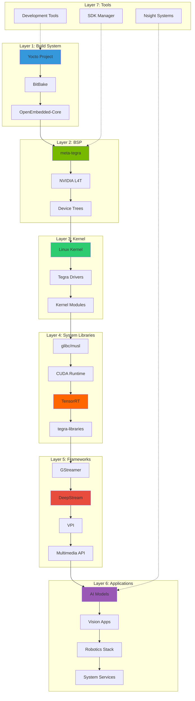

---

## Version Compatibility Matrix

### Yocto Release Compatibility

| Yocto Release | Codename | Release Date | meta-tegra Branch | Support Status | EOL Date |
|---------------|----------|--------------|-------------------|----------------|----------|
| 5.0 | Scarthgap | May 2024 | scarthgap | Current LTS | Apr 2028 |
| 4.3 | Nanbield | Oct 2023 | nanbield | Stable | Oct 2025 |
| 4.2 | Mickledore | May 2023 | mickledore | Stable | May 2024 |
| 4.0 | Kirkstone | May 2022 | kirkstone | LTS | Apr 2026 |
| 3.4 | Honister | Oct 2021 | honister | Maintenance | Apr 2024 |
| 3.3 | Hardknott | Apr 2021 | hardknott | EOL | Oct 2022 |

**Recommended**: Kirkstone (LTS) or Scarthgap (Latest LTS)

---

### JetPack & L4T Version Matrix

| JetPack | L4T Version | Jetson Modules | Linux Kernel | CUDA | TensorRT | Release Date |
|---------|-------------|----------------|--------------|------|----------|--------------|
| 6.1 | 36.4.0 | Orin, AGX Orin | 5.15 | 12.6 | 10.3 | Q2 2024 |
| 6.0 | 36.3.0 | Orin, AGX Orin | 5.15 | 12.2 | 8.6 | Q4 2023 |
| 5.1.3 | 35.5.0 | Orin, Xavier | 5.10 | 11.4 | 8.5 | Q3 2023 |
| 5.1.2 | 35.4.1 | Orin, Xavier | 5.10 | 11.4 | 8.5 | Q2 2023 |
| 5.1.1 | 35.3.1 | Orin, Xavier | 5.10 | 11.4 | 8.5 | Q1 2023 |
| 5.1 | 35.2.1 | Orin, Xavier | 5.10 | 11.4 | 8.5 | Q4 2022 |
| 5.0.2 | 35.1.0 | Orin, Xavier | 5.10 | 11.4 | 8.4 | Q3 2022 |
| 4.6.4 | 32.7.4 | Xavier, Nano, TX2 | 4.9 | 10.2 | 8.2 | Q3 2022 |
| 4.6 | 32.6.1 | Xavier, Nano, TX2 | 4.9 | 10.2 | 8.0 | Q1 2021 |

**Current Production Recommendation**: JetPack 5.1.3 (L4T 35.5.0) or JetPack 6.1

---

### meta-tegra Version Compatibility

| meta-tegra Branch | Yocto Release | JetPack/L4T | Supported Modules | Status |
|-------------------|---------------|-------------|-------------------|--------|
| scarthgap | 5.0 | JP 6.1 (36.4) | Orin, AGX Orin | Active |
| nanbield | 4.3 | JP 6.0 (36.3) | Orin, AGX Orin, Xavier | Active |
| mickledore | 4.2 | JP 5.1.3 (35.5) | Orin, Xavier, Nano | Active |
| kirkstone | 4.0 LTS | JP 5.1.2 (35.4) | Orin, Xavier, Nano | LTS |
| honister | 3.4 | JP 4.6.4 (32.7) | Xavier, Nano, TX2 | Maintenance |

---

## Core Technology Versions

### Build System Stack

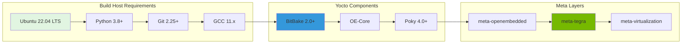

#### Detailed Versions

**Build Host Operating Systems**:
- **Recommended**: Ubuntu 22.04 LTS
- **Supported**: Ubuntu 20.04 LTS, Debian 11, Fedora 38+
- **Minimum Requirements**:
  - 8GB RAM (16GB+ recommended)
  - 200GB free disk space
  - 4+ CPU cores

**Python Environment**:
- Python: 3.8, 3.9, 3.10, 3.11
- pip: 21.0+
- Required packages: `python3-pip python3-pexpect python3-git python3-jinja2`

**Toolchain**:
- GCC: 11.x, 12.x (cross-compiler)
- Binutils: 2.38+
- glibc: 2.35+ (for target)
- musl: 1.2.3+ (alternative to glibc)

**Build Tools**:
- Git: 2.25+
- tar: 1.28+
- chrpath: 0.16+
- diffstat: 1.64+
- kas: 3.0+ (optional, for project setup)
- repo: 2.29+ (optional, for manifest)

---

### Kernel & Driver Stack

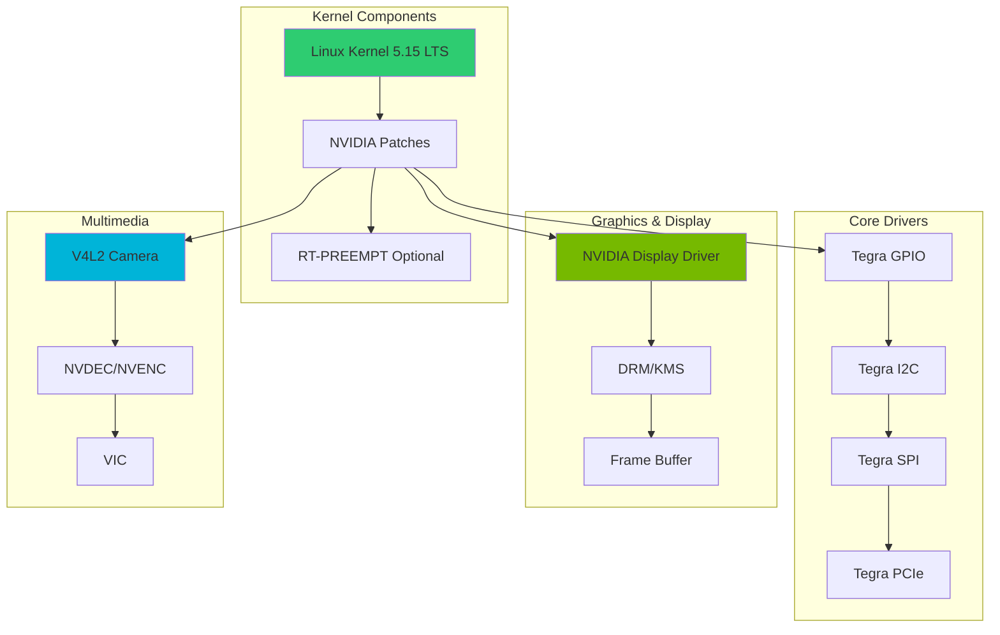

#### Kernel Versions

**Linux Kernel**:
- **JetPack 6.x**: Linux 5.15 LTS
- **JetPack 5.x**: Linux 5.10 LTS
- **JetPack 4.6**: Linux 4.9 LTS
- **RT-PREEMPT**: Patches available for 5.10, 5.15

**Key Kernel Configurations**:
- CONFIG_TEGRA_HOST1X
- CONFIG_TEGRA_FUSE
- CONFIG_TEGRA_GPIO
- CONFIG_TEGRA_IOMMU_SMMU
- CONFIG_TEGRA_MC
- CONFIG_DRM_TEGRA

---

### NVIDIA Software Stack

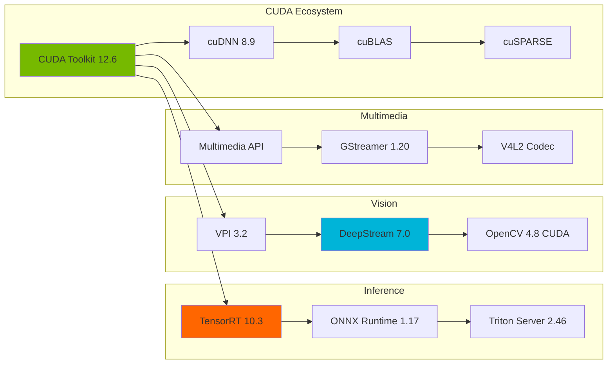

#### CUDA & Deep Learning

**CUDA Versions by JetPack**:
| JetPack | CUDA | cuDNN | TensorRT | DeepStream |
|---------|------|-------|----------|------------|
| 6.1 | 12.6 | 8.9 | 10.3 | 7.0 |
| 6.0 | 12.2 | 8.9 | 8.6 | 6.4 |
| 5.1.3 | 11.4 | 8.6 | 8.5.2 | 6.3 |
| 5.1 | 11.4 | 8.6 | 8.5.1 | 6.2 |
| 5.0.2 | 11.4 | 8.6 | 8.4.1 | 6.1 |

**CUDA Compute Capabilities**:
- Jetson Orin: SM 8.7 (Ampere)
- Jetson AGX Orin: SM 8.7 (Ampere)
- Jetson AGX Xavier: SM 7.2 (Volta)
- Jetson Xavier NX: SM 7.2 (Volta)
- Jetson Nano: SM 5.3 (Maxwell)

**TensorRT Supported Frameworks**:
- PyTorch: 2.0, 2.1, 2.2
- TensorFlow: 2.12, 2.13, 2.14
- ONNX: 1.14, 1.15, 1.16
- Caffe: 1.0
- MXNet: 1.9

---

### Multimedia & Vision Stack

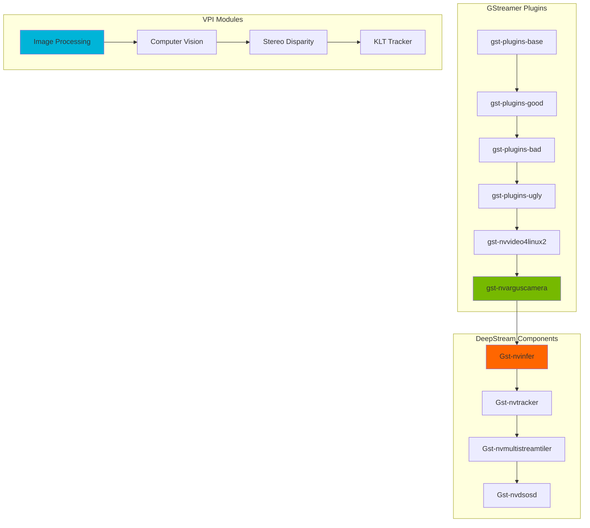

#### Version Details

**GStreamer Stack**:
- GStreamer Core: 1.20.3 (JetPack 6.x), 1.16.3 (JetPack 5.x)
- gst-plugins-base: 1.20.3
- gst-plugins-good: 1.20.3
- gst-plugins-bad: 1.20.3
- gst-plugins-ugly: 1.20.3
- gst-libav: 1.20.3

**NVIDIA GStreamer Plugins**:
- nvvideoconvert: Hardware-accelerated format conversion
- nvv4l2decoder/encoder: V4L2-based codec
- nvarguscamera: Argus camera source
- nvvideoconvert: Color space conversion
- nvdsosd: On-screen display

**DeepStream SDK**:
- Version: 7.0 (JP 6.1), 6.3 (JP 5.1.3)
- Triton Integration: Yes
- Multi-stream: Up to 32 streams (hardware dependent)
- Tracking: NvDCF, DeepSORT, IOU

**VPI (Vision Programming Interface)**:
- Version: 3.2 (JP 6.1), 2.3 (JP 5.1)
- Backends: CPU, GPU, PVA (Programmable Vision Accelerator), VIC
- Algorithms: 30+ (filtering, transforms, feature detection, etc.)

**OpenCV**:
- Version: 4.8.0 (with CUDA), 4.5.4 (JetPack 5.x)
- CUDA Acceleration: Yes
- DNN Module: Yes (supports TensorFlow, PyTorch, ONNX)

---

### Container & Runtime Stack

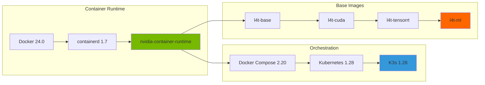

#### Container Technologies

**Docker & Runtime**:
- Docker: 24.0.5+ (with buildx)
- containerd: 1.7.2+
- nvidia-container-runtime: 3.13.0+
- nvidia-docker: 2.13.0+

**NVIDIA Container Images**:
- l4t-base: Minimal L4T base
- l4t-cuda: Base + CUDA toolkit
- l4t-tensorrt: CUDA + TensorRT
- l4t-ml: Full ML stack (PyTorch, TensorFlow)
- l4t-pytorch: PyTorch optimized
- l4t-tensorflow: TensorFlow optimized

**Registry**:
- nvcr.io/nvidia/l4t-base
- nvcr.io/nvidia/l4t-cuda
- nvcr.io/nvidia/l4t-tensorrt
- nvcr.io/nvidia/l4t-ml

**Kubernetes**:
- K8s: 1.28, 1.27, 1.26
- K3s: 1.28 (lightweight)
- NVIDIA Device Plugin: 0.14.0

---

### Development Tools

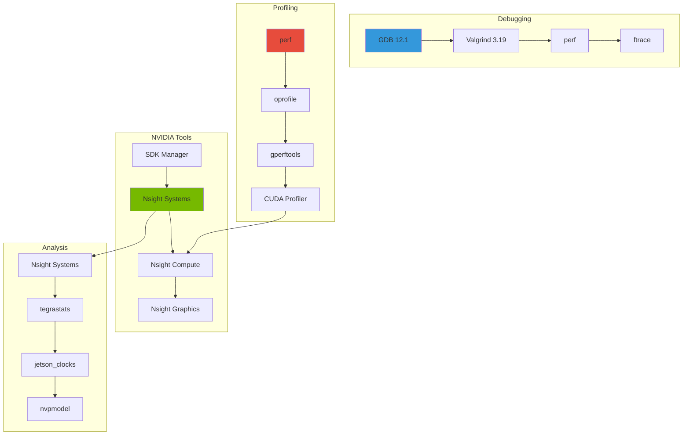

#### Tool Versions

**NVIDIA Development Tools**:
- SDK Manager: 2.1.0
- Nsight Systems: 2024.5
- Nsight Compute: 2024.3
- Nsight Graphics: 2024.4
- Visual Profiler: 11.8 (deprecated, use Nsight)

**Cross-Compilation**:
- GCC ARM64: 11.4, 12.3, 13.1
- Clang: 15.0, 16.0, 17.0
- CMake: 3.22+
- Meson: 0.63+

**Debugging & Profiling**:
- GDB: 12.1
- Valgrind: 3.19
- perf: 5.15
- strace: 5.16
- ltrace: 0.7.3

**Jetson Utilities**:
- tegrastats: Built-in system monitor
- jetson_clocks: Performance mode
- nvpmodel: Power model selection
- jtop: Python-based monitoring (unofficial)

---

## Alternative Technology Approaches

### Build System Alternatives

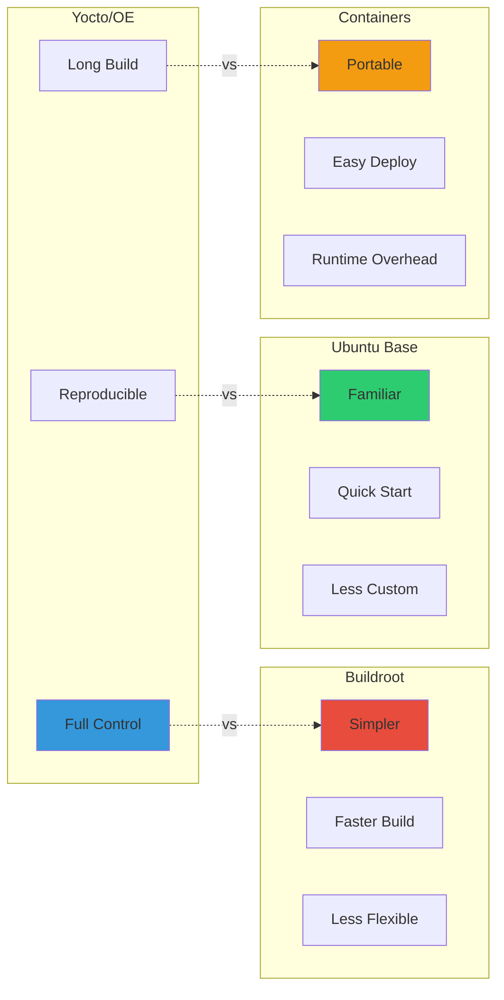

#### Comparison Matrix

| Aspect | Yocto/OE | Buildroot | Ubuntu Base | Container-only |
|--------|----------|-----------|-------------|----------------|
| **Flexibility** | ⭐⭐⭐⭐⭐ | ⭐⭐⭐ | ⭐⭐ | ⭐⭐⭐ |
| **Build Time** | ⭐⭐ | ⭐⭐⭐⭐ | ⭐⭐⭐⭐⭐ | ⭐⭐⭐⭐⭐ |
| **Customization** | ⭐⭐⭐⭐⭐ | ⭐⭐⭐⭐ | ⭐⭐ | ⭐⭐⭐ |
| **Learning Curve** | ⭐⭐ | ⭐⭐⭐ | ⭐⭐⭐⭐⭐ | ⭐⭐⭐⭐ |
| **Reproducibility** | ⭐⭐⭐⭐⭐ | ⭐⭐⭐⭐ | ⭐⭐⭐ | ⭐⭐⭐⭐ |
| **Image Size** | ⭐⭐⭐⭐ | ⭐⭐⭐⭐⭐ | ⭐⭐ | ⭐⭐⭐ |
| **OTA Updates** | ⭐⭐⭐⭐⭐ | ⭐⭐⭐ | ⭐⭐⭐ | ⭐⭐⭐⭐ |
| **Production Ready** | ⭐⭐⭐⭐⭐ | ⭐⭐⭐⭐ | ⭐⭐⭐⭐ | ⭐⭐⭐ |

**Recommendation**:
- **Production/Custom**: Yocto/OE with meta-tegra
- **Quick Prototyping**: Ubuntu Base + Docker
- **Small Footprint**: Buildroot (if meta-tegra unavailable)
- **Cloud-Native**: Container-based deployment

---

### AI Framework Alternatives

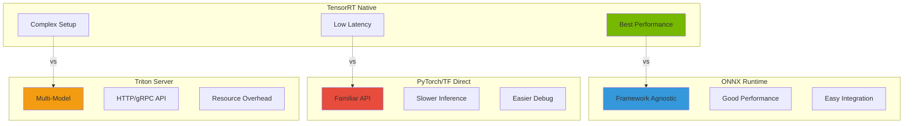

#### AI Inference Comparison

| Framework | Throughput | Latency | Flexibility | Ease of Use | Production |
|-----------|------------|---------|-------------|-------------|------------|
| **TensorRT** | ⭐⭐⭐⭐⭐ | ⭐⭐⭐⭐⭐ | ⭐⭐⭐ | ⭐⭐ | ⭐⭐⭐⭐⭐ |
| **ONNX Runtime** | ⭐⭐⭐⭐ | ⭐⭐⭐⭐ | ⭐⭐⭐⭐ | ⭐⭐⭐⭐ | ⭐⭐⭐⭐ |
| **PyTorch JIT** | ⭐⭐⭐ | ⭐⭐⭐ | ⭐⭐⭐⭐⭐ | ⭐⭐⭐⭐⭐ | ⭐⭐⭐ |
| **TensorFlow Lite** | ⭐⭐⭐ | ⭐⭐⭐ | ⭐⭐⭐ | ⭐⭐⭐⭐ | ⭐⭐⭐ |
| **Triton Server** | ⭐⭐⭐⭐ | ⭐⭐⭐⭐ | ⭐⭐⭐⭐⭐ | ⭐⭐⭐ | ⭐⭐⭐⭐⭐ |

**Use Cases**:
- **Maximum Performance**: TensorRT with INT8
- **Multi-Framework**: ONNX Runtime
- **Rapid Development**: PyTorch/TensorFlow direct
- **Microservices**: Triton Inference Server
- **Edge Devices**: TensorFlow Lite or TensorRT

---

### Vision Pipeline Alternatives

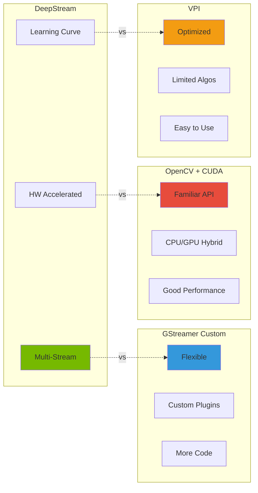

#### Vision Framework Comparison

| Framework | Performance | Flexibility | Complexity | Multi-Stream | HW Accel |
|-----------|-------------|-------------|------------|--------------|----------|
| **DeepStream** | ⭐⭐⭐⭐⭐ | ⭐⭐⭐ | ⭐⭐ | ⭐⭐⭐⭐⭐ | ⭐⭐⭐⭐⭐ |
| **GStreamer** | ⭐⭐⭐⭐ | ⭐⭐⭐⭐⭐ | ⭐⭐⭐ | ⭐⭐⭐⭐ | ⭐⭐⭐⭐ |
| **OpenCV CUDA** | ⭐⭐⭐⭐ | ⭐⭐⭐⭐ | ⭐⭐⭐⭐ | ⭐⭐ | ⭐⭐⭐ |
| **VPI** | ⭐⭐⭐⭐⭐ | ⭐⭐ | ⭐⭐⭐⭐⭐ | ⭐ | ⭐⭐⭐⭐⭐ |
| **Custom CUDA** | ⭐⭐⭐⭐⭐ | ⭐⭐⭐⭐⭐ | ⭐ | ⭐⭐⭐ | ⭐⭐⭐⭐⭐ |

---

## Dependency Tree

### Critical Path Dependencies

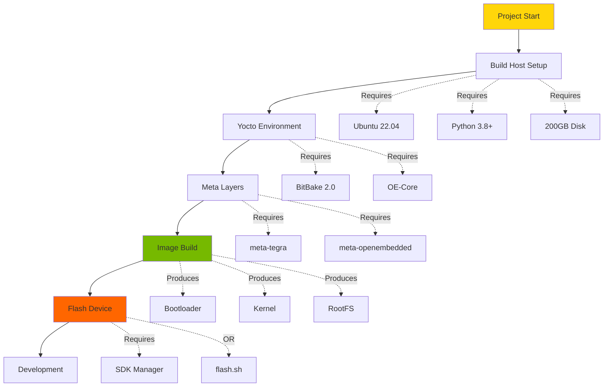

---

## Software Bill of Materials (SBOM)

### Core Components

**Build System**:
- Yocto Project: 4.0+ (Apache-2.0, GPL-2.0, MIT)
- BitBake: 2.0+ (GPL-2.0)
- OpenEmbedded-Core: 4.0+ (Various)

**BSP & Drivers**:
- meta-tegra: Latest (MIT, GPL-2.0)
- NVIDIA L4T: 35.x/36.x (Proprietary, GPL-2.0 for kernel)
- Linux Kernel: 5.10/5.15 (GPL-2.0)

**AI/ML**:
- CUDA: 11.4/12.6 (Proprietary)
- TensorRT: 8.5/10.3 (Proprietary)
- cuDNN: 8.6/8.9 (Proprietary)
- ONNX Runtime: 1.17 (MIT)

**Multimedia**:
- GStreamer: 1.20 (LGPL-2.1)
- DeepStream: 6.3/7.0 (Proprietary)
- VPI: 2.3/3.2 (Proprietary)
- OpenCV: 4.8 (Apache-2.0)

---

## Version Update Strategy

### Staying Current

**Quarterly Updates**:
- Review Yocto Project releases
- Check meta-tegra updates
- Monitor JetPack releases
- Update dependency versions

**LTS Strategy**:
- Stick with LTS for production (Kirkstone, Scarthgap)
- Test newer releases in development
- Plan migration 6 months before EOL

**Security Updates**:
- Subscribe to security mailing lists
- Apply CVE patches promptly
- Regular dependency scanning

---

*Generated by Knowledge Integration Agent*
*Part of Yocto & Meta-Tegra Multi-Agent Learning System*
