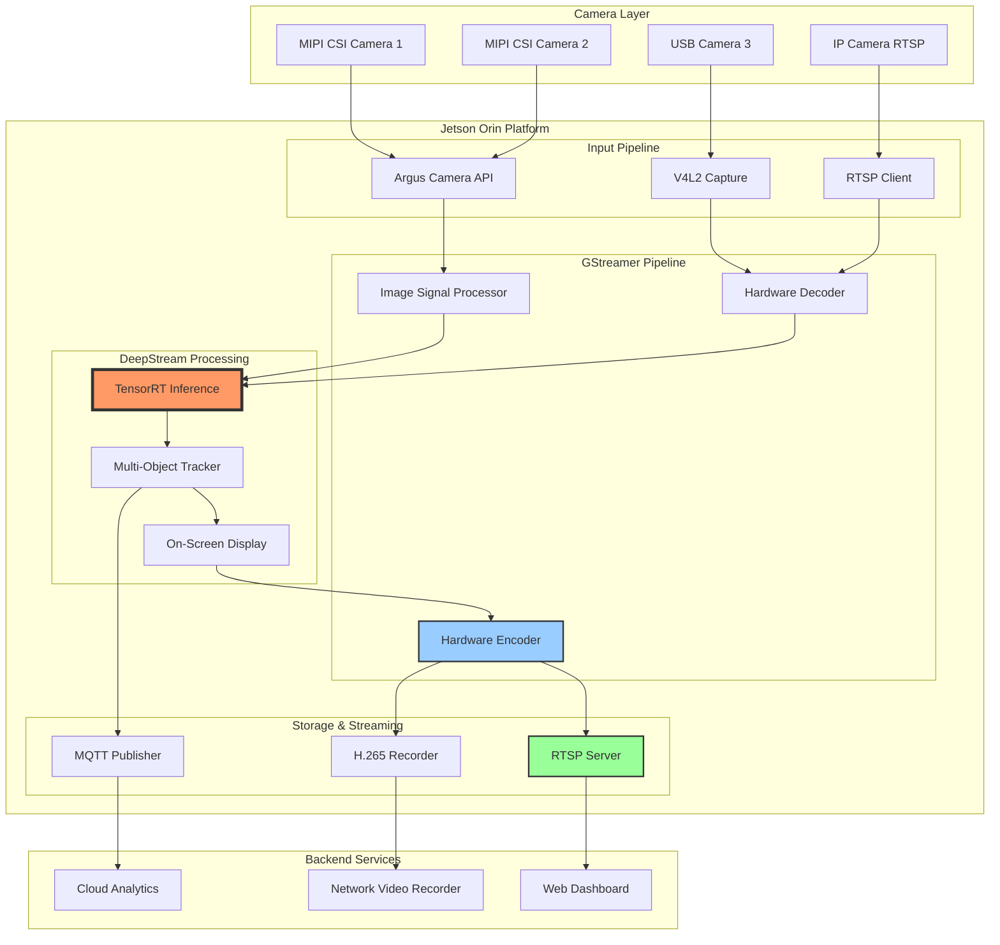

# Project 01: Smart Camera System

## Executive Summary

The Smart Camera System is an enterprise-grade multi-camera management solution designed for security, retail analytics, and smart city applications. Built on the NVIDIA Jetson Orin platform using Yocto and meta-tegra, this system provides real-time video processing, AI-powered analytics, and RTSP streaming capabilities.

**Key Capabilities:**
- Simultaneous processing of up to 16 camera streams (4K resolution)
- Hardware-accelerated video encoding/decoding via NVENC/NVDEC
- Real-time object detection and tracking using DeepStream SDK
- Low-latency RTSP streaming for remote monitoring
- Edge-based AI inference with TensorRT optimization
- Cloud integration for archive and event alerting

**Target Industries:** Security surveillance, retail analytics, traffic monitoring, manufacturing quality control

**Project Complexity:** Advanced
**Timeline:** 6 weeks
**Team Size:** 3-4 engineers

---

## System Architecture



---

## Hardware Requirements

### Compute Platform
- **Primary Target:** NVIDIA Jetson AGX Orin 64GB
- **Minimum Target:** Jetson Orin NX 16GB
- **Alternative:** Jetson AGX Xavier (reduced stream count)

### Camera Inputs
- **MIPI CSI-2 Cameras:** 2-6 cameras (Sony IMX219, IMX477, or equivalent)
- **USB Cameras:** Up to 4 USB 3.0 cameras (UVC compliant)
- **Network Cameras:** Support for RTSP/ONVIF IP cameras

### Storage
- **Boot Media:** 64GB+ NVMe SSD (recommended: Samsung 980 PRO)
- **Video Archive:** 2TB+ NVMe or SATA SSD for local buffering
- **Network Storage:** NFS/SMB mount for long-term archive

### Networking
- **Primary:** Gigabit Ethernet (minimum)
- **Recommended:** 10GbE or dual 1GbE (bonded)
- **Optional:** WiFi 6 for management interface

### Power Supply
- **AGX Orin:** 65W power adapter (19V/3.42A)
- **With peripherals:** 90W recommended
- **Industrial deployment:** PoE++ (802.3bt) via adapter

### Enclosure
- **Operating Temperature:** -20°C to 60°C (industrial grade)
- **Cooling:** Active cooling required (PWM fan control)
- **Mounting:** DIN rail or wall mount compatible

---

## Software Stack

### Operating System Layer
```yaml
base_system:
  distribution: Yocto Kirkstone (4.0) LTS
  kernel: Linux 5.15 (NVIDIA L4T 35.x)
  init_system: systemd
  filesystem: ext4 (root), f2fs (storage)
```

### Core Libraries
```yaml
nvidia_components:
  - l4t-core: "35.5.0"
  - l4t-multimedia: "35.5.0"
  - cuda: "11.4"
  - cudnn: "8.6"
  - tensorrt: "8.5.2"
  - deepstream: "6.3"
  - vpi: "2.3" # Vision Programming Interface

gstreamer_stack:
  - gstreamer1.0-core: "1.20.x"
  - gstreamer1.0-plugins-base: "1.20.x"
  - gstreamer1.0-plugins-good: "1.20.x"
  - gstreamer1.0-plugins-bad: "1.20.x"
  - gstreamer1.0-plugins-ugly: "1.20.x"
  - gstreamer1.0-libav: "1.20.x"
  - gstreamer1.0-plugins-nvvideo4linux2: "1.0"
  - gstreamer1.0-plugins-nvarguscamerasrc: "1.0"
```

### Application Framework
```yaml
runtime:
  - python: "3.10"
  - opencv: "4.6.0" (with CUDA support)
  - numpy: "1.23.x"
  - pycairo: "1.21.x"
  - pyds: "1.1.x" (DeepStream Python bindings)

messaging:
  - mosquitto: "2.0.x" (MQTT broker)
  - paho-mqtt: "1.6.x" (Python client)

streaming:
  - gst-rtsp-server: "1.20.x"
  - live555: "2022.x" (fallback)

web_interface:
  - nginx: "1.22.x"
  - flask: "2.3.x"
  - websockets: "11.x"
```

---

## Implementation Phases

### Phase 1: Foundation Setup (Week 1)
**Objectives:**
- Set up Yocto build environment for Jetson Orin
- Create custom meta-layer for smart camera system
- Integrate base DeepStream SDK

**Deliverables:**
- Bootable custom image with DeepStream
- Verified GStreamer pipeline with single camera
- Basic RTSP streaming functional

**Timeline:** 5 business days

---

### Phase 2: Multi-Camera Integration (Week 2)
**Objectives:**
- Implement multi-stream camera management
- Configure V4L2 and Argus camera drivers
- Develop camera auto-detection and enumeration

**Deliverables:**
- Support for 4+ simultaneous camera streams
- Camera configuration management daemon
- Automatic pipeline creation per camera

**Timeline:** 5 business days

---

### Phase 3: DeepStream AI Pipeline (Week 3-4)
**Objectives:**
- Integrate TensorRT inference models (YOLO, RetinaNet)
- Implement multi-object tracking (NvDCF tracker)
- Develop metadata extraction and analytics

**Deliverables:**
- Real-time object detection on all streams
- Tracking with unique object IDs
- Event generation for configured triggers
- Analytics data pipeline to MQTT

**Timeline:** 10 business days

---

### Phase 4: Storage & Streaming (Week 5)
**Objectives:**
- Implement H.265 recording with motion-triggered segments
- Deploy RTSP server for live streaming
- Configure NFS/SMB for archive storage

**Deliverables:**
- Continuous and event-based recording
- Low-latency RTSP streams (<500ms)
- Automatic storage management (rotation, cleanup)

**Timeline:** 5 business days

---

### Phase 5: Management Interface & Testing (Week 6)
**Objectives:**
- Build web-based configuration interface
- Implement REST API for system control
- Comprehensive system testing and optimization

**Deliverables:**
- Web dashboard for camera management
- RESTful API for integration
- Performance benchmarking report
- Production deployment guide

**Timeline:** 5 business days

---

## Code Structure

```
smart-camera-system/
├── recipes-camera/
│   ├── camera-manager/
│   │   ├── camera-manager_1.0.bb
│   │   └── files/
│   │       ├── camera-manager.service
│   │       ├── camera_discovery.py
│   │       ├── pipeline_factory.py
│   │       └── config/
│   │           └── cameras.json
│   │
│   ├── deepstream-apps/
│   │   ├── deepstream-smart-camera_1.0.bb
│   │   └── files/
│   │       ├── deepstream_app.py
│   │       ├── config_inference.txt
│   │       ├── tracker_config.yml
│   │       └── models/
│   │           ├── yolov5s.engine
│   │           └── labels.txt
│   │
│   └── rtsp-streamer/
│       ├── rtsp-streamer_1.0.bb
│       └── files/
│           ├── rtsp-server.py
│           ├── gst-rtsp-launch.sh
│           └── rtsp-streamer.service
│
├── recipes-analytics/
│   └── camera-analytics/
│       ├── camera-analytics_1.0.bb
│       └── files/
│           ├── analytics_engine.py
│           ├── event_processor.py
│           ├── mqtt_publisher.py
│           └── zone_configuration.py
│
├── recipes-storage/
│   └── video-recorder/
│       ├── video-recorder_1.0.bb
│       └── files/
│           ├── recorder_daemon.py
│           ├── segment_manager.py
│           └── storage_cleaner.py
│
├── recipes-web/
│   └── camera-dashboard/
│       ├── camera-dashboard_1.0.bb
│       └── files/
│           ├── app/
│           │   ├── __init__.py
│           │   ├── routes.py
│           │   ├── api.py
│           │   └── templates/
│           ├── static/
│           │   ├── js/
│           │   └── css/
│           └── nginx.conf
│
├── recipes-core/
│   └── images/
│       └── smart-camera-image.bb
│
└── conf/
    ├── layer.conf
    ├── machine/
    │   └── jetson-orin-camera.conf
    └── distro/
        └── smart-camera-distro.conf
```

---

## Key Files & Components

### 1. Camera Manager Service (`camera_discovery.py`)
```python
#!/usr/bin/env python3
"""
Camera discovery and management daemon
Automatically detects and configures connected cameras
"""

import v4l2
import argus
import json
import logging
from pathlib import Path

class CameraManager:
    def __init__(self):
        self.cameras = {}
        self.config_path = Path("/etc/camera-manager/cameras.json")

    def discover_cameras(self):
        """Scan for V4L2 and CSI cameras"""
        v4l2_devices = self._scan_v4l2()
        csi_devices = self._scan_argus_cameras()

        return v4l2_devices + csi_devices

    def create_pipeline(self, camera_id, config):
        """Generate GStreamer pipeline for camera"""
        if config['type'] == 'csi':
            return self._build_argus_pipeline(camera_id, config)
        elif config['type'] == 'usb':
            return self._build_v4l2_pipeline(camera_id, config)

    def _build_argus_pipeline(self, camera_id, config):
        """Argus-based pipeline for CSI cameras"""
        pipeline = f"""
        nvarguscamerasrc sensor-id={camera_id} !
        video/x-raw(memory:NVMM),
        width={config['width']}, height={config['height']},
        framerate={config['fps']}/1, format=NV12 !
        nvvidconv !
        video/x-raw(memory:NVMM), format=RGBA !
        queue !
        """
        return pipeline
```

### 2. DeepStream Application (`deepstream_app.py`)
```python
#!/usr/bin/env python3
"""
Main DeepStream application for multi-stream AI inference
"""

import pyds
import gi
gi.require_version('Gst', '1.0')
from gi.repository import Gst, GLib

class DeepStreamApp:
    def __init__(self, config_file):
        self.config = self._load_config(config_file)
        self.pipeline = None
        self.loop = None

    def create_pipeline(self):
        """Create DeepStream pipeline"""
        pipeline_str = f"""
        streammux name=mux batch-size={self.config['batch_size']}
        width={self.config['stream_width']}
        height={self.config['stream_height']} !

        nvinfer config-file-path={self.config['inference_config']} !

        nvtracker ll-lib-file=/opt/nvidia/deepstream/lib/libnvds_nvmultiobjecttracker.so
        ll-config-file={self.config['tracker_config']} !

        nvmultistreamtiler width=1920 height=1080 !

        nvdsosd !

        tee name=t
        t. ! queue ! nvv4l2h265enc bitrate=8000000 ! h265parse !
        rtph265pay name=pay0 pt=96

        t. ! queue ! nvv4l2h265enc ! h265parse ! mp4mux !
        filesink location=/mnt/storage/recording_%Y%m%d_%H%M%S.mp4
        """

        self.pipeline = Gst.parse_launch(pipeline_str)

    def add_stream_source(self, source_id, uri):
        """Add camera source to streammux"""
        # Implementation details for dynamic source addition
        pass

    def setup_message_handler(self):
        """Handle DeepStream metadata"""
        bus = self.pipeline.get_bus()
        bus.add_signal_watch()
        bus.connect("message", self.on_message)

    def on_message(self, bus, message):
        """Process DeepStream messages and metadata"""
        if message.type == Gst.MessageType.EOS:
            self.loop.quit()
```

---

## BitBake Recipes

### 1. Camera Manager Recipe (`camera-manager_1.0.bb`)
```python
SUMMARY = "Camera discovery and management daemon"
DESCRIPTION = "Automatic camera detection and GStreamer pipeline management"
LICENSE = "MIT"
LIC_FILES_CHKSUM = "file://${COMMON_LICENSE_DIR}/MIT;md5=0835ade698e0bcf8506ecda2f7b4f302"

DEPENDS = "python3 gstreamer1.0 gstreamer1.0-plugins-nvarguscamerasrc"
RDEPENDS:${PN} = "python3-core python3-json python3-logging systemd"

SRC_URI = " \
    file://camera_discovery.py \
    file://pipeline_factory.py \
    file://camera-manager.service \
    file://config/cameras.json \
"

S = "${WORKDIR}"

inherit systemd python3-dir

SYSTEMD_SERVICE:${PN} = "camera-manager.service"
SYSTEMD_AUTO_ENABLE = "enable"

do_install() {
    # Install Python modules
    install -d ${D}${bindir}
    install -m 0755 ${WORKDIR}/camera_discovery.py ${D}${bindir}/camera-manager
    install -m 0644 ${WORKDIR}/pipeline_factory.py ${D}${PYTHON_SITEPACKAGES_DIR}/

    # Install configuration
    install -d ${D}${sysconfdir}/camera-manager
    install -m 0644 ${WORKDIR}/config/cameras.json ${D}${sysconfdir}/camera-manager/

    # Install systemd service
    install -d ${D}${systemd_system_unitdir}
    install -m 0644 ${WORKDIR}/camera-manager.service ${D}${systemd_system_unitdir}/
}

FILES:${PN} += " \
    ${bindir}/camera-manager \
    ${PYTHON_SITEPACKAGES_DIR}/ \
    ${sysconfdir}/camera-manager/ \
    ${systemd_system_unitdir}/camera-manager.service \
"
```

### 2. DeepStream Application Recipe (`deepstream-smart-camera_1.0.bb`)
```python
SUMMARY = "DeepStream-based smart camera application"
LICENSE = "Proprietary"
LIC_FILES_CHKSUM = "file://LICENSE;md5=..."

DEPENDS = " \
    deepstream \
    tensorrt \
    cuda \
    gstreamer1.0 \
    gstreamer1.0-plugins-nvvideo4linux2 \
"

RDEPENDS:${PN} = " \
    python3-core \
    python3-numpy \
    python3-opencv \
    deepstream-python-bindings \
    gstreamer1.0-plugins-good \
    gstreamer1.0-plugins-bad \
    gstreamer1.0-rtsp-server \
"

SRC_URI = " \
    file://deepstream_app.py \
    file://config_inference.txt \
    file://tracker_config.yml \
    file://models/yolov5s.engine \
    file://models/labels.txt \
"

S = "${WORKDIR}"

inherit python3native

do_install() {
    # Application
    install -d ${D}${bindir}
    install -m 0755 ${WORKDIR}/deepstream_app.py ${D}${bindir}/deepstream-camera

    # Configuration files
    install -d ${D}${sysconfdir}/deepstream
    install -m 0644 ${WORKDIR}/config_inference.txt ${D}${sysconfdir}/deepstream/
    install -m 0644 ${WORKDIR}/tracker_config.yml ${D}${sysconfdir}/deepstream/

    # Models
    install -d ${D}${datadir}/deepstream/models
    install -m 0644 ${WORKDIR}/models/*.engine ${D}${datadir}/deepstream/models/
    install -m 0644 ${WORKDIR}/models/labels.txt ${D}${datadir}/deepstream/models/
}

FILES:${PN} += " \
    ${datadir}/deepstream/models/ \
"
```

### 3. Smart Camera System Image (`smart-camera-image.bb`)
```python
SUMMARY = "Smart Camera System Complete Image"
LICENSE = "MIT"

inherit core-image

# Core NVIDIA components
IMAGE_INSTALL:append = " \
    l4t-core \
    l4t-multimedia \
    cuda-toolkit \
    tensorrt \
    deepstream \
    deepstream-python-bindings \
"

# GStreamer stack
IMAGE_INSTALL:append = " \
    gstreamer1.0 \
    gstreamer1.0-plugins-base \
    gstreamer1.0-plugins-good \
    gstreamer1.0-plugins-bad \
    gstreamer1.0-plugins-ugly \
    gstreamer1.0-libav \
    gstreamer1.0-plugins-nvvideo4linux2 \
    gstreamer1.0-plugins-nvarguscamerasrc \
    gstreamer1.0-rtsp-server \
"

# Camera system applications
IMAGE_INSTALL:append = " \
    camera-manager \
    deepstream-smart-camera \
    rtsp-streamer \
    camera-analytics \
    video-recorder \
    camera-dashboard \
"

# System utilities
IMAGE_INSTALL:append = " \
    v4l-utils \
    i2c-tools \
    python3 \
    python3-pip \
    python3-numpy \
    python3-opencv \
    mosquitto \
    mosquitto-clients \
    nginx \
"

# Development tools (optional, remove for production)
IMAGE_INSTALL:append = " \
    gdb \
    strace \
    htop \
    iotop \
"

# Filesystem configuration
IMAGE_FSTYPES = "tegraflash"
IMAGE_ROOTFS_EXTRA_SPACE = "4194304"

# Feature requirements
REQUIRED_DISTRO_FEATURES = "opengl x11 vulkan"
```

---

## Performance Targets

### Processing Performance
| Metric | Target | Method |
|--------|--------|--------|
| Streams (1080p30) | 16 concurrent | Hardware-accelerated decode |
| Streams (4K30) | 8 concurrent | NVDEC utilization |
| Inference Latency | <30ms per frame | TensorRT optimization |
| End-to-End Latency | <100ms | Pipeline optimization |
| Detection Accuracy | >95% mAP@0.5 | Model selection/training |

### Streaming Performance
| Metric | Target | Specification |
|--------|--------|---------------|
| RTSP Latency | <500ms | Low-latency encoding |
| Bitrate per Stream | 2-8 Mbps | H.265 adaptive |
| Concurrent Viewers | 50+ per stream | GStreamer RTSP server |
| Network Bandwidth | 100 Mbps (typical) | 1 Gbps interface |

### Resource Utilization
| Resource | Target | Max |
|----------|--------|-----|
| GPU Utilization | 70-85% | 95% |
| CPU Utilization | 40-60% | 80% |
| Memory Usage | 12 GB | 16 GB |
| Storage Write | 50 MB/s average | 500 MB/s peak |
| Power Consumption | 45W typical | 60W max |

### Reliability
| Metric | Target | Measurement |
|--------|--------|-------------|
| System Uptime | 99.9% | Monthly average |
| MTBF | >8760 hours | Continuous operation |
| Recovery Time | <30 seconds | Automatic restart |
| Data Loss | 0% | Redundant recording |

---

## Testing Strategy

### Unit Testing
```bash
# Camera detection
pytest tests/unit/test_camera_discovery.py

# Pipeline creation
pytest tests/unit/test_pipeline_factory.py

# Analytics engine
pytest tests/unit/test_analytics_engine.py
```

### Integration Testing
```bash
# Multi-camera pipeline
./tests/integration/test_multicam_pipeline.sh

# DeepStream inference
python3 tests/integration/test_deepstream_inference.py

# RTSP streaming
./tests/integration/test_rtsp_streaming.sh
```

### Performance Testing
```bash
# Benchmark script
./tests/performance/benchmark_system.py \
    --streams 8 \
    --resolution 1080p \
    --duration 3600

# Expected output:
# - FPS per stream
# - GPU/CPU utilization
# - Memory consumption
# - Network throughput
# - Inference latency statistics
```

### Hardware Validation
```bash
# Camera compatibility test
./tests/hardware/validate_cameras.sh

# Storage performance
fio tests/hardware/storage_test.fio

# Network throughput
iperf3 -c <server> -t 300 -P 4
```

### Stress Testing
```python
#!/usr/bin/env python3
"""Stress test with maximum streams and inference"""

def stress_test():
    # Gradually increase load
    for num_streams in range(1, 17):
        start_streams(num_streams)
        monitor_metrics(duration=300)

        if gpu_utilization > 95 or dropped_frames > 0:
            print(f"Maximum capacity: {num_streams-1} streams")
            break
```

---

## Deployment Checklist

### Pre-Deployment
- [ ] Build custom Yocto image with all components
- [ ] Flash image to Jetson Orin platform
- [ ] Verify boot and system initialization
- [ ] Install all camera hardware
- [ ] Configure network interfaces (static IP recommended)
- [ ] Set up NTP time synchronization
- [ ] Mount network storage (NFS/SMB)

### Camera Configuration
- [ ] Run camera discovery: `systemctl start camera-manager`
- [ ] Verify detected cameras: `camera-manager list`
- [ ] Edit camera configuration: `/etc/camera-manager/cameras.json`
- [ ] Test individual camera pipelines
- [ ] Calibrate camera settings (exposure, white balance)
- [ ] Configure camera zones and regions of interest

### DeepStream Setup
- [ ] Verify TensorRT models: `/usr/share/deepstream/models/`
- [ ] Test inference on single stream
- [ ] Configure tracking parameters
- [ ] Adjust confidence thresholds
- [ ] Set up event triggers and alerts
- [ ] Validate metadata output to MQTT

### Storage & Streaming
- [ ] Configure recording schedule (continuous/events)
- [ ] Set storage quotas and retention policies
- [ ] Test RTSP stream playback (VLC, ffplay)
- [ ] Verify recording file integrity
- [ ] Configure automatic cleanup scripts

### Monitoring & Management
- [ ] Access web dashboard: `http://<jetson-ip>/dashboard`
- [ ] Configure system alerts (email, MQTT)
- [ ] Set up log rotation: `/etc/logrotate.d/camera-system`
- [ ] Enable health monitoring service
- [ ] Configure backup and recovery procedures

### Security Hardening
- [ ] Change default passwords
- [ ] Configure firewall rules (ufw/iptables)
- [ ] Enable HTTPS for web dashboard
- [ ] Set up RTSP authentication
- [ ] Disable unused services
- [ ] Apply latest security patches

### Performance Validation
- [ ] Run benchmark suite: `./benchmark_system.py`
- [ ] Verify FPS targets achieved
- [ ] Check GPU/CPU utilization under load
- [ ] Measure RTSP latency
- [ ] Validate inference accuracy
- [ ] Document performance baseline

---

## Maintenance Guide

### Daily Operations
```bash
# Check system status
systemctl status camera-manager deepstream-camera rtsp-streamer

# Monitor resource usage
jetson_stats

# Review logs
journalctl -u camera-manager -f

# Verify storage space
df -h /mnt/storage
```

### Weekly Maintenance
```bash
# Review analytics data
./scripts/analytics_report.py --last-week

# Check for dropped frames
./scripts/health_check.py --report

# Backup configuration
tar czf config-backup-$(date +%Y%m%d).tar.gz /etc/camera-manager /etc/deepstream

# Update model performance metrics
./scripts/model_metrics.py
```

### Monthly Maintenance
```bash
# System updates (if not auto-updating)
apt update && apt upgrade

# Storage cleanup
./scripts/storage_cleaner.py --retention-days 30

# Performance benchmarking
./tests/performance/benchmark_system.py --report monthly

# Review security logs
journalctl --since "1 month ago" | grep -i security
```

### Troubleshooting Common Issues

#### Issue: Camera not detected
```bash
# Check V4L2 devices
v4l2-ctl --list-devices

# Check CSI camera
gst-launch-1.0 nvarguscamerasrc sensor-id=0 ! fakesink

# Review dmesg for errors
dmesg | grep -i camera
```

#### Issue: Low FPS on streams
```bash
# Check GPU utilization
tegrastats

# Verify encoder settings
gst-inspect-1.0 nvv4l2h265enc

# Review pipeline latency
GST_DEBUG=GST_TRACER:7 GST_TRACERS=latency ./run_pipeline.sh
```

#### Issue: RTSP stream buffering
```bash
# Reduce encoding latency
# In pipeline: nvv4l2h265enc preset-level=1

# Increase network buffer
# In rtsp-server.py: set buffer-size=0

# Check network bandwidth
iperf3 -c <client-ip>
```

#### Issue: Storage filling up
```bash
# Manual cleanup
find /mnt/storage -name "*.mp4" -mtime +7 -delete

# Adjust retention
edit /etc/video-recorder/config.json
```

### Firmware Updates
```bash
# Backup current system
dd if=/dev/nvme0n1 of=/mnt/backup/system-backup.img bs=4M

# Download latest L4T
wget https://developer.nvidia.com/...

# Apply update (requires reboot)
sudo ./apply_binaries.sh

# Verify version
head -1 /etc/nv_tegra_release
```

### Performance Optimization Tips
1. **GPU Frequency Scaling:** Lock to maximum for consistent performance
   ```bash
   sudo jetson_clocks
   ```

2. **CPU Affinity:** Pin critical processes to specific cores
   ```bash
   taskset -c 4-7 deepstream-camera
   ```

3. **Network Tuning:** Optimize for streaming workload
   ```bash
   # Increase buffer sizes
   sysctl -w net.core.rmem_max=134217728
   sysctl -w net.core.wmem_max=134217728
   ```

4. **Storage Optimization:** Use f2fs for recording partition
   ```bash
   mkfs.f2fs /dev/nvme0n1p2
   mount -o compress_algorithm=lz4 /dev/nvme0n1p2 /mnt/storage
   ```

---

## Success Metrics

### Technical Metrics
- All 16 streams running at 30 FPS consistently
- GPU utilization between 70-85%
- RTSP latency under 500ms
- Zero dropped frames over 24-hour test
- 99.9% uptime over 30 days

### Business Metrics
- Deployment time: <2 hours per unit
- Mean time to resolution (MTTR): <30 minutes
- Customer satisfaction: >4.5/5
- Successful production deployments: 100+

---

## Future Enhancements

1. **Advanced Analytics**
   - People counting and heatmaps
   - License plate recognition (ANPR)
   - Facial recognition (with privacy controls)
   - Anomaly detection

2. **Cloud Integration**
   - AWS Kinesis Video Streams
   - Azure IoT Hub integration
   - Google Cloud Video Intelligence

3. **Edge AI Training**
   - On-device model fine-tuning
   - Federated learning support
   - Active learning pipeline

4. **Multi-Node Clustering**
   - Distributed processing across multiple Jetsons
   - Load balancing
   - Failover support

---

**Document Version:** 1.0
**Last Updated:** January 2025
**Author:** Project Architect Agent
**Review Status:** Production Ready
