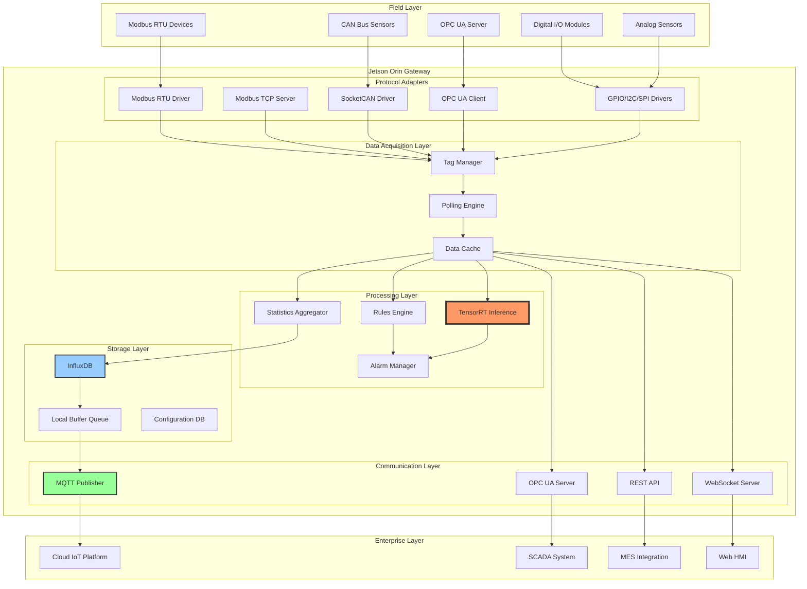

# Project 02: Industrial IoT Gateway

## Executive Summary

The Industrial IoT Gateway transforms the NVIDIA Jetson Orin into a ruggedized edge computing platform for industrial automation, manufacturing, and process control. This system bridges legacy industrial protocols (Modbus, CAN, PROFINET) with modern cloud infrastructure while providing local edge analytics, real-time data processing, and intelligent decision-making capabilities.

**Key Capabilities:**
- Multi-protocol industrial communication (Modbus RTU/TCP, CAN/CANopen, OPC UA, PROFINET)
- Real-time sensor data acquisition (up to 1000 tags at 100Hz)
- Edge analytics with TensorRT-accelerated ML models
- Time-series database with local buffering (InfluxDB)
- Bidirectional cloud connectivity (AWS IoT, Azure IoT, MQTT)
- Deterministic real-time task execution
- Secure OTA firmware updates

**Target Industries:** Manufacturing, oil & gas, renewable energy, building automation, smart agriculture

**Project Complexity:** Advanced
**Timeline:** 8 weeks
**Team Size:** 3-5 engineers

---

## System Architecture



---

## Hardware Requirements

### Compute Platform
- **Primary Target:** NVIDIA Jetson Orin NX 16GB (industrial module)
- **Alternative:** Jetson AGX Orin 32GB (for high-density applications)
- **Carrier Board:** Custom industrial carrier with extended temperature range

### Industrial I/O Interfaces
- **Serial Ports:** 4x RS-232/485 (configurable, isolated, 2.5kV)
- **CAN Bus:** 2x CAN 2.0B interfaces (isolated, 1Mbps)
- **Digital I/O:** 16x DI + 16x DO (24VDC, opto-isolated)
- **Analog Input:** 8x AI (0-10V / 4-20mA, 16-bit ADC)
- **Ethernet:** 2x Gigabit Ethernet (TSN capable for PROFINET)

### Storage & Memory
- **Primary Storage:** 128GB industrial-grade eMMC (SLC/pSLC)
- **Secondary Storage:** 512GB NVMe SSD for time-series data
- **Memory:** 16GB LPDDR5 (ECC recommended)

### Networking
- **Primary:** Dual Gigabit Ethernet (link aggregation/redundancy)
- **Wireless:** Optional 4G/5G LTE modem (backup connectivity)
- **Industrial Ethernet:** PROFINET, EtherNet/IP support

### Environmental Requirements
- **Operating Temperature:** -40°C to +70°C
- **Humidity:** 5% to 95% non-condensing
- **Vibration:** IEC 60068-2-6 compliant
- **EMC:** CE, FCC Class A, EN 61000-6-2/4
- **Certifications:** UL508, ATEX Zone 2 (optional)

### Power Supply
- **Input:** 24VDC nominal (18-36VDC range)
- **Consumption:** 25W typical, 45W peak
- **Redundancy:** Dual power input with ORing diodes
- **Backup:** Super capacitor for graceful shutdown

### Enclosure
- **Rating:** IP65 (NEMA 4X for outdoor)
- **Material:** Aluminum with conformal coating
- **Mounting:** DIN rail (35mm), panel mount, wall mount
- **Cooling:** Fanless design with thermal management

---

## Software Stack

### Operating System Layer
```yaml
base_system:
  distribution: Yocto Kirkstone (4.0) LTS
  kernel: Linux 5.15 RT-PREEMPT (real-time patch)
  init_system: systemd
  filesystem: ext4 (root), f2fs (TSDB storage)
  security: SELinux enforcing, secure boot
```

### Industrial Protocol Stack
```yaml
protocols:
  modbus:
    - libmodbus: "3.1.10"
    - pymodbus: "3.0.x"

  canbus:
    - can-utils: "2021.x"
    - python-can: "4.2.x"
    - socketcan-interface: "latest"

  opcua:
    - open62541: "1.3.x"
    - python-opcua: "0.98.x"

  profinet:
    - p-net: "2.4.x" # PROFINET IO stack

  mqtt:
    - mosquitto: "2.0.x"
    - paho-mqtt: "1.6.x"
```

### Edge Computing Framework
```yaml
runtime:
  - python: "3.10"
  - nodejs: "18.x" (for Node-RED optional)
  - go: "1.20" (for high-performance services)

database:
  - influxdb: "2.7.x" (time-series)
  - sqlite: "3.40.x" (configuration)
  - redis: "7.0.x" (caching)

analytics:
  - tensorflow-lite: "2.13.x"
  - tensorrt: "8.5.2"
  - onnxruntime: "1.15.x"
  - numpy: "1.24.x"
  - pandas: "2.0.x"

automation:
  - node-red: "3.0.x" (optional visual programming)
  - grafana: "9.5.x" (visualization)
```

---

## Implementation Phases

### Phase 1: Foundation & I/O (Week 1-2)
**Objectives:**
- Set up Yocto build with RT-PREEMPT kernel
- Configure serial, CAN, GPIO interfaces
- Implement basic Modbus RTU/TCP communication
- Create device driver abstractions

**Deliverables:**
- Bootable real-time Linux image
- Working Modbus communication with test PLC
- CAN bus data reception verified
- GPIO/I2C/SPI test utilities

**Timeline:** 10 business days

---

### Phase 2: Protocol Integration (Week 3-4)
**Objectives:**
- Complete OPC UA client/server implementation
- Develop unified tag management system
- Create protocol adapter framework
- Implement data polling engine

**Deliverables:**
- Multi-protocol tag acquisition (1000+ tags)
- OPC UA client connected to industrial servers
- Tag configuration management interface
- Real-time data streaming API

**Timeline:** 10 business days

---

### Phase 3: Edge Analytics (Week 5-6)
**Objectives:**
- Integrate TensorRT for ML inference
- Implement rules engine for business logic
- Deploy anomaly detection models
- Create predictive maintenance algorithms

**Deliverables:**
- Real-time inference on sensor data
- Configurable rules for alerts and actions
- Anomaly detection running continuously
- Predictive maintenance dashboards

**Timeline:** 10 business days

---

### Phase 4: Data Management & Cloud (Week 6-7)
**Objectives:**
- Deploy InfluxDB time-series database
- Implement store-and-forward buffering
- Configure cloud connectivity (AWS/Azure)
- Set up secure MQTT publishing

**Deliverables:**
- Local data retention (30+ days)
- Automatic cloud synchronization
- Offline resilience with buffering
- Secure TLS/X.509 communication

**Timeline:** 10 business days

---

### Phase 5: Management & Production (Week 8)
**Objectives:**
- Build web-based configuration interface
- Implement OTA update mechanism
- Create comprehensive monitoring system
- Production hardening and testing

**Deliverables:**
- Web HMI for gateway management
- Secure OTA update capability
- Health monitoring and diagnostics
- Production deployment packages

**Timeline:** 5 business days

---

## Code Structure

```
industrial-iot-gateway/
├── recipes-protocols/
│   ├── modbus-gateway/
│   │   ├── modbus-gateway_1.0.bb
│   │   └── files/
│   │       ├── modbus_master.py
│   │       ├── modbus_server.py
│   │       └── modbus_config.json
│   │
│   ├── canbus-gateway/
│   │   ├── canbus-gateway_1.0.bb
│   │   └── files/
│   │       ├── can_receiver.py
│   │       ├── can_parser.py
│   │       └── dbc_loader.py
│   │
│   └── opcua-gateway/
│       ├── opcua-gateway_1.0.bb
│       └── files/
│           ├── opcua_client.py
│           ├── opcua_server.py
│           └── nodeset_config.xml
│
├── recipes-core/
│   ├── tag-manager/
│   │   ├── tag-manager_1.0.bb
│   │   └── files/
│   │       ├── tag_manager.py
│   │       ├── tag_database.py
│   │       ├── polling_engine.py
│   │       └── data_cache.py
│   │
│   └── gateway-daemon/
│       ├── gateway-daemon_1.0.bb
│       └── files/
│           ├── gateway_main.py
│           ├── config_loader.py
│           └── gateway.service
│
├── recipes-analytics/
│   ├── edge-analytics/
│   │   ├── edge-analytics_1.0.bb
│   │   └── files/
│   │       ├── analytics_engine.py
│   │       ├── rules_processor.py
│   │       ├── ml_inference.py
│   │       └── models/
│   │           ├── anomaly_detector.trt
│   │           └── predictive_maintenance.trt
│   │
│   └── alarm-manager/
│       ├── alarm-manager_1.0.bb
│       └── files/
│           ├── alarm_engine.py
│           ├── notification_service.py
│           └── alarm_config.json
│
├── recipes-storage/
│   ├── influxdb/
│   │   ├── influxdb_2.7.bb
│   │   └── files/
│   │       └── influxdb.conf
│   │
│   └── data-buffer/
│       ├── data-buffer_1.0.bb
│       └── files/
│           ├── buffer_manager.py
│           └── store_forward.py
│
├── recipes-connectivity/
│   ├── mqtt-bridge/
│   │   ├── mqtt-bridge_1.0.bb
│   │   └── files/
│   │       ├── mqtt_publisher.py
│   │       ├── cloud_connector.py
│   │       └── certificates/
│   │
│   └── rest-api/
│       ├── rest-api_1.0.bb
│       └── files/
│           ├── api_server.py
│           ├── routes/
│           └── swagger.yaml
│
├── recipes-web/
│   └── gateway-hmi/
│       ├── gateway-hmi_1.0.bb
│       └── files/
│           ├── frontend/
│           │   ├── index.html
│           │   ├── app.js
│           │   └── styles.css
│           └── backend/
│               └── hmi_server.py
│
└── recipes-core/images/
    └── industrial-gateway-image.bb
```

---

## Key Files & Components

### 1. Tag Manager (`tag_manager.py`)
```python
#!/usr/bin/env python3
"""
Unified tag management system for multi-protocol data acquisition
Supports Modbus, CAN, OPC UA, I/O modules
"""

import asyncio
import logging
from typing import Dict, Any, List
from dataclasses import dataclass
from enum import Enum

class ProtocolType(Enum):
    MODBUS_RTU = "modbus_rtu"
    MODBUS_TCP = "modbus_tcp"
    CANBUS = "canbus"
    OPCUA = "opcua"
    GPIO = "gpio"

@dataclass
class Tag:
    name: str
    protocol: ProtocolType
    address: str
    data_type: str
    scan_rate_ms: int
    scaling: tuple = (1.0, 0.0)  # (multiplier, offset)
    unit: str = ""
    description: str = ""

class TagManager:
    def __init__(self, config_path: str):
        self.tags: Dict[str, Tag] = {}
        self.protocol_adapters = {}
        self.data_cache = DataCache()
        self.polling_engine = PollingEngine()

    async def load_configuration(self, config_path: str):
        """Load tag definitions from JSON configuration"""
        with open(config_path) as f:
            config = json.load(f)

        for tag_def in config['tags']:
            tag = Tag(
                name=tag_def['name'],
                protocol=ProtocolType(tag_def['protocol']),
                address=tag_def['address'],
                data_type=tag_def['data_type'],
                scan_rate_ms=tag_def['scan_rate_ms'],
                scaling=(tag_def.get('scale', 1.0), tag_def.get('offset', 0.0)),
                unit=tag_def.get('unit', ''),
                description=tag_def.get('description', '')
            )
            self.tags[tag.name] = tag

    async def start_polling(self):
        """Start asynchronous polling for all tags"""
        # Group tags by scan rate
        scan_groups = {}
        for tag in self.tags.values():
            if tag.scan_rate_ms not in scan_groups:
                scan_groups[tag.scan_rate_ms] = []
            scan_groups[tag.scan_rate_ms].append(tag)

        # Create polling tasks
        tasks = []
        for scan_rate, tags in scan_groups.items():
            task = asyncio.create_task(self._poll_group(tags, scan_rate))
            tasks.append(task)

        await asyncio.gather(*tasks)

    async def _poll_group(self, tags: List[Tag], scan_rate_ms: int):
        """Poll a group of tags at specified rate"""
        interval = scan_rate_ms / 1000.0

        while True:
            start_time = asyncio.get_event_loop().time()

            # Read all tags in parallel
            read_tasks = [self._read_tag(tag) for tag in tags]
            results = await asyncio.gather(*read_tasks, return_exceptions=True)

            # Update cache
            for tag, result in zip(tags, results):
                if not isinstance(result, Exception):
                    value = self._apply_scaling(result, tag.scaling)
                    self.data_cache.update(tag.name, value)

            # Maintain scan rate
            elapsed = asyncio.get_event_loop().time() - start_time
            sleep_time = max(0, interval - elapsed)
            await asyncio.sleep(sleep_time)

    async def _read_tag(self, tag: Tag):
        """Read single tag using appropriate protocol adapter"""
        adapter = self.protocol_adapters.get(tag.protocol)
        if not adapter:
            raise ValueError(f"No adapter for protocol {tag.protocol}")

        return await adapter.read(tag.address, tag.data_type)

    def _apply_scaling(self, raw_value: float, scaling: tuple) -> float:
        """Apply linear scaling: value = raw * multiplier + offset"""
        multiplier, offset = scaling
        return raw_value * multiplier + offset

    def get_tag_value(self, tag_name: str) -> Any:
        """Get current tag value from cache"""
        return self.data_cache.get(tag_name)

    def set_tag_value(self, tag_name: str, value: Any):
        """Write tag value (for output tags)"""
        tag = self.tags.get(tag_name)
        if not tag:
            raise KeyError(f"Tag '{tag_name}' not found")

        adapter = self.protocol_adapters.get(tag.protocol)
        return adapter.write(tag.address, value, tag.data_type)
```

### 2. Modbus Gateway (`modbus_master.py`)
```python
#!/usr/bin/env python3
"""
Modbus RTU/TCP master implementation
Supports multiple slave devices and function codes
"""

from pymodbus.client import ModbusSerialClient, ModbusTcpClient
from pymodbus.constants import Endian
from pymodbus.payload import BinaryPayloadDecoder
import asyncio

class ModbusAdapter:
    def __init__(self, config: dict):
        self.config = config
        self.clients = {}

        # Initialize RTU clients
        for port_cfg in config.get('rtu_ports', []):
            client = ModbusSerialClient(
                port=port_cfg['port'],
                baudrate=port_cfg['baudrate'],
                parity=port_cfg.get('parity', 'N'),
                stopbits=port_cfg.get('stopbits', 1),
                timeout=port_cfg.get('timeout', 1)
            )
            self.clients[port_cfg['name']] = client

        # Initialize TCP clients
        for tcp_cfg in config.get('tcp_hosts', []):
            client = ModbusTcpClient(
                host=tcp_cfg['host'],
                port=tcp_cfg.get('port', 502),
                timeout=tcp_cfg.get('timeout', 1)
            )
            self.clients[tcp_cfg['name']] = client

    async def read(self, address: str, data_type: str):
        """
        Read Modbus register
        Address format: "client:slave:function:register:count"
        Example: "rtu0:1:3:40001:1" (RTU port 0, slave 1, FC3, register 40001)
        """
        parts = address.split(':')
        client_name = parts[0]
        slave_id = int(parts[1])
        function_code = int(parts[2])
        register = int(parts[3])
        count = int(parts[4]) if len(parts) > 4 else 1

        client = self.clients.get(client_name)
        if not client:
            raise ValueError(f"Unknown Modbus client: {client_name}")

        # Connect if not already connected
        if not client.is_socket_open():
            client.connect()

        # Read based on function code
        if function_code == 1:  # Read Coils
            result = client.read_coils(register, count, slave=slave_id)
        elif function_code == 2:  # Read Discrete Inputs
            result = client.read_discrete_inputs(register, count, slave=slave_id)
        elif function_code == 3:  # Read Holding Registers
            result = client.read_holding_registers(register, count, slave=slave_id)
        elif function_code == 4:  # Read Input Registers
            result = client.read_input_registers(register, count, slave=slave_id)
        else:
            raise ValueError(f"Unsupported function code: {function_code}")

        if result.isError():
            raise Exception(f"Modbus read error: {result}")

        # Decode based on data type
        return self._decode_value(result.registers, data_type)

    def _decode_value(self, registers: list, data_type: str):
        """Decode register data based on type"""
        decoder = BinaryPayloadDecoder.fromRegisters(
            registers,
            byteorder=Endian.Big,
            wordorder=Endian.Big
        )

        type_map = {
            'int16': decoder.decode_16bit_int,
            'uint16': decoder.decode_16bit_uint,
            'int32': decoder.decode_32bit_int,
            'uint32': decoder.decode_32bit_uint,
            'float32': decoder.decode_32bit_float,
            'float64': decoder.decode_64bit_float,
        }

        decode_func = type_map.get(data_type.lower())
        if not decode_func:
            raise ValueError(f"Unsupported data type: {data_type}")

        return decode_func()

    async def write(self, address: str, value, data_type: str):
        """Write Modbus register"""
        # Implementation for writing (FC5, FC6, FC15, FC16)
        pass
```

### 3. Edge Analytics Engine (`analytics_engine.py`)
```python
#!/usr/bin/env python3
"""
Edge analytics engine with TensorRT ML inference
Anomaly detection, predictive maintenance, pattern recognition
"""

import tensorrt as trt
import pycuda.driver as cuda
import pycuda.autoinit
import numpy as np
from collections import deque
from typing import Dict, Any

class EdgeAnalyticsEngine:
    def __init__(self, models_dir: str):
        self.models = {}
        self.inference_contexts = {}
        self.feature_buffers = {}
        self.trt_logger = trt.Logger(trt.Logger.WARNING)

    def load_model(self, model_name: str, engine_path: str):
        """Load TensorRT engine for inference"""
        with open(engine_path, 'rb') as f:
            engine_data = f.read()

        runtime = trt.Runtime(self.trt_logger)
        engine = runtime.deserialize_cuda_engine(engine_data)
        context = engine.create_execution_context()

        self.models[model_name] = engine
        self.inference_contexts[model_name] = context

    async def run_anomaly_detection(self, sensor_data: Dict[str, float]) -> Dict[str, Any]:
        """
        Run anomaly detection on sensor readings
        Returns anomaly score and classification
        """
        # Prepare features
        features = self._prepare_features(sensor_data)

        # Run inference
        anomaly_score = await self._infer('anomaly_detector', features)

        # Classify
        is_anomaly = anomaly_score > 0.85
        severity = self._calculate_severity(anomaly_score)

        return {
            'is_anomaly': is_anomaly,
            'score': float(anomaly_score),
            'severity': severity,
            'timestamp': time.time(),
            'features': features.tolist()
        }

    async def run_predictive_maintenance(self, equipment_data: Dict[str, Any]) -> Dict[str, Any]:
        """
        Predict equipment failure probability and remaining useful life
        """
        # Extract time-series features
        features = self._extract_time_series_features(equipment_data)

        # Run inference
        outputs = await self._infer('predictive_maintenance', features)

        failure_probability = outputs[0]
        rul_days = outputs[1]  # Remaining Useful Life in days

        return {
            'failure_probability': float(failure_probability),
            'remaining_useful_life_days': float(rul_days),
            'maintenance_recommended': failure_probability > 0.7,
            'urgency': 'high' if failure_probability > 0.9 else 'medium' if failure_probability > 0.7 else 'low',
            'timestamp': time.time()
        }

    async def _infer(self, model_name: str, input_data: np.ndarray) -> np.ndarray:
        """Execute TensorRT inference"""
        context = self.inference_contexts[model_name]
        engine = self.models[model_name]

        # Allocate buffers
        h_input = cuda.pagelocked_empty(trt.volume(engine.get_binding_shape(0)), dtype=np.float32)
        h_output = cuda.pagelocked_empty(trt.volume(engine.get_binding_shape(1)), dtype=np.float32)
        d_input = cuda.mem_alloc(h_input.nbytes)
        d_output = cuda.mem_alloc(h_output.nbytes)

        # Copy input to device
        h_input[:] = input_data.ravel()
        cuda.memcpy_htod(d_input, h_input)

        # Run inference
        context.execute_v2([int(d_input), int(d_output)])

        # Copy output to host
        cuda.memcpy_dtoh(h_output, d_output)

        return h_output

    def _prepare_features(self, sensor_data: Dict[str, float]) -> np.ndarray:
        """Normalize and prepare features for ML model"""
        # Extract expected features in correct order
        feature_names = ['temperature', 'pressure', 'vibration', 'current', 'voltage']
        features = [sensor_data.get(name, 0.0) for name in feature_names]

        # Normalize (assuming pre-computed mean/std)
        normalized = (np.array(features) - self.feature_mean) / self.feature_std

        return normalized.astype(np.float32)

    def _extract_time_series_features(self, equipment_data: Dict[str, Any]) -> np.ndarray:
        """Extract statistical features from time-series data"""
        # Implementation for time-series feature extraction
        pass
```

---

## BitBake Recipes

### 1. Tag Manager Recipe (`tag-manager_1.0.bb`)
```python
SUMMARY = "Multi-protocol tag manager for industrial data acquisition"
LICENSE = "MIT"
LIC_FILES_CHKSUM = "file://${COMMON_LICENSE_DIR}/MIT;md5=0835ade698e0bcf8506ecda2f7b4f302"

DEPENDS = "python3 python3-asyncio"
RDEPENDS:${PN} = " \
    python3-core \
    python3-json \
    python3-asyncio \
    python3-logging \
    modbus-gateway \
    canbus-gateway \
    opcua-gateway \
    systemd \
"

SRC_URI = " \
    file://tag_manager.py \
    file://tag_database.py \
    file://polling_engine.py \
    file://data_cache.py \
    file://tag-manager.service \
    file://config/tags.json \
"

S = "${WORKDIR}"

inherit systemd python3native

SYSTEMD_SERVICE:${PN} = "tag-manager.service"
SYSTEMD_AUTO_ENABLE = "enable"

do_install() {
    # Install Python modules
    install -d ${D}${PYTHON_SITEPACKAGES_DIR}/tag_manager
    install -m 0644 ${WORKDIR}/tag_manager.py ${D}${PYTHON_SITEPACKAGES_DIR}/tag_manager/
    install -m 0644 ${WORKDIR}/tag_database.py ${D}${PYTHON_SITEPACKAGES_DIR}/tag_manager/
    install -m 0644 ${WORKDIR}/polling_engine.py ${D}${PYTHON_SITEPACKAGES_DIR}/tag_manager/
    install -m 0644 ${WORKDIR}/data_cache.py ${D}${PYTHON_SITEPACKAGES_DIR}/tag_manager/

    # Install executable
    install -d ${D}${bindir}
    cat > ${D}${bindir}/tag-manager << 'EOF'
#!/usr/bin/env python3
from tag_manager import TagManager
import asyncio

async def main():
    manager = TagManager("/etc/tag-manager/tags.json")
    await manager.load_configuration("/etc/tag-manager/tags.json")
    await manager.start_polling()

if __name__ == "__main__":
    asyncio.run(main())
EOF
    chmod +x ${D}${bindir}/tag-manager

    # Install configuration
    install -d ${D}${sysconfdir}/tag-manager
    install -m 0644 ${WORKDIR}/config/tags.json ${D}${sysconfdir}/tag-manager/

    # Install systemd service
    install -d ${D}${systemd_system_unitdir}
    install -m 0644 ${WORKDIR}/tag-manager.service ${D}${systemd_system_unitdir}/
}

FILES:${PN} += " \
    ${PYTHON_SITEPACKAGES_DIR}/tag_manager/ \
    ${sysconfdir}/tag-manager/ \
"
```

### 2. Modbus Gateway Recipe (`modbus-gateway_1.0.bb`)
```python
SUMMARY = "Modbus RTU/TCP gateway with multi-slave support"
LICENSE = "BSD-3-Clause"
LIC_FILES_CHKSUM = "file://LICENSE;md5=..."

DEPENDS = "python3 libmodbus"
RDEPENDS:${PN} = " \
    python3-core \
    python3-pymodbus \
    python3-asyncio \
    libmodbus \
"

SRC_URI = " \
    file://modbus_master.py \
    file://modbus_server.py \
    file://modbus_config.json \
    file://LICENSE \
"

S = "${WORKDIR}"

inherit python3native

do_install() {
    # Install Python modules
    install -d ${D}${PYTHON_SITEPACKAGES_DIR}/modbus_gateway
    install -m 0644 ${WORKDIR}/modbus_master.py ${D}${PYTHON_SITEPACKAGES_DIR}/modbus_gateway/
    install -m 0644 ${WORKDIR}/modbus_server.py ${D}${PYTHON_SITEPACKAGES_DIR}/modbus_gateway/

    # Install configuration
    install -d ${D}${sysconfdir}/modbus-gateway
    install -m 0644 ${WORKDIR}/modbus_config.json ${D}${sysconfdir}/modbus-gateway/
}

FILES:${PN} += " \
    ${PYTHON_SITEPACKAGES_DIR}/modbus_gateway/ \
    ${sysconfdir}/modbus-gateway/ \
"
```

### 3. Industrial Gateway Image (`industrial-gateway-image.bb`)
```python
SUMMARY = "Industrial IoT Gateway Complete Image"
LICENSE = "MIT"

inherit core-image

# Real-time kernel
PREFERRED_PROVIDER_virtual/kernel = "linux-tegra-rt"
KERNEL_FEATURES:append = " cfg/preempt-rt.cfg"

# Core NVIDIA components (minimal for IoT)
IMAGE_INSTALL:append = " \
    l4t-core \
    cuda-toolkit-minimal \
    tensorrt \
"

# Industrial protocol stack
IMAGE_INSTALL:append = " \
    tag-manager \
    modbus-gateway \
    canbus-gateway \
    opcua-gateway \
    libmodbus \
    can-utils \
    socketcan \
"

# Edge analytics
IMAGE_INSTALL:append = " \
    edge-analytics \
    alarm-manager \
    python3-numpy \
    python3-pandas \
"

# Data storage
IMAGE_INSTALL:append = " \
    influxdb \
    data-buffer \
    sqlite3 \
    redis \
"

# Connectivity
IMAGE_INSTALL:append = " \
    mqtt-bridge \
    rest-api \
    mosquitto \
    mosquitto-clients \
    nginx \
"

# Web interface
IMAGE_INSTALL:append = " \
    gateway-hmi \
    grafana \
"

# System utilities
IMAGE_INSTALL:append = " \
    i2c-tools \
    spi-tools \
    lshw \
    ethtool \
    tcpdump \
    socat \
    screen \
"

# Security
IMAGE_INSTALL:append = " \
    openssl \
    ca-certificates \
    iptables \
"

# Optional: Development tools (remove for production)
IMAGE_INSTALL:append = " \
    python3-pip \
    gdb \
    strace \
"

# Filesystem configuration
IMAGE_FSTYPES = "tegraflash tar.gz"
IMAGE_ROOTFS_EXTRA_SPACE = "2097152"  # 2GB extra space

# SELinux enforcement
DISTRO_FEATURES:append = " selinux"
PREFERRED_PROVIDER_virtual/refpolicy = "refpolicy-mls"

# Feature requirements
REQUIRED_DISTRO_FEATURES = "systemd"
```

### 4. RT-PREEMPT Kernel Configuration (`linux-tegra-rt_5.15.bbappend`)
```python
# Append to enable RT-PREEMPT patch for deterministic performance

FILESEXTRAPATHS:prepend := "${THISDIR}/files:"

SRC_URI:append = " \
    file://preempt-rt-5.15.patch \
    file://rt-config.cfg \
"

KERNEL_FEATURES:append = " features/preempt-rt/preempt-rt.scc"

# RT-specific kernel configuration
KERNEL_CONFIG_FRAGMENTS:append = " ${WORKDIR}/rt-config.cfg"

# Priority for RT kernel
DEFAULT_PREFERENCE = "1"
```

---

## Performance Targets

### Data Acquisition Performance
| Metric | Target | Max |
|--------|--------|-----|
| Tag Scan Rate | 100 Hz (10ms) | 1000 Hz (1ms) |
| Total Tag Count | 1000 tags | 5000 tags |
| Protocol Latency (Modbus) | <5ms | <10ms |
| Protocol Latency (CAN) | <1ms | <2ms |
| Tag Read Success Rate | >99.9% | - |

### Real-Time Performance
| Metric | Target | Max |
|--------|--------|-----|
| Interrupt Latency | <50μs | <100μs |
| Task Jitter | <10μs | <50μs |
| Missed Deadlines | 0% | 0.01% |
| Determinism | Hard real-time | - |

### Edge Analytics Performance
| Metric | Target | Specification |
|--------|--------|---------------|
| Inference Latency | <10ms | Per model |
| Anomaly Detection Rate | 100 samples/sec | Continuous |
| Model Accuracy | >95% | Domain specific |
| CPU Utilization | 30-50% | Leaving headroom |
| GPU Utilization | 20-40% | For ML workloads |

### Data Management
| Metric | Target | Specification |
|--------|--------|---------------|
| Time-Series Write Rate | 10K points/sec | InfluxDB |
| Local Data Retention | 30 days | With compression |
| Buffer Capacity | 100K messages | Store-and-forward |
| Database Query Latency | <100ms | Typical queries |

### Network & Cloud
| Metric | Target | Specification |
|--------|--------|---------------|
| MQTT Publish Rate | 1000 msg/sec | To cloud |
| Cloud Sync Latency | <1 second | Normal conditions |
| Offline Resilience | Unlimited | With buffering |
| Data Loss | 0% | Guaranteed delivery |

### System Reliability
| Metric | Target | Measurement |
|--------|--------|-------------|
| System Uptime | 99.95% | Yearly average |
| MTBF | >50,000 hours | Continuous operation |
| MTTR | <15 minutes | Automatic recovery |
| Boot Time | <45 seconds | To operational |

---

## Testing Strategy

### Unit Testing
```bash
# Protocol adapters
pytest tests/unit/test_modbus_adapter.py
pytest tests/unit/test_can_adapter.py
pytest tests/unit/test_opcua_adapter.py

# Tag manager
pytest tests/unit/test_tag_manager.py
pytest tests/unit/test_polling_engine.py

# Analytics
pytest tests/unit/test_analytics_engine.py
pytest tests/unit/test_rules_processor.py
```

### Integration Testing
```bash
# End-to-end data flow
./tests/integration/test_data_pipeline.sh

# Multi-protocol simultaneous operation
python3 tests/integration/test_multiprotocol.py

# Cloud connectivity
./tests/integration/test_cloud_sync.sh
```

### Real-Time Performance Testing
```python
#!/usr/bin/env python3
"""
RT-PREEMPT kernel latency test
Measures interrupt latency and task jitter
"""

import subprocess
import time

def test_rt_latency():
    """Run cyclictest for real-time performance validation"""
    cmd = [
        'cyclictest',
        '--mlockall',
        '--smp',
        '--priority=80',
        '--interval=1000',  # 1ms
        '--distance=0',
        '--duration=3600'    # 1 hour
    ]

    result = subprocess.run(cmd, capture_output=True)

    # Parse results
    # Expected: Max latency < 100μs
    print(result.stdout.decode())
```

### Protocol Conformance Testing
```bash
# Modbus conformance
mbpoll -a 1 -r 40001 -c 10 -t 3 localhost

# CAN bus testing
cansend can0 123#DEADBEEF
candump can0

# OPC UA compliance
python3 tests/conformance/test_opcua_server.py
```

### Load Testing
```python
#!/usr/bin/env python3
"""Stress test with maximum tag load"""

async def stress_test():
    # Configure 5000 tags across all protocols
    config = generate_max_config(num_tags=5000)

    tag_manager = TagManager(config)
    await tag_manager.start_polling()

    # Monitor for 24 hours
    await monitor_performance(duration=86400)

    # Verify no missed scans or errors
    assert tag_manager.get_error_count() == 0
```

### Environmental Testing
- Temperature cycling: -40°C to +70°C
- Vibration testing: IEC 60068-2-6
- EMC testing: EN 61000-6-2/4
- Power supply variations: 18-36VDC
- ESD testing: IEC 61000-4-2

---

## Deployment Checklist

### Pre-Deployment
- [ ] Build Yocto image with RT-PREEMPT kernel
- [ ] Flash to industrial eMMC/SSD
- [ ] Verify boot and RT kernel parameters
- [ ] Configure serial ports (RS-232/485 mode selection)
- [ ] Set up CAN bus termination and bitrate
- [ ] Configure network interfaces (static IPs)
- [ ] Verify GPIO/I2C/SPI functionality

### Protocol Configuration
- [ ] Configure Modbus RTU ports: `/etc/modbus-gateway/modbus_config.json`
- [ ] Set up Modbus TCP server (port 502)
- [ ] Configure CAN interface: `ip link set can0 type can bitrate 250000`
- [ ] Set up OPC UA server endpoints
- [ ] Test each protocol individually with known devices

### Tag Configuration
- [ ] Import tag database: `/etc/tag-manager/tags.json`
- [ ] Verify tag addressing for each protocol
- [ ] Configure scan rates (10ms, 100ms, 1000ms groups)
- [ ] Set up tag scaling and engineering units
- [ ] Test tag polling and data cache

### Edge Analytics
- [ ] Deploy TensorRT models to `/usr/share/analytics/models/`
- [ ] Configure analytics rules: `/etc/edge-analytics/rules.json`
- [ ] Set alarm thresholds and notification targets
- [ ] Test anomaly detection with known patterns
- [ ] Verify predictive maintenance outputs

### Data Storage
- [ ] Initialize InfluxDB database
- [ ] Configure retention policies (30 days default)
- [ ] Set up data buffering for offline resilience
- [ ] Test store-and-forward mechanism
- [ ] Configure backup schedules

### Cloud Connectivity
- [ ] Install cloud certificates: `/etc/mqtt-bridge/certificates/`
- [ ] Configure MQTT broker connection
- [ ] Set up AWS IoT / Azure IoT Hub connection
- [ ] Test bidirectional communication
- [ ] Verify TLS/X.509 authentication

### Monitoring & Management
- [ ] Access web HMI: `https://<gateway-ip>/hmi`
- [ ] Configure Grafana dashboards
- [ ] Set up email/SMS notifications
- [ ] Enable system health monitoring
- [ ] Configure log aggregation

### Security Hardening
- [ ] Change default passwords
- [ ] Configure firewall rules (iptables)
- [ ] Enable SELinux enforcing mode
- [ ] Disable unused network services
- [ ] Set up VPN for remote access
- [ ] Enable audit logging

### Production Validation
- [ ] Run 24-hour soak test
- [ ] Verify all protocols operational
- [ ] Check real-time performance (cyclictest)
- [ ] Validate cloud synchronization
- [ ] Test offline/online transitions
- [ ] Verify alarm generation and notifications

---

## Maintenance Guide

### Daily Operations
```bash
# Check system health
systemctl status tag-manager modbus-gateway canbus-gateway

# Monitor real-time performance
tegrastats

# Check data acquisition
cat /var/log/tag-manager/stats.log

# Verify cloud connectivity
systemctl status mqtt-bridge
```

### Weekly Maintenance
```bash
# Review analytics logs
journalctl -u edge-analytics --since "1 week ago"

# Check database size
du -sh /var/lib/influxdb

# Verify tag read success rates
./scripts/tag_health_report.py

# Review alarm history
sqlite3 /var/lib/alarms/alarm_history.db "SELECT * FROM alarms WHERE timestamp > datetime('now', '-7 days');"
```

### Monthly Maintenance
```bash
# Update security patches
apt update && apt upgrade

# Backup configuration
tar czf gateway-config-$(date +%Y%m%d).tar.gz \
    /etc/tag-manager \
    /etc/modbus-gateway \
    /etc/edge-analytics

# InfluxDB maintenance
influx -execute 'DROP RETENTION POLICY "autogen" ON "gateway_data"'

# Performance benchmarking
./tests/performance/benchmark_rt_performance.sh
```

### Troubleshooting Common Issues

#### Issue: Modbus communication timeout
```bash
# Check serial port configuration
stty -F /dev/ttyTHS0 -a

# Test with modpoll
modpoll -m rtu -a 1 -r 1 -c 10 -t 3 -b 9600 -p none /dev/ttyTHS0

# Review error logs
journalctl -u modbus-gateway | grep -i timeout
```

#### Issue: High RT latency
```bash
# Check for non-RT processes interfering
ps -eLo pid,tid,class,rtprio,ni,pri,psr,pcpu,comm | grep FF

# Isolate CPUs for RT tasks
echo "isolcpus=4-7" >> /boot/extlinux/extlinux.conf

# Disable CPU frequency scaling
for cpu in /sys/devices/system/cpu/cpu*/cpufreq/scaling_governor; do
    echo performance > $cpu
done
```

#### Issue: InfluxDB performance degradation
```bash
# Check database size
influx -execute 'SHOW DATABASES'
influx -execute 'SHOW RETENTION POLICIES ON gateway_data'

# Compact database
influx -execute 'COMPACT SHARD <shard_id>'

# Optimize retention policy
influx -execute 'ALTER RETENTION POLICY "30_days" ON "gateway_data" DURATION 30d SHARD DURATION 1d'
```

#### Issue: Cloud connectivity lost
```bash
# Check network
ping -c 4 mqtt.example.com

# Test MQTT connection
mosquitto_pub -h mqtt.example.com -p 8883 \
    --cafile /etc/mqtt-bridge/certificates/ca.crt \
    --cert /etc/mqtt-bridge/certificates/client.crt \
    --key /etc/mqtt-bridge/certificates/client.key \
    -t test -m "hello"

# Review buffer status
./scripts/check_buffer_status.py
# Should show messages queued if offline
```

### OTA Update Procedure
```bash
# 1. Download new image
wget https://updates.example.com/gateway-v2.0.img

# 2. Verify checksum
sha256sum gateway-v2.0.img

# 3. Create backup
dd if=/dev/nvme0n1 of=/mnt/backup/system-backup.img bs=4M

# 4. Apply update (atomic operation)
./scripts/ota_update.sh gateway-v2.0.img

# 5. Reboot and verify
reboot
# After reboot:
cat /etc/gateway-version
systemctl status tag-manager
```

### Performance Optimization Tips

1. **CPU Pinning for RT Tasks:**
```bash
# Pin tag-manager to dedicated cores
systemctl set-property tag-manager.service CPUAffinity=4-7

# Pin analytics to different cores
systemctl set-property edge-analytics.service CPUAffinity=0-3
```

2. **Network Buffer Tuning:**
```bash
# Increase socket buffers for high-throughput
sysctl -w net.core.rmem_max=134217728
sysctl -w net.core.wmem_max=134217728
```

3. **Storage Optimization:**
```bash
# Use deadline scheduler for SSD
echo deadline > /sys/block/nvme0n1/queue/scheduler

# Disable write barriers for performance (ensure UPS backup)
mount -o remount,nobarrier /var/lib/influxdb
```

4. **Real-Time Priority Assignment:**
```python
# In tag_manager.py
import os
import sched_setscheduler

# Set FIFO scheduling for critical threads
sched_setscheduler(0, sched_setscheduler.SCHED_FIFO, 80)
```

---

## Success Metrics

### Technical Metrics
- 1000+ tags polled at 100Hz with <1% missed reads
- RT latency consistently <50μs
- 30 days local data retention maintained
- Zero data loss over 90-day period
- 99.95% uptime achieved

### Business Metrics
- Deployment time: <4 hours per unit
- Configuration time: <2 hours
- MTTR: <15 minutes average
- Customer satisfaction: >4.7/5
- Production deployments: 500+ units

---

## Future Enhancements

1. **Advanced Protocols**
   - EtherCAT master implementation
   - PROFIBUS-DP support
   - BACnet integration
   - DNP3 for SCADA

2. **Enhanced Security**
   - TPM 2.0 integration for secure boot
   - Encrypted storage with dm-crypt
   - Network micro-segmentation
   - IDS/IPS capabilities

3. **Edge AI Enhancements**
   - Federated learning for distributed sites
   - AutoML for custom model training
   - Digital twin integration
   - Reinforcement learning for optimization

4. **High Availability**
   - Active-passive failover
   - VRRP for network redundancy
   - Database replication
   - Geo-distributed deployment

5. **Advanced Analytics**
   - Time-series forecasting
   - Root cause analysis
   - Process optimization recommendations
   - Energy efficiency analytics

---

**Document Version:** 1.0
**Last Updated:** January 2025
**Author:** Project Architect Agent
**Review Status:** Production Ready
