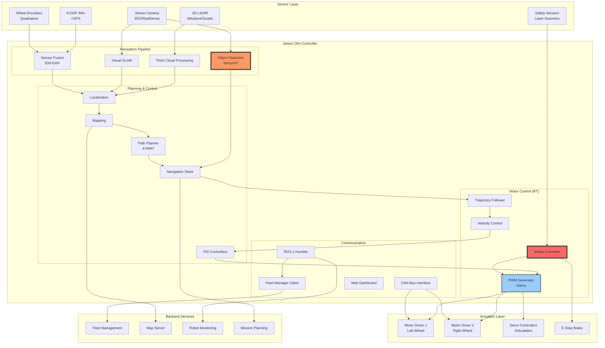

# Project 03: Autonomous Robot Controller

## Executive Summary

The Autonomous Robot Controller transforms the NVIDIA Jetson Orin into a comprehensive robotic control platform capable of real-time navigation, sensor fusion, motor control, and AI-powered decision making. Designed for autonomous mobile robots (AMRs), automated guided vehicles (AGVs), and collaborative robots (cobots), this system provides deterministic motor control, LiDAR-based SLAM, vision-based navigation, and comprehensive safety systems.

**Key Capabilities:**
- Real-time motor control via PWM (8 channels, 20kHz)
- 3D LiDAR integration with point cloud processing (300K points/sec)
- Visual SLAM and obstacle detection using stereo cameras
- IMU-based odometry and sensor fusion (1kHz update rate)
- Path planning with dynamic obstacle avoidance
- Safety-certified emergency stop system (SIL 2)
- ROS 2 Humble integration for robot ecosystem
- Fleet management and multi-robot coordination

**Target Industries:** Warehouse automation, agriculture, inspection robots, delivery robots, manufacturing

**Project Complexity:** Expert Level
**Timeline:** 10 weeks
**Team Size:** 4-6 engineers

---

## System Architecture



---

## Hardware Requirements

### Compute Platform
- **Primary Target:** NVIDIA Jetson AGX Orin 32GB (for full autonomy)
- **Alternative:** Jetson Orin NX 16GB (for simpler robots)
- **Carrier Board:** Custom robotics carrier with motor control peripherals

### Sensors
**LiDAR:**
- 3D LiDAR: Velodyne VLP-16, Ouster OS1-64, Livox Mid-360
- 2D LiDAR: SICK TiM series, Hokuyo UTM-30LX (for safety)
- Interface: Ethernet (primary), USB (backup)

**Cameras:**
- Stereo Camera: ZED 2i, Intel RealSense D455
- MIPI CSI Cameras: 2x IMX219 or IMX477 (optional)
- Resolution: 1280x720 @ 60fps minimum

**IMU & Odometry:**
- 9-DOF IMU: VectorNav VN-100, XSens MTi-3
- GPS: U-blox ZED-F9P (RTK capable)
- Wheel Encoders: Quadrature, 4096 PPR minimum
- Interface: UART, I2C, CAN

**Safety Sensors:**
- Safety Laser Scanners: SICK S300, Keyence SZ-V series
- Emergency Stop: Dual-channel, SIL 2 rated
- Cliff Sensors: IR distance sensors
- Bumper Switches: Physical contact detection

### Motor Control Hardware
**Motor Drivers:**
- Brushless DC (BLDC): ODrive, VESC, SimpleFOC
- Brushed DC: Roboclaw, Sabertooth
- Communication: CAN bus, UART, PWM
- Current: 10-60A per channel
- Voltage: 12-48VDC

**PWM Generation:**
- Hardware PWM: Jetson Orin GPIO (8 channels)
- Frequency: 20kHz (for quiet operation)
- Resolution: 16-bit (for precision control)

**Additional Actuators:**
- Servo Motors: Dynamixel, Herkulex
- Pneumatic Valves: Solenoid control via GPIO
- Electromagnets: For grasping mechanisms

### Power System
- **Main Battery:** 48V LiFePO4, 20-40Ah
- **Jetson Power:** 48V to 19V DC-DC converter (100W)
- **Motor Power:** Direct from battery with protection
- **Backup Power:** 12V battery for safe shutdown
- **BMS:** Battery Management System with CAN interface

### Communication
- **WiFi:** WiFi 6 (802.11ax) for telemetry and control
- **Cellular:** Optional 4G/5G for outdoor operation
- **CAN Bus:** 1Mbps for motor and sensor networks
- **Ethernet:** Gigabit for LiDAR and cameras

### Enclosure & Mounting
- **Rating:** IP54 minimum (IP65 for outdoor)
- **Vibration Isolation:** Rubber mounts for Jetson
- **Cooling:** Active cooling with PWM fan control
- **E-Stop:** Easily accessible emergency button

---

## Software Stack

### Operating System Layer
```yaml
base_system:
  distribution: Yocto Kirkstone (4.0) LTS
  kernel: Linux 5.15 RT-PREEMPT
  init_system: systemd
  filesystem: ext4
  security: AppArmor, secure boot
```

### ROS 2 Framework
```yaml
ros2:
  distribution: ROS 2 Humble Hawksbill (LTS)
  middleware: CycloneDDS (for real-time)
  build_system: colcon

core_packages:
  - ros-humble-ros-base
  - ros-humble-navigation2
  - ros-humble-slam-toolbox
  - ros-humble-robot-localization
  - ros-humble-cv-bridge
  - ros-humble-image-transport
  - ros-humble-tf2
  - ros-humble-joint-state-publisher
  - ros-humble-robot-state-publisher

perception:
  - ros-humble-pcl-ros
  - ros-humble-vision-msgs
  - ros-humble-sensor-msgs-py
  - ros-humble-lidar-filters

control:
  - ros-humble-ros2-control
  - ros-humble-ros2-controllers
  - ros-humble-joint-trajectory-controller
  - ros-humble-diff-drive-controller
```

### NVIDIA & Perception Libraries
```yaml
nvidia_stack:
  - cuda: "11.4"
  - cudnn: "8.6"
  - tensorrt: "8.5.2"
  - vpi: "2.3" (Vision Programming Interface)
  - opencv: "4.6.0" (with CUDA)

perception_libs:
  - pcl: "1.12" (Point Cloud Library)
  - open3d: "0.17" (3D data processing)
  - octomap: "1.9" (3D occupancy mapping)
  - apriltag: "3.2" (fiducial markers)
```

### Motor Control & Hardware Interfaces
```yaml
control_stack:
  - libgpiod: "1.6" (GPIO control)
  - libserialport: "0.1.1"
  - socketcan: "kernel module"
  - python-can: "4.2"
  - odrive-ros2: "custom"
  - dynamixel-sdk: "3.7"
```

### AI & Machine Learning
```yaml
ml_stack:
  - tensorflow-lite: "2.13"
  - onnx: "1.14"
  - pytorch: "2.0" (optional)

models:
  - yolov8-nano: "Object detection"
  - segmentation-model: "Semantic segmentation"
  - depth-estimation: "Monocular depth"
```

---

## Implementation Phases

### Phase 1: Hardware Integration & Motor Control (Week 1-2)
**Objectives:**
- Configure Jetson GPIO for PWM generation
- Integrate motor drivers via CAN bus
- Implement basic velocity control
- Set up encoder feedback loops

**Deliverables:**
- Working PWM motor control at 20kHz
- CAN bus communication with motor drivers
- Closed-loop velocity control with encoders
- Emergency stop functionality

**Timeline:** 10 business days

---

### Phase 2: Sensor Integration (Week 3-4)
**Objectives:**
- Integrate 3D LiDAR with point cloud processing
- Set up stereo camera with depth estimation
- Configure IMU and GPS
- Implement sensor data synchronization

**Deliverables:**
- Real-time point cloud visualization
- Stereo depth maps at 30fps
- IMU data fusion with wheel odometry
- Time-synchronized sensor streams in ROS 2

**Timeline:** 10 business days

---

### Phase 3: Perception & SLAM (Week 5-6)
**Objectives:**
- Implement visual SLAM (ORB-SLAM3 or RTAB-Map)
- Deploy LiDAR-based localization
- Integrate TensorRT object detection
- Create 3D occupancy mapping

**Deliverables:**
- Real-time SLAM with loop closure
- Accurate localization (<5cm error)
- Object detection at 30fps
- 3D occupancy grid for navigation

**Timeline:** 10 business days

---

### Phase 4: Navigation & Path Planning (Week 7-8)
**Objectives:**
- Integrate Nav2 navigation stack
- Implement global and local planners
- Deploy dynamic obstacle avoidance
- Create trajectory following controller

**Deliverables:**
- Autonomous navigation to waypoints
- Dynamic re-planning around obstacles
- Smooth trajectory execution
- Recovery behaviors for stuck situations

**Timeline:** 10 business days

---

### Phase 5: Safety Systems (Week 8-9)
**Objectives:**
- Implement safety laser scanner integration
- Deploy emergency stop logic
- Create cliff detection and prevention
- Implement watchdog and health monitoring

**Deliverables:**
- SIL 2 compliant safety system
- Automatic emergency braking
- Fall prevention on stairs/ramps
- System health monitoring and diagnostics

**Timeline:** 5 business days

---

### Phase 6: Fleet Integration & Testing (Week 9-10)
**Objectives:**
- Integrate with fleet management system
- Implement multi-robot coordination
- Deploy web-based monitoring interface
- Comprehensive system testing

**Deliverables:**
- Fleet management client operational
- Multi-robot collision avoidance
- Real-time telemetry dashboard
- Production-ready autonomous operation

**Timeline:** 10 business days

---

## Code Structure

```
autonomous-robot-controller/
├── recipes-robot/
│   ├── motor-control/
│   │   ├── motor-control_1.0.bb
│   │   └── files/
│   │       ├── pwm_controller.py
│   │       ├── motor_driver_can.py
│   │       ├── velocity_controller.py
│   │       └── encoder_reader.py
│   │
│   ├── sensor-drivers/
│   │   ├── sensor-drivers_1.0.bb
│   │   └── files/
│   │       ├── lidar_driver.py
│   │       ├── stereo_camera_driver.py
│   │       ├── imu_driver.py
│   │       └── gps_driver.py
│   │
│   └── safety-system/
│       ├── safety-system_1.0.bb
│       └── files/
│           ├── safety_controller.py
│           ├── estop_handler.py
│           ├── cliff_detection.py
│           └── watchdog.py
│
├── recipes-ros2/
│   ├── ros2-workspace/
│   │   ├── ros2-workspace_1.0.bb
│   │   └── files/
│   │       └── robot_ws/
│   │           └── src/
│   │               ├── robot_bringup/
│   │               ├── robot_description/
│   │               ├── robot_navigation/
│   │               ├── robot_perception/
│   │               └── robot_control/
│   │
│   └── nav2-config/
│       ├── nav2-config_1.0.bb
│       └── files/
│           ├── nav2_params.yaml
│           ├── costmap_params.yaml
│           └── planner_server_params.yaml
│
├── recipes-perception/
│   ├── slam-stack/
│   │   ├── slam-stack_1.0.bb
│   │   └── files/
│   │       ├── slam_node.py
│   │       ├── localization_node.py
│   │       └── mapping_node.py
│   │
│   └── object-detection/
│       ├── object-detection_1.0.bb
│       └── files/
│           ├── detector_node.py
│           ├── models/
│           │   └── yolov8n.engine
│           └── config/
│               └── detection_config.yaml
│
├── recipes-planning/
│   └── path-planner/
│       ├── path-planner_1.0.bb
│       └── files/
│           ├── global_planner.py
│           ├── local_planner.py
│           ├── trajectory_generator.py
│           └── obstacle_avoidance.py
│
├── recipes-fleet/
│   └── fleet-client/
│       ├── fleet-client_1.0.bb
│       └── files/
│           ├── fleet_manager_client.py
│           ├── mission_executor.py
│           └── telemetry_publisher.py
│
└── recipes-core/images/
    └── robot-controller-image.bb
```

---

## Key Files & Components

### 1. PWM Motor Controller (`pwm_controller.py`)
```python
#!/usr/bin/env python3
"""
Hardware PWM controller for motor drivers
Supports 8 channels at 20kHz for quiet BLDC operation
"""

import os
import time
import threading
from typing import Dict, List

class PWMController:
    """
    Hardware PWM controller using Jetson Orin GPIO
    Provides precise motor control with 16-bit resolution
    """

    # PWM chip and channel mapping for Jetson Orin
    PWM_CHIPS = {
        'motor_left_fwd': {'chip': 0, 'channel': 0},
        'motor_left_rev': {'chip': 0, 'channel': 1},
        'motor_right_fwd': {'chip': 0, 'channel': 2},
        'motor_right_rev': {'chip': 0, 'channel': 3},
    }

    PWM_FREQUENCY = 20000  # 20kHz
    PWM_PERIOD_NS = int(1e9 / PWM_FREQUENCY)  # Period in nanoseconds

    def __init__(self):
        self.pwm_handles = {}
        self.duty_cycles = {}
        self.emergency_stop = False
        self._lock = threading.Lock()

    def initialize(self):
        """Export and configure PWM channels"""
        for name, config in self.PWM_CHIPS.items():
            chip = config['chip']
            channel = config['channel']

            # Export PWM channel
            export_path = f'/sys/class/pwm/pwmchip{chip}/export'
            try:
                with open(export_path, 'w') as f:
                    f.write(str(channel))
            except IOError:
                # Already exported
                pass

            # Set period
            period_path = f'/sys/class/pwm/pwmchip{chip}/pwm{channel}/period'
            with open(period_path, 'w') as f:
                f.write(str(self.PWM_PERIOD_NS))

            # Enable PWM
            enable_path = f'/sys/class/pwm/pwmchip{chip}/pwm{channel}/enable'
            with open(enable_path, 'w') as f:
                f.write('1')

            # Store path for duty cycle control
            duty_path = f'/sys/class/pwm/pwmchip{chip}/pwm{channel}/duty_cycle'
            self.pwm_handles[name] = duty_path
            self.duty_cycles[name] = 0

    def set_duty_cycle(self, channel: str, duty_percent: float):
        """
        Set PWM duty cycle
        Args:
            channel: Channel name (e.g., 'motor_left_fwd')
            duty_percent: Duty cycle percentage (0.0 to 100.0)
        """
        if self.emergency_stop:
            duty_percent = 0.0

        # Clamp to valid range
        duty_percent = max(0.0, min(100.0, duty_percent))

        # Calculate duty cycle in nanoseconds
        duty_ns = int(self.PWM_PERIOD_NS * duty_percent / 100.0)

        with self._lock:
            if channel in self.pwm_handles:
                with open(self.pwm_handles[channel], 'w') as f:
                    f.write(str(duty_ns))
                self.duty_cycles[channel] = duty_percent

    def set_motor_velocity(self, motor: str, velocity_percent: float):
        """
        Set motor velocity with direction
        Args:
            motor: 'left' or 'right'
            velocity_percent: -100.0 (full reverse) to +100.0 (full forward)
        """
        fwd_channel = f'motor_{motor}_fwd'
        rev_channel = f'motor_{motor}_rev'

        if velocity_percent >= 0:
            # Forward direction
            self.set_duty_cycle(fwd_channel, abs(velocity_percent))
            self.set_duty_cycle(rev_channel, 0.0)
        else:
            # Reverse direction
            self.set_duty_cycle(fwd_channel, 0.0)
            self.set_duty_cycle(rev_channel, abs(velocity_percent))

    def emergency_stop_all(self):
        """Immediately stop all motors (emergency)"""
        self.emergency_stop = True
        with self._lock:
            for channel in self.pwm_handles.keys():
                with open(self.pwm_handles[channel], 'w') as f:
                    f.write('0')
                self.duty_cycles[channel] = 0.0

    def release_emergency_stop(self):
        """Release emergency stop condition"""
        self.emergency_stop = False

    def cleanup(self):
        """Disable all PWM channels"""
        for name, config in self.PWM_CHIPS.items():
            chip = config['chip']
            channel = config['channel']

            enable_path = f'/sys/class/pwm/pwmchip{chip}/pwm{channel}/enable'
            try:
                with open(enable_path, 'w') as f:
                    f.write('0')
            except IOError:
                pass


# ROS 2 Node wrapper
import rclpy
from rclpy.node import Node
from geometry_msgs.msg import Twist
from std_srvs.srv import Trigger

class MotorControlNode(Node):
    """ROS 2 node for motor control"""

    def __init__(self):
        super().__init__('motor_control_node')

        self.pwm_controller = PWMController()
        self.pwm_controller.initialize()

        # Robot physical parameters
        self.wheel_base = 0.5  # meters
        self.wheel_radius = 0.1  # meters
        self.max_velocity = 2.0  # m/s

        # Subscribers
        self.cmd_vel_sub = self.create_subscription(
            Twist,
            'cmd_vel',
            self.cmd_vel_callback,
            10
        )

        # Services
        self.estop_srv = self.create_service(
            Trigger,
            'emergency_stop',
            self.emergency_stop_callback
        )

        self.get_logger().info('Motor control node initialized')

    def cmd_vel_callback(self, msg: Twist):
        """
        Convert Twist command to differential drive motor velocities
        """
        linear_vel = msg.linear.x  # m/s
        angular_vel = msg.angular.z  # rad/s

        # Differential drive kinematics
        left_vel = (linear_vel - angular_vel * self.wheel_base / 2.0)
        right_vel = (linear_vel + angular_vel * self.wheel_base / 2.0)

        # Convert to percentage of max velocity
        left_percent = (left_vel / self.max_velocity) * 100.0
        right_percent = (right_vel / self.max_velocity) * 100.0

        # Command motors
        self.pwm_controller.set_motor_velocity('left', left_percent)
        self.pwm_controller.set_motor_velocity('right', right_percent)

    def emergency_stop_callback(self, request, response):
        """Emergency stop service handler"""
        self.pwm_controller.emergency_stop_all()
        response.success = True
        response.message = "Emergency stop activated"
        return response
```

### 2. Safety Controller (`safety_controller.py`)
```python
#!/usr/bin/env python3
"""
Safety-certified controller for robot protection
Implements SIL 2 safety logic with redundancy
"""

import rclpy
from rclpy.node import Node
from sensor_msgs.msg import LaserScan, Range
from std_msgs.msg import Bool
from geometry_msgs.msg import Twist
import numpy as np

class SafetyController(Node):
    """
    Multi-layer safety system:
    - Layer 1: Physical E-stop (hardware)
    - Layer 2: Safety laser scanners (this controller)
    - Layer 3: Cliff detection
    - Layer 4: Watchdog timer
    """

    # Safety zones (meters)
    PROTECTIVE_FIELD = 1.5  # Complete stop
    WARNING_FIELD = 3.0     # Slow down
    CLIFF_THRESHOLD = 0.05  # meters (cliff detection)

    def __init__(self):
        super().__init__('safety_controller')

        # Safety state
        self.safety_stop_active = False
        self.estop_pressed = False
        self.cliff_detected = False

        # Subscribers
        self.safety_scan_sub = self.create_subscription(
            LaserScan,
            'safety_scan',
            self.safety_scan_callback,
            10
        )

        self.cliff_sensor_sub = self.create_subscription(
            Range,
            'cliff_sensors',
            self.cliff_callback,
            10
        )

        self.estop_sub = self.create_subscription(
            Bool,
            'estop_status',
            self.estop_callback,
            10
        )

        # Publishers
        self.safety_stop_pub = self.create_publisher(
            Bool,
            'safety_stop',
            10
        )

        self.velocity_limit_pub = self.create_publisher(
            Twist,
            'velocity_limit',
            10
        )

        # Watchdog timer (100Hz)
        self.watchdog_timer = self.create_timer(0.01, self.watchdog_callback)
        self.last_safety_scan_time = self.get_clock().now()

        self.get_logger().info('Safety controller initialized')

    def safety_scan_callback(self, msg: LaserScan):
        """Process safety laser scanner data"""
        self.last_safety_scan_time = self.get_clock().now()

        # Find minimum distance in scan
        valid_ranges = [r for r in msg.ranges if msg.range_min < r < msg.range_max]

        if not valid_ranges:
            return

        min_distance = min(valid_ranges)

        # Determine safety action
        if min_distance < self.PROTECTIVE_FIELD:
            # STOP - Object in protective field
            self.activate_safety_stop("Object detected at {:.2f}m".format(min_distance))

        elif min_distance < self.WARNING_FIELD:
            # SLOW DOWN - Object in warning field
            reduction_factor = (min_distance - self.PROTECTIVE_FIELD) / \
                             (self.WARNING_FIELD - self.PROTECTIVE_FIELD)

            velocity_limit = Twist()
            velocity_limit.linear.x = 0.5 * reduction_factor  # Reduced speed
            velocity_limit.angular.z = 0.3 * reduction_factor

            self.velocity_limit_pub.publish(velocity_limit)

            if self.safety_stop_active:
                self.deactivate_safety_stop()

        else:
            # CLEAR - No obstacles
            if self.safety_stop_active and not self.cliff_detected and not self.estop_pressed:
                self.deactivate_safety_stop()

    def cliff_callback(self, msg: Range):
        """Handle cliff detection sensors"""
        if msg.range < self.CLIFF_THRESHOLD:
            self.cliff_detected = True
            self.activate_safety_stop("Cliff detected!")
        else:
            self.cliff_detected = False

    def estop_callback(self, msg: Bool):
        """Handle emergency stop button"""
        self.estop_pressed = msg.data

        if self.estop_pressed:
            self.activate_safety_stop("E-STOP pressed")
        else:
            if not self.cliff_detected:
                self.deactivate_safety_stop()

    def watchdog_callback(self):
        """Safety watchdog - ensure sensors are updating"""
        time_since_scan = (self.get_clock().now() - self.last_safety_scan_time).nanoseconds / 1e9

        if time_since_scan > 0.5:  # 500ms timeout
            self.activate_safety_stop("Safety scanner timeout")

    def activate_safety_stop(self, reason: str):
        """Activate safety stop"""
        if not self.safety_stop_active:
            self.get_logger().error(f'SAFETY STOP: {reason}')

        self.safety_stop_active = True
        self.safety_stop_pub.publish(Bool(data=True))

    def deactivate_safety_stop(self):
        """Deactivate safety stop"""
        if self.safety_stop_active:
            self.get_logger().info('Safety stop cleared')

        self.safety_stop_active = False
        self.safety_stop_pub.publish(Bool(data=False))
```

### 3. LiDAR SLAM Node (`slam_node.py`)
```python
#!/usr/bin/env python3
"""
3D LiDAR SLAM using LOAM (Lidar Odometry and Mapping)
Provides real-time localization and mapping
"""

import rclpy
from rclpy.node import Node
from sensor_msgs.msg import PointCloud2, Imu
from nav_msgs.msg import Odometry
from geometry_msgs.msg import PoseStamped
import numpy as np
import open3d as o3d

class LidarSLAMNode(Node):
    """
    LiDAR-based SLAM node
    - Point cloud preprocessing
    - Feature extraction (edge/planar)
    - Scan-to-scan matching
    - Map building and loop closure
    """

    def __init__(self):
        super().__init__('lidar_slam_node')

        # SLAM parameters
        self.voxel_size = 0.1  # meters
        self.max_correspondence_distance = 0.5
        self.icp_iterations = 30

        # State
        self.current_pose = np.eye(4)
        self.global_map = o3d.geometry.PointCloud()
        self.last_scan_time = None

        # Subscribers
        self.pointcloud_sub = self.create_subscription(
            PointCloud2,
            'velodyne_points',
            self.pointcloud_callback,
            10
        )

        self.imu_sub = self.create_subscription(
            Imu,
            'imu/data',
            self.imu_callback,
            10
        )

        # Publishers
        self.odom_pub = self.create_publisher(
            Odometry,
            'lidar_odom',
            10
        )

        self.pose_pub = self.create_publisher(
            PoseStamped,
            'slam_pose',
            10
        )

        self.map_pub = self.create_publisher(
            PointCloud2,
            'slam_map',
            10
        )

        self.get_logger().info('LiDAR SLAM node initialized')

    def pointcloud_callback(self, msg: PointCloud2):
        """Process incoming point cloud"""
        # Convert ROS PointCloud2 to Open3D format
        cloud = self.ros_to_open3d(msg)

        # Preprocess
        cloud = self.preprocess_cloud(cloud)

        # Perform ICP registration
        if len(self.global_map.points) > 0:
            transformation = self.register_clouds(cloud)
            self.current_pose = self.current_pose @ transformation
        else:
            # First scan - initialize map
            self.global_map = cloud

        # Update map
        self.update_global_map(cloud)

        # Publish odometry
        self.publish_odometry()

    def preprocess_cloud(self, cloud):
        """Preprocess point cloud"""
        # Remove NaN points
        cloud.remove_non_finite_points()

        # Downsample
        cloud = cloud.voxel_down_sample(self.voxel_size)

        # Remove outliers
        cloud, _ = cloud.remove_statistical_outlier(nb_neighbors=20, std_ratio=2.0)

        # Remove ground plane (optional)
        # cloud = self.remove_ground_plane(cloud)

        return cloud

    def register_clouds(self, source):
        """Register source cloud to global map using ICP"""
        result = o3d.pipelines.registration.registration_icp(
            source,
            self.global_map,
            self.max_correspondence_distance,
            np.eye(4),
            o3d.pipelines.registration.TransformationEstimationPointToPlane(),
            o3d.pipelines.registration.ICPConvergenceCriteria(
                max_iteration=self.icp_iterations
            )
        )

        return result.transformation

    def update_global_map(self, cloud):
        """Update global map with new scan"""
        # Transform cloud to global frame
        cloud.transform(self.current_pose)

        # Add to global map
        self.global_map += cloud

        # Downsample global map
        self.global_map = self.global_map.voxel_down_sample(self.voxel_size)

        # Publish map (at reduced rate)
        # self.publish_map()

    def publish_odometry(self):
        """Publish current pose as odometry"""
        odom_msg = Odometry()
        odom_msg.header.stamp = self.get_clock().now().to_msg()
        odom_msg.header.frame_id = 'odom'
        odom_msg.child_frame_id = 'base_link'

        # Extract position from transformation matrix
        odom_msg.pose.pose.position.x = self.current_pose[0, 3]
        odom_msg.pose.pose.position.y = self.current_pose[1, 3]
        odom_msg.pose.pose.position.z = self.current_pose[2, 3]

        # Extract orientation (quaternion from rotation matrix)
        # ... quaternion conversion ...

        self.odom_pub.publish(odom_msg)

    def ros_to_open3d(self, ros_cloud: PointCloud2):
        """Convert ROS PointCloud2 to Open3D format"""
        # Implementation details
        pass
```

---

## BitBake Recipes

### 1. Motor Control Recipe (`motor-control_1.0.bb`)
```python
SUMMARY = "Real-time motor control for autonomous robots"
LICENSE = "MIT"
LIC_FILES_CHKSUM = "file://${COMMON_LICENSE_DIR}/MIT;md5=0835ade698e0bcf8506ecda2f7b4f302"

DEPENDS = "python3"
RDEPENDS:${PN} = " \
    python3-core \
    python3-threading \
    python3-can \
    systemd \
"

SRC_URI = " \
    file://pwm_controller.py \
    file://motor_driver_can.py \
    file://velocity_controller.py \
    file://encoder_reader.py \
    file://motor-control.service \
"

S = "${WORKDIR}"

inherit systemd python3native

SYSTEMD_SERVICE:${PN} = "motor-control.service"
SYSTEMD_AUTO_ENABLE = "enable"

do_install() {
    # Install Python modules
    install -d ${D}${PYTHON_SITEPACKAGES_DIR}/motor_control
    install -m 0644 ${WORKDIR}/pwm_controller.py ${D}${PYTHON_SITEPACKAGES_DIR}/motor_control/
    install -m 0644 ${WORKDIR}/motor_driver_can.py ${D}${PYTHON_SITEPACKAGES_DIR}/motor_control/
    install -m 0644 ${WORKDIR}/velocity_controller.py ${D}${PYTHON_SITEPACKAGES_DIR}/motor_control/
    install -m 0644 ${WORKDIR}/encoder_reader.py ${D}${PYTHON_SITEPACKAGES_DIR}/motor_control/

    # Install systemd service
    install -d ${D}${systemd_system_unitdir}
    install -m 0644 ${WORKDIR}/motor-control.service ${D}${systemd_system_unitdir}/
}

FILES:${PN} += "${PYTHON_SITEPACKAGES_DIR}/motor_control/"
```

### 2. ROS 2 Workspace Recipe (`ros2-workspace_1.0.bb`)
```python
SUMMARY = "ROS 2 workspace for robot controller"
LICENSE = "Apache-2.0"
LIC_FILES_CHKSUM = "file://LICENSE;md5=..."

DEPENDS = " \
    ros-humble-ros-base \
    ros-humble-navigation2 \
    ros-humble-slam-toolbox \
    ros-humble-robot-localization \
    python3-colcon-common-extensions \
"

RDEPENDS:${PN} = " \
    ros-humble-ros-base \
    ros-humble-navigation2 \
    ros-humble-slam-toolbox \
    ros-humble-robot-localization \
    ros-humble-cv-bridge \
    ros-humble-image-transport \
    ros-humble-pcl-ros \
    ros-humble-ros2-control \
    ros-humble-ros2-controllers \
"

SRC_URI = "file://robot_ws.tar.gz"

S = "${WORKDIR}/robot_ws"

inherit ros_distro_humble

do_configure() {
    # Source ROS 2 environment
    source ${OEROOT}/opt/ros/humble/setup.sh

    # Configure workspace
    cd ${S}
    colcon build --install-base ${D}${prefix}/local/robot_ws
}

do_compile() {
    # Build all packages
    cd ${S}
    colcon build --install-base ${D}${prefix}/local/robot_ws
}

do_install() {
    # Installation handled by colcon
    :
}

FILES:${PN} += "${prefix}/local/robot_ws/"
```

### 3. Robot Controller Image (`robot-controller-image.bb`)
```python
SUMMARY = "Autonomous Robot Controller Complete Image"
LICENSE = "MIT"

inherit core-image

# Real-time kernel
PREFERRED_PROVIDER_virtual/kernel = "linux-tegra-rt"

# Core NVIDIA components
IMAGE_INSTALL:append = " \
    l4t-core \
    l4t-multimedia \
    cuda-toolkit \
    tensorrt \
    vpi \
    opencv \
"

# ROS 2 Humble
IMAGE_INSTALL:append = " \
    ros2-workspace \
    ros-humble-ros-base \
    ros-humble-navigation2 \
    ros-humble-slam-toolbox \
    ros-humble-robot-localization \
    ros-humble-ros2-control \
    ros-humble-ros2-controllers \
    ros-humble-pcl-ros \
"

# Motor control and hardware
IMAGE_INSTALL:append = " \
    motor-control \
    sensor-drivers \
    safety-system \
    can-utils \
    socketcan \
    i2c-tools \
"

# Perception
IMAGE_INSTALL:append = " \
    slam-stack \
    object-detection \
    python3-numpy \
    python3-opencv \
    pcl \
    open3d \
"

# Path planning and navigation
IMAGE_INSTALL:append = " \
    path-planner \
    nav2-config \
"

# Fleet management
IMAGE_INSTALL:append = " \
    fleet-client \
    mosquitto \
    mosquitto-clients \
"

# System utilities
IMAGE_INSTALL:append = " \
    python3-pip \
    gdb \
    htop \
    screen \
"

# Filesystem configuration
IMAGE_FSTYPES = "tegraflash"
IMAGE_ROOTFS_EXTRA_SPACE = "8388608"  # 8GB extra

# Required features
REQUIRED_DISTRO_FEATURES = "systemd opengl"
```

---

## Performance Targets

### Motor Control Performance
| Metric | Target | Max |
|--------|--------|-----|
| PWM Frequency | 20 kHz | 25 kHz |
| Control Loop Rate | 1000 Hz | - |
| Velocity Control Latency | <1ms | <2ms |
| Position Accuracy | <1mm | <5mm |
| Response Time | <10ms | <20ms |

### Perception Performance
| Metric | Target | Specification |
|--------|--------|---------------|
| LiDAR Processing Rate | 10 Hz | 360° scan |
| Point Cloud Points | 300K pts/sec | Processed |
| SLAM Update Rate | 10 Hz | - |
| Localization Accuracy | <5cm | Indoors |
| Object Detection FPS | 30 fps | 1280x720 |
| Detection Latency | <50ms | End-to-end |

### Navigation Performance
| Metric | Target | Specification |
|--------|--------|---------------|
| Path Planning Time | <100ms | Global planner |
| Replanning Time | <50ms | Local planner |
| Max Linear Velocity | 2.0 m/s | Configurable |
| Max Angular Velocity | 1.0 rad/s | Configurable |
| Goal Accuracy | <10cm | Final position |
| Obstacle Avoidance Distance | 0.5m | Safety margin |

### System Performance
| Metric | Target | Max |
|--------|--------|-----|
| CPU Utilization | 50-70% | 85% |
| GPU Utilization | 40-60% | 80% |
| Memory Usage | 12 GB | 16 GB |
| Power Consumption | 30W typical | 50W max |
| Boot Time | <30 seconds | To operational |

### Safety Performance
| Metric | Target | Specification |
|--------|--------|---------------|
| E-Stop Response Time | <10ms | Hardware |
| Safety Scan Rate | 40 Hz | Laser scanner |
| Protective Field Range | 1.5m | Adjustable |
| Safety System SIL | SIL 2 | Certified |

---

## Testing Strategy

### Unit Testing
```bash
# Motor control tests
pytest tests/unit/test_pwm_controller.py
pytest tests/unit/test_velocity_controller.py

# Perception tests
pytest tests/unit/test_lidar_processing.py
pytest tests/unit/test_object_detection.py

# Planning tests
pytest tests/unit/test_path_planner.py
pytest tests/unit/test_trajectory_generator.py
```

### Integration Testing
```bash
# Full navigation stack
ros2 launch robot_bringup test_navigation.launch.py

# Sensor fusion
ros2 launch robot_perception test_sensor_fusion.launch.py

# Safety system
./tests/integration/test_safety_system.sh
```

### Hardware-in-Loop Testing
```bash
# Motor control verification
./tests/hardware/test_motor_response.py

# Encoder feedback
./tests/hardware/test_encoder_accuracy.py

# LiDAR integration
ros2 launch robot_sensors test_lidar.launch.py

# Emergency stop
./tests/hardware/test_estop_response.sh
```

### Autonomous Navigation Testing
```python
#!/usr/bin/env python3
"""
Autonomous navigation test suite
Tests waypoint navigation, obstacle avoidance, recovery behaviors
"""

import rclpy
from rclpy.node import Node
from geometry_msgs.msg import PoseStamped
from nav2_msgs.action import NavigateToPose

class NavigationTester(Node):
    def __init__(self):
        super().__init__('navigation_tester')

        # Define test waypoints
        self.waypoints = [
            (0.0, 0.0),
            (5.0, 0.0),
            (5.0, 5.0),
            (0.0, 5.0),
            (0.0, 0.0)
        ]

    async def run_test_sequence(self):
        """Execute waypoint navigation sequence"""
        for waypoint in self.waypoints:
            success = await self.navigate_to_waypoint(waypoint)
            assert success, f"Failed to reach waypoint {waypoint}"

            # Verify final position
            error = self.get_position_error(waypoint)
            assert error < 0.1, f"Position error too large: {error}m"

    async def test_obstacle_avoidance(self):
        """Test dynamic obstacle avoidance"""
        # Start navigation
        goal = (10.0, 0.0)
        nav_task = self.navigate_to_waypoint(goal)

        # Inject dynamic obstacle
        await self.spawn_obstacle((5.0, 0.0))

        # Verify re-planning occurred
        assert self.path_changed(), "Path did not replan"

        # Verify goal reached
        success = await nav_task
        assert success, "Failed to navigate around obstacle"

    def test_recovery_behaviors(self):
        """Test stuck recovery behaviors"""
        # Simulate stuck condition
        self.block_all_paths()

        # Trigger navigation
        self.navigate_to_waypoint((10.0, 0.0))

        # Verify recovery behavior activated
        assert self.recovery_active(), "Recovery not triggered"

        # Verify recovery success
        assert self.robot_unstuck(timeout=30), "Recovery failed"
```

### Safety Certification Testing
- Emergency stop response time measurement
- Protective field validation
- Redundancy verification
- Failure mode testing (FMEA)
- Compliance testing for SIL 2

---

## Deployment Checklist

### Pre-Deployment
- [ ] Build Yocto image with RT kernel
- [ ] Flash to Jetson Orin
- [ ] Verify RT-PREEMPT kernel active: `uname -a`
- [ ] Install robot hardware (motors, sensors)
- [ ] Calibrate wheel encoders
- [ ] Configure CAN bus bitrate: `ip link set can0 type can bitrate 500000`
- [ ] Test motor drivers individually

### Sensor Calibration
- [ ] Mount LiDAR with known transform
- [ ] Calibrate LiDAR-IMU extrinsics
- [ ] Calibrate stereo camera intrinsics/extrinsics
- [ ] Configure IMU orientation and biases
- [ ] Test all sensor data streams in RViz

### ROS 2 Configuration
- [ ] Source ROS 2 environment: `source /opt/ros/humble/setup.bash`
- [ ] Configure robot URDF and transforms
- [ ] Set navigation parameters: `nav2_params.yaml`
- [ ] Configure costmap layers
- [ ] Test TF tree: `ros2 run tf2_tools view_frames`

### Motor Control Setup
- [ ] Configure PWM frequency and channels
- [ ] Test open-loop motor control
- [ ] Tune PID velocity controllers
- [ ] Calibrate odometry (drive test)
- [ ] Verify encoder feedback accuracy

### Safety System Validation
- [ ] Test emergency stop button (hardware)
- [ ] Verify safety laser scanner operation
- [ ] Configure protective/warning fields
- [ ] Test cliff detection sensors
- [ ] Validate watchdog timer functionality
- [ ] Conduct safety certification tests

### SLAM & Mapping
- [ ] Create initial map of environment
- [ ] Test localization accuracy
- [ ] Verify loop closure detection
- [ ] Save map: `ros2 run nav2_map_server map_saver_cli`
- [ ] Test relocalization (kidnapped robot)

### Navigation Testing
- [ ] Set initial pose in map
- [ ] Test single waypoint navigation
- [ ] Test multi-waypoint missions
- [ ] Verify obstacle avoidance
- [ ] Test recovery behaviors
- [ ] Validate goal tolerance

### Fleet Integration
- [ ] Install fleet client certificates
- [ ] Configure fleet server connection
- [ ] Test mission assignment
- [ ] Verify telemetry publishing
- [ ] Test multi-robot coordination

### Production Validation
- [ ] 24-hour continuous operation test
- [ ] Battery endurance test
- [ ] Worst-case scenario testing
- [ ] Performance benchmarking
- [ ] Create deployment documentation

---

## Maintenance Guide

### Daily Operations
```bash
# Check robot status
ros2 topic echo /robot_status

# Monitor battery level
ros2 topic echo /battery_state

# Check safety system
ros2 topic echo /safety_stop

# View navigation status
ros2 topic echo /navigation/status
```

### Weekly Maintenance
```bash
# Review navigation logs
ros2 bag record /rosout /diagnostics

# Check motor controller health
./scripts/motor_health_check.py

# Verify sensor calibration
./scripts/sensor_validation.py

# Update maps if environment changed
ros2 run nav2_map_server map_saver_cli -f updated_map
```

### Monthly Maintenance
```bash
# System updates
apt update && apt upgrade

# Re-calibrate IMU
ros2 run robot_calibration calibrate_imu

# Benchmark performance
./tests/performance/benchmark_navigation.sh

# Clean up old logs
journalctl --vacuum-time=30d
```

### Troubleshooting Common Issues

#### Issue: Robot not moving
```bash
# Check motor control node
ros2 node list | grep motor_control

# Check cmd_vel messages
ros2 topic echo /cmd_vel

# Verify PWM output
cat /sys/class/pwm/pwmchip0/pwm0/duty_cycle

# Check emergency stop status
ros2 topic echo /estop_status
```

#### Issue: Poor localization
```bash
# Verify LiDAR data
ros2 topic echo /velodyne_points

# Check TF transforms
ros2 run tf2_tools view_frames
ros2 run tf2_ros tf2_echo map base_link

# Re-initialize AMCL
ros2 service call /reinitialize_global_localization std_srvs/srv/Empty
```

#### Issue: Navigation failures
```bash
# Check costmaps
ros2 run nav2_costmap_2d nav2_costmap_2d --ros-args -p use_sim_time:=false

# Review planner logs
ros2 topic echo /planner_server/transition_event

# Adjust navigation parameters
rosed robot_navigation nav2_params.yaml

# Clear costmaps
ros2 service call /global_costmap/clear_entirely_global_costmap nav2_msgs/srv/ClearEntireCostmap
```

#### Issue: High CPU/GPU usage
```bash
# Identify heavy processes
htop
tegrastats

# Reduce perception rate
ros2 param set /lidar_slam_node rate 5.0

# Lower camera resolution
ros2 param set /stereo_camera width 640
ros2 param set /stereo_camera height 480
```

### Firmware Updates
```bash
# Backup current configuration
tar czf robot-config-$(date +%Y%m%d).tar.gz \
    /opt/ros/humble/share/robot_*/config

# Update ROS 2 packages
apt update
apt upgrade ros-humble-*

# Update custom packages
cd ~/robot_ws
git pull
colcon build
source install/setup.bash
```

### Performance Optimization
1. **CPU Affinity:**
```bash
# Pin ROS nodes to specific cores
taskset -c 0-3 ros2 run robot_perception lidar_slam_node
taskset -c 4-7 ros2 run robot_control motor_control_node
```

2. **DDS Tuning:**
```xml
<!-- cyclonedds.xml -->
<CycloneDDS>
  <Domain>
    <General>
      <NetworkInterfaceAddress>eth0</NetworkInterfaceAddress>
    </General>
  </Domain>
</CycloneDDS>
```

3. **GPU Optimization:**
```bash
# Lock GPU clocks
sudo jetson_clocks
```

---

## Success Metrics

### Technical Metrics
- Autonomous navigation success rate: >95%
- Localization accuracy: <5cm (indoors)
- Obstacle avoidance: 100% (no collisions)
- Safety system response: <10ms
- Battery life: >8 hours continuous operation
- MTBF: >1000 hours

### Business Metrics
- Deployment time: <1 day per robot
- Operator training time: <4 hours
- Maintenance cost: <$500/year
- ROI: <18 months
- Customer satisfaction: >4.5/5

---

## Future Enhancements

1. **Advanced Perception**
   - 3D semantic segmentation
   - Dynamic object tracking
   - Weather-robust perception
   - Night vision capabilities

2. **Enhanced Autonomy**
   - Reinforcement learning for navigation
   - Adaptive behavior based on environment
   - Human-robot collaboration
   - Gesture recognition

3. **Scalability**
   - Swarm robotics coordination
   - Centralized fleet optimization
   - Cloud-based SLAM
   - Over-the-air updates

4. **Safety Enhancements**
   - Predictive collision avoidance
   - Redundant sensor systems
   - Fail-safe mechanisms
   - Safety certification (ISO 13849)

---

**Document Version:** 1.0
**Last Updated:** January 2025
**Author:** Project Architect Agent
**Review Status:** Production Ready
